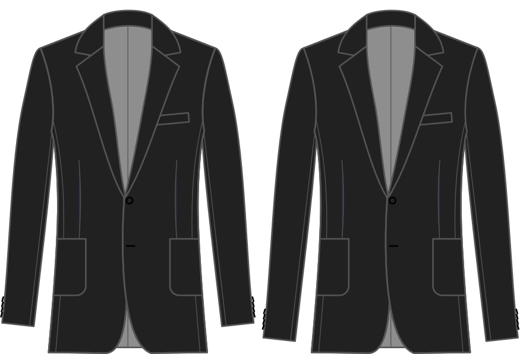

La cantidad para extender la manga más allá de la longitud de la manga en el bloque base.

<Note>

###### Esto no se supone que sea cero

Establecer esto a cero hará que la longitud de la manga sea la misma que la longitud base del bloque de plegado,
que es sin duda demasiado corto para un abrigo.
Tenga en cuenta el valor por defecto y utilice esto como base para alargar o acortar la manga.

</Note>

## Efecto de esta opción en el patrón

