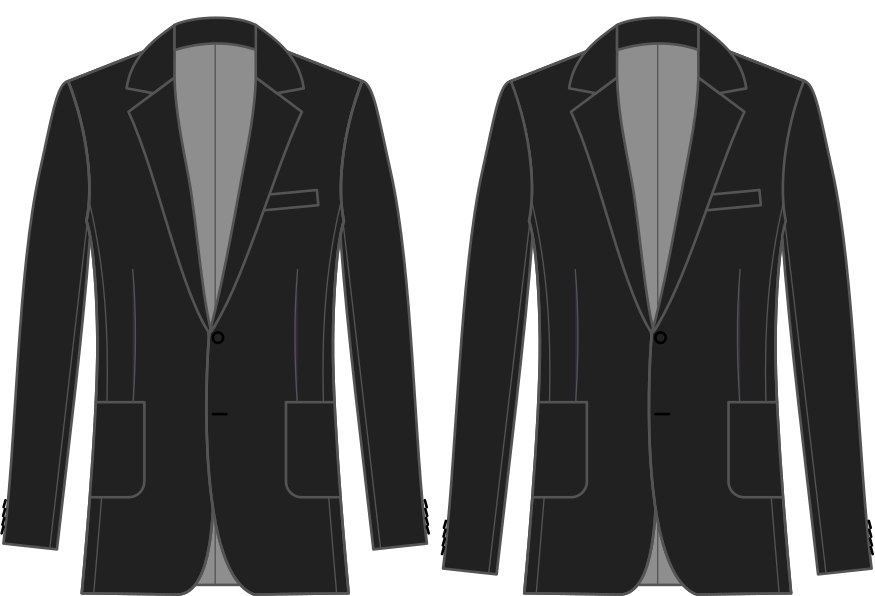

Кількість, на яку потрібно подовжити втулку понад довжину втулки в базовому блоці.

<Note>

###### Цей параметр не повинен дорівнювати нулю

Якщо встановити його на нуль, довжина рукава буде дорівнювати базовій довжині блоку Bent,
що, безумовно, занадто мало для пальта.
Будь ласка, зверніть увагу на значення за замовчуванням і використовуйте його як основу для подовження або вкорочення рукава.

</Note>

## Вплив цієї опції на шаблон

