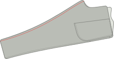

<Tip>

##### Eine Notiz über die Naht endet

bevor du loslegst, möchtest du über deine Nahtmethode entscheiden, oder wie Sie
die rohen Nähte entlang der Beine Ihrer Hosen aufräumen, um sie vor dem Ausbrüchen zu bewahren. Es gibt viele
Optionen dafür. Gewöhnliche Wahl ist die Beschichtung der rohen Kanten oder mit französischen Nähten, um
die rohen Kanten zu umhüllen.

Für diese Anweisungen gehen wir davon aus, dass Sie einen Serger für die Naht verwenden, aber wir
bieten auch Alternativen an. Weitere Optionen für die Bearbeitung von Nähten beinhalten das Schneiden von
Scheren mit rosa Scheren Das Nähen eines Zick-Zick-Zack am Rand der Naht, um ihn vor dem Ausziehen zu bewahren oder mit
Bänder zu binden.

</Tip>

## Schritt 1: Baue die hinteren Taschen

Are you planning to insert welt pockets in the back of your Paco pants? Is so, awesome! This is arguably the trickiest part, and we'll accomplish it first. If not, you can skip ahead to the next step, preparing the front pockets.

Construct the welt pockets at the back of your trousers, including the pocket bag.

<Tip>

##### Welt Taschen

Eine Welttasche zu bauen ist eine Technik, die verwendet wird ist verschiedene Kleidung. Aus diesem Grund ist es
in eine eigene Dokumentationsseite verzweigt.

Es gibt sowohl schriftliche Dokumentation als auch eine Videoserie, die Ihnen zeigt, wie Sie es machen können Selbst wenn
Sie noch nie Welttaschen gemacht haben, sind Sie in Ordnung.

[Zur Welt Taschendokumentation](https://freesewing.org/docs/sewing/double-welt-pockets/)

</Tip>

## Schritt 2: Bereiten Sie die Vordertaschen vor

Your pockets are cut from a lining material, which can save on weight and bulk, but also means that you'll want to hide them a little bit inside the side seam, so the lining doesn't show. The flap along the outside seam of each leg is for just this purpose.

If you are using a serger, serge the curved edges of your pocket pieces. Then, serge along the long edges of the pocket flaps.

## Schritt 3: Taschen an Hosen anhängen

With [good sides together](https://freesewing.org/docs/sewing/good-sides-together/), line up the markings on the edge of the pocket bag with the ends of the flap along the outside seam of the front leg. Sew together. Repeat for second leg.

Now do the same with the back legs. With good sides together, line up the markings on the edge of the pocket bag with the ends of the flap along the outside seam of the back leg. Before sewing, make sure that your left leg front and back are attached to one pocket, and your right leg front and back are attached to the other. Sew together.

Press all seams toward the pants (away from the pocket bag).

<Note>

Optional: Du kannst hier einen Millimeter oder zwei Millimeter aus der Naht auf jeder Seite der Tasche
unterstichen um die Klappen und Taschen so zu befestigen, wie Sie sie gedrückt haben.

</Note>

## Schritt 4: Bereiten Sie die Seitennaht und Tasche vor

You should now have two big pieces, each with a front and back leg attached by a pocket.

Take one of the pieces, and place the front and back leg good sides together. Align the outer side seam, so that the side seam of the leg pieces match up, and the pocket bag edges are aligned, with good sides together.

## Schritt 5: Nähte die Seitennaht

You'll sew two separate seams to stitch up your side seams while leaving your pockets open.

Start at the top of the leg pieces. Sew along the side seam, pivoting as you reach the pocket bag. You can also shorten your stitch length here to reinforce the corner of the pocket opening. Follow the side seam, pivoting again and ending at the top of the pocket.

Next, you'll close the bottom of the pocket bag and stitch the rest of the side seam. Start at the bottom edge of the pocket bag, sewing along the bottom of the pocket, then pivoting when you get to the side seam of the pants. You can use a shorter stitch length for the first few stitches on the side seam, to reinforce the bottom of the pocket opening. Sew all the way down the leg side seam.

Repeat for second leg.

## Schritt 6: Beende die Seitennaht

Finishing these seams requires a touch of delicacy, especially around the tops of the pockets.

It would be difficult to finish the top part of the side seam with a serger, so we'll use a zig-zag stitch. Starting at the top of the side seam, zig-zag stitch along the raw edge of the seam allowance, pivoting around the pocket opening. Continue the zig-zag stitch up the side of the pocket, unless you've serged your pockets already (in which case you can stop when you reach the pocket).

The bottom opening of the pocket is a tight corner. To finish the seam around this corner, zig-zag stitch the raw edge of the seam allowance, starting where it joins the pocket, pivoting at the corner and continuing about 5 cm (2 in.) down the side seam. You can continue finishing the side seam with a zig-zag stitch all the way down. Alternatively, you can serge the side seam, making sure to stop the line of serger stitches a little ways from the pocket.

<Note>

Achten Sie darauf, diese Serger-Nähte zu sichern. Sie werden nicht in anderen Nähten gefangen, daher riskieren sie
aufzulösen, wenn sie unsicher bleiben.

</Note>

Repeat for second leg.

Press the side seams toward the front.

<Note>

Dies kann sich als unintuitiv empfinden, da viele Hosen darauf hindeuten, dass die Seitennaht nach hinten gedrückt wird.
Mit Inseam-Taschen wollen Sie jedoch, dass die Taschen auf die Vorderseite der Hose gedrückt werden. Deine
Taschen kämpfen gegen deine Seitennaht, wenn du die Naht auf die Rückseite drückst so drücken wir es alles
nach vorne. Dies wird zu einem glatteren Ende führen.

</Note>

<Note>

Die Ecken einer Taschenöffnung sind einer der am wahrscheinlichsten verschleißenden Orte besonders
, wenn du deine Taschen viel verwendest. Wenn du Angst davor hast, an den Ecken deiner Taschen zu reißen, oder
, wenn dein Stoff delikater ist, Sie können die Taschenöffnungen mit Balken entlang der Nahtlinie
verstärken, direkt außerhalb der Taschenöffnungen.

</Note>

## Schritt 7: Ankertasche zum Taillen

The pockets in Paco are anchored at the waist. This means that you can put things in your pockets without them becoming unsightly bump that’s just dangling around in your trouser leg.

To anchor each pocket, align the top of the pocket with the mark along the waistline of your pattern. Sew a line of basting stitches inside your seam allowance to hold the pocket in place.

## Schritt 8: Nähen und beenden Sie die Inneams

Align the inseams with good sides together, then sew up the inseams. Finish the seams the same way you finished the side seams. Press inseams to the back.

## Schritt 9: Nähen und Fertigstellen der Schrittnaht

To attach the individual legs, flip one leg good side out (it doesn't matter which leg), then place it inside the other leg, good sides together. You should now have what looks like just one pant leg, with wrong sides visible. Align the center front, center back, and inseams of each leg, then pin along the length of the crotch seam. Sew and finish the crotch seam.

<Note>

Wenn Sie von der Mitte vorne nach hinten nähen es ist einfacher, Ihre Inseam-Nahtzustände
auf die Rückseite zu drücken, wenn sie durch die Maschine eingespeist werden.

</Note>

## Schritt 10: Stellen Sie die Ösen für die Zeichenfolge ein (optional)

Mark the middle of your waistband length. Fold one of your waistband pieces double, and mark the middle of the width (do not take the seam allowance into account).

A bit to the left and right of this, you can add two eyelets to pass a drawstring through. Because your Paco pants have elastic in the waistband, as well, this is a nice detail, but is not required.

<Tip>

##### Es ist am besten, Verstärkung

hinzuzufügen, wenn du einen Stoff gewählt hast, der rutschig ist drapey, oder dünn, möchten Sie vielleicht einige Verstärkung
hinter diesen Ösen hinzufügen. Ein bisschen Schnittstellen oder ein übrig bleibendes Denim-Stück wird gut funktionieren.

</Tip>

## Schritt 11: Bereiten Sie die Taille elastisch vor

There’s no magic formula for the length of your elastic. So you wrap it around your waist and pull it tight until you get a good fit. Paco is cut to sit at the high hip, so make sure your elastic is long enough to sit comfortably at the high hip.

Mark this length, cut the elastic, and join the two ends together.

## Schritt 12: Betrete die Taille

Place the two waistband pieces good sides together, and align the short edges. Sew the short edges together, then press open. These will be inside the waistband, so you don't need to finish the edges of these seams unless your fabric is particularly likely to fray.

Fold the waistband double along the length, with good sides out, and press. This fold will be the top of your waistband.

## Schritt 13: Hänge die Taille an

You have two options for attaching your waistband. One is a bit simpler, but leaves an exposed seam on the inside. The other is a bit more fiddly, but it encloses the raw edges of your fabric.

### Die einfachere Methode

Keep your waistband folded double, and place the elastic inside. Make sure to align the place where the elastic is joined with the back of the waistband (opposite the eyelets).

Find the center front of your waistband (easy if there are eyelets, if not just fold it double), and align that with the center front seam of your pants. Make sure that your waistband is outside of your pants, with good sides together. Pin in place.

<Tip>

##### Achte auf deine eyelets

wenn du die eyelets in deiner Taille gemacht hast überprüfen Sie, ob sie nach außen hin platziert sind,
nicht die Innenseite Ihrer Taille.

</Tip>

Next, align the center backs and pin in place, adding additional pins around the waistband as needed.

Sew the waistband to the pants, as close to the the elastic as you can, but don’t sew into the elastic.

It’s fine to not sew too close the first time around, and once your elastic is attached and encased, make a second round to sew it a bit more snugly.

Remove any basting stitches from the tops of the pocket bags.

Finish the seam with a serger or other method.

### Die beigefügte Nahtmethode

Open the waistband. You will still be able to see the fold along its length, but you will be working with each side of the waistband individually.

Find the center front of your waistband (easy if there are eyelets, if not just fold it double), and align that with the center front seam of your pants. Make sure that your waistband is outside of your pants, with good sides together. Pin in place.

<Tip>

##### Mind your eyelets

To make sure your eyelets will end up on the outside, make sure they are closer to the top of your
waistband, above the fold, for now.

</Tip>

Next, align the center back of your waistband with the center back seam. Pin in place. Then, add additional pins around the waistband as needed.

Sew the waistband to the pants.

Press the waistband up. Press the seam allowance in on the opposite side of the waistband, maintaining the fold along the center of the waistband.

Refold the waistband, turning half the waistband to the inside. Pin so that the seam allowance on the inside is just below the seam joining the waistband to the pants, and pin in place around the waistband. From the outside, stitch in the ditch, catching the inner waistband as you go.

## Schritt 14: Bereiten Sie die Manschette elastisch vor

As you did with the waistband elastic, wrap the elastic for your cuff around your ankle and pull it tight until you get a good fit.

Mark this length, cut the elastic, and join the two ends together. Repeat for the other cuff elastic.

## Schritt 15: Join the Manschetten

Fold each cuff with good sides together, aligning the short edges. For each cuff, sew the short edges together, then press open. These will be inside the cuff, so you don't need to finish the edges of these seams unless your fabric is particularly likely to fray.

Fold each cuff double along the length, with good sides out, and press. This fold will be the bottom of your cuffs.

## Schritt 16: Füge die Manschetten hinzu

You will attach your cuffs the same way that you attached the waistband. As with the waistband, there are two options - a simpler choice, and a choice without exposed seams on the inside.

<Note>

If your sewing machine has a detachable bed (usually removed to expose the "free arm" for sewing
sleeve cuffs), this will make sewing the cuffs easier.

 </Note>

### Die einfachere Methode

Keep your cuffs folded double, and place the elastic inside.

Align the seam in the cuff with the inseam of the pants. Make sure that your cuff is outside of your pants, with good sides together. Pin in place, then pin the rest of the way around the cuff.

<Tip>

##### Anlegen der Manschetten

wird die Manschetten schwieriger anzupinnen. Um sicherzustellen, dass deine Manschetten gleichmäßig
an die Hose gesteckt werden platzieren Sie den zweiten Pin auf der gegenüberliegenden Seite des Beins von der ersten Seite. Du kannst
die Elastik dehnen, um sicherzustellen, dass alles glatt ist, dann platzieren Sie Ihre nächsten Pins auf halbem Wege
zwischen den ersten beiden. Auf diese Weise fortfahren, auf halbem Weg zwischen anderen Pins fixieren, bis du sicher bist, dass
genug ist.

</Tip>

Sew the cuff to the pants opening, as close to the the elastic as you can, but don’t sew into the elastic.

Finish the seam with a serger or other method.

### Die beigefügte Nahtmethode

Open the cuff. You will still be able to see the fold along its length, but you will be working with each side of the cuff individually.

Align the seam in the cuff with the inseam of the pants. Make sure that your cuff is outside of your pants, with good sides together. Pin in place, then pin the rest of the way around the cuff.

Sew the cuff to the pants.

Press the cuff away from the pants. Press the seam allowance in on the opposite side of the cuff, maintaining the fold along the center of the cuff.

Refold the cuff, turning half the cuff to the inside. Pin so that the seam allowance on the inside is just past the seam joining the cuff to the pants, and pin in place around the cuff. From the outside, stitch in the ditch, catching the inner cuff as you go.

## Schritt 17: Nähen der Manschetten und der Taille (optional)

If you have wider cuff elastic, you may want to stitch a horizontal line halfway up the cuff. This will hold your elastic in place and help keep it from folding or twisting. Make sure to stretch the elastic evenly as you sew, so that it gathers the fabric evenly. (If you sew without stretching the elastic, you risk lumpy gathers and a leg opening too narrow to get your foot through.)

If you like the look, you can also sew more than one line of stitches, evenly spaced between the top and bottom of the cuff.

You can do the same for the waistband.

<Note>

Wenn du Ösen für eine Zeichenkette einfügst, nähst du eine Linie von Nähten über den Ösen und eine separate Linie
unter den Ösen lassen Sie einen Kanal breit genug für Ihre Zeichenkette.

</Note>

## Schritt 18: Thread eine Zeichenfolge um die Taille herum (optional)

If you put eyelets in your waistband, thread a drawstring through one eyelet, around the waist, and out of the other eyelet.

<Note>

Es gibt Werkzeuge, um diese Aufgabe zu erleichtern, aber eine, die fast jeder hat, ist ein einfacher Sicherheitsstift.
Den Sicherheitspin an einem Ende deiner Zeichenkette anheften und dann durch den Kanal drücken. Der Sicherheitspin
wird leichter durch den Stoff manövrieren, und er wird die Zeichenfolge mitziehen.

</Note>

## Schritt 19: Genießen Sie Ihre Paco Hose!

You did it! Way to go!

