<Tip>

##### Een notitie op de afwerkingen van de naad

voordat je begint, zal je beslissen over je manier van naad, afwerking, of hoe je de onbewerkte naden
langs de benen van je broek opschont om te voorkomen dat ze rafelen. Er zijn hiervoor veel
opties. Gemeenschappelijke keuzes naaien de onbewerkte randen of gebruiken Franse naden om
de rauwe randen te omhelzen.

Voor deze instructies, gaan we ervan uit dat je een overlock gebruikt voor naadafstand, maar we
ook alternatieven aanbieden. Andere opties voor het afwerken van de naden zijn onder meer het knippen met een knijpende
schaar, stik een zigzag langs de rand van de naad om te voorkomen dat het uitrafelt, of koppel met
bias tape.

</Tip>

## Stap 1: Maak de achterzakken

Ga je paspelzakken gebruiken op de achterkant van je Paco-broek? Top! Dit is misschien wel het lastige stuk van de constructie, en we gaan het als eerste aanpakken. If not, you can skip ahead to the next step, preparing the front pockets.

Maak de paspelzakken aan de achterkant van de broekdelen, inclusief de broekzak.

<Tip>

##### Paspelzakken

Paspelzakken worden in verschillende kledingstukken gebruikt. Daarom is het
in zijn eigen documentatiepagina verdisconteerd.

Er is zowel geschreven documentatie als een videoserie die je laat zien hoe je het moet doen, dus zelfs als
je nog nooit paspelzakken hebt gemaakt, ben je in orde.

[Naar de documentatie voor paspelzakken (in het Engels)](https://freesewing.org/docs/sewing/double-welt-pockets/)

</Tip>

## Stap 2: Maak de voorzakken

Your pockets are cut from a lining material, which can save on weight and bulk, but also means that you'll want to hide them a little bit inside the side seam, so the lining doesn't show. Daarvoor dient de flap bovenaan de buitennaad van de broekspijp.

Als je een overlocker gebruikt, werk dan nu de gebogen randen van je zakstukken af. Then, serge along the long edges of the pocket flaps.

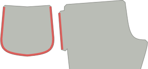

## Stap 3: Bevestig de zakken aan de broekspijpen

With [good sides together](https://freesewing.org/docs/sewing/good-sides-together/), line up the markings on the edge of the pocket bag with the ends of the flap along the outside seam of the front leg. Stik ze aan elkaar. Herhaal dit voor de andere pijp.

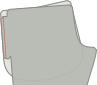

Doe nu hetzelfde met de achterpanden. With good sides together, line up the markings on the edge of the pocket bag with the ends of the flap along the outside seam of the back leg. Before sewing, make sure that your left leg front and back are attached to one pocket, and your right leg front and back are attached to the other. Stik ze aan elkaar.

Pers de naadwaarde van de steekzak en de broekspijp weg van de zak, tegen de broekspijp.

<Note>

Optioneel: Vanaf elke kant van de zak kun je hier een millimeter of twee tussendoorstikken,
zak, onderstikken om de kleppen en het zakdeel helemaal samen te bevestigen op de manier waarop je ze hebt gedrukt.

</Note>

## Stap 4: Bereid de zijnaden en de steekzak voor

Je hebt nu twee grote delen voor elke pijp, elk met een voor- en achterpand die aan elkaar vasthangen met een zak.

Neem één van de pijpen en leg het voor- en achterpand op elkaar met de goede kant naar binnen. Align the outer side seam, so that the side seam of the leg pieces match up, and the pocket bag edges are aligned, with good sides together.

## Stap 5: Stik de zijnaden

Stik twee afzonderlijke naden: eentje boven de zak en eentje eronder. Op die manier blijven je steekzakken open.

Begin aan de bovenkant van de broekspijpen. Stik langs de zijnaad. Om te draaien aan de steekzak, stop je met de naald in de stof. Hef de persvoet op en draai het werk. Hier kan je eventueel een kortere steeklengte gebruiken om de hoek van de zakopening te verstevigen. Volg de zijnaad, draai opnieuw en stop aan de bovenkant van de zak.

Nu ga je de onderkant van de steekzak sluiten en de rest van de zijnaad stikken. Start at the bottom edge of the pocket bag, sewing along the bottom of the pocket, then pivoting when you get to the side seam of the pants. You can use a shorter stitch length for the first few stitches on the side seam, to reinforce the bottom of the pocket opening. Stik de hele zijkant van de broekspijp naar beneden.

Herhaal dit voor de andere pijp.

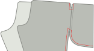

## Stap 6: Werk de zijnaden af

De afwerking van deze naden vraagt een beetje extra aandacht, vooral rond de bovenkant van de zakken.

It would be difficult to finish the top part of the side seam with a serger, so we'll use a zig-zag stitch. Starting at the top of the side seam, zig-zag stitch along the raw edge of the seam allowance, pivoting around the pocket opening. Continue the zig-zag stitch up the side of the pocket, unless you've serged your pockets already (in which case you can stop when you reach the pocket).

De onderste opening van de steekzak is een lastig hoekje. To finish the seam around this corner, zig-zag stitch the raw edge of the seam allowance, starting where it joins the pocket, pivoting at the corner and continuing about 5 cm (2 in.) down the side seam. You can continue finishing the side seam with a zig-zag stitch all the way down. Alternatively, you can serge the side seam, making sure to stop the line of serger stitches a little ways from the pocket.

<Note>

Maak de overlockstiksels zeker goed vast. Ze zullen niet worden betrapt in andere naden, dus ze riskeren
onveilig te worden gelaten.

</Note>

Herhaal dit voor de andere pijp.

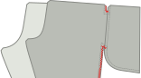

Pers de zijnaden naar het voorpand.

<Note>

Dat lijkt misschien geen logische manier van werken. Veel naaipatronen voor broeken laten je de zijnaden naar het achterpand persen.
Maar in dit geval heb je steekzakken in de naad verwerkt, en die moeten natuurlijk aan de voorkant van de broek zitten. Je
zakken gaan met je zijnaad strijden als je de naad aan de achterkant strijkt. dus strijken we alles
naar het voorpand. Het resultaat zal er mooier uitzien.

</Note>

<Note>

De hoeken van een opening van de zak zijn een van de meest waarschijnlijke plekken om uit te dragen of tranen, vooral
als je je zakken veel gebruikt. Als je je zorgen maakt over het scheuren aan de hoeken van je zakken, of
als je stof gevoeliger is, je kan de zakopeningen versterken met staven langs de naad
lijn, net buiten de zakopeningen.

</Note>

## Stap 7: Ankerzakdeel naar taille

De zakken in het Paco zijn geankerd aan de taille. This means that you can put things in your pockets without them becoming unsightly bump that’s just dangling around in your trouser leg.

To anchor each pocket, align the top of the pocket with the mark along the waistline of your pattern. Stik een rand van driegsteek binnen je naadwaarde om de zak vast te houden.

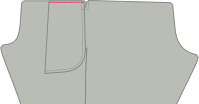

## Stap 8: Stik en werk de innaden af

Leg de innaden gelijk met de goede kanten op elkaar, en stik de innaden dan op. Finish the seams the same way you finished the side seams. Strijk de binnenste naar de achterkant.

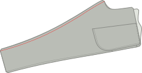

## Stap 9: Stik en voltooi de kruisnaad

To attach the individual legs, flip one leg good side out (it doesn't matter which leg), then place it inside the other leg, good sides together. You should now have what looks like just one pant leg, with wrong sides visible. Align the center front, center back, and inseams of each leg, then pin along the length of the crotch seam. Stik en werk de kruisnaad af.

<Note>

Als je van het midden naar het midden naait Het is makkelijker om je binnennaadwaarde
aan de achterkant te houden terwijl ze via de machine stromen.

</Note>

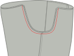

## Stap 10: Plaats veterzakken voor de tekenreeks (optioneel)

Markeer het midden van de lengte van je tailleband. Fold one of your waistband pieces double, and mark the middle of the width (do not take the seam allowance into account).

Installeer twee vetergaten links en rechts van deze markering. Because your Paco pants have elastic in the waistband, as well, this is a nice detail, but is not required.

<Tip>

##### Het is het beste om wat versterking toe te voegen

Als je een stof gekozen hebt die glad is, droog, of dun, je wilt misschien wat versterking
toevoegen achter deze wenkels. Een beetje tussenvoering of een overblijfsel van denim doet het goed.

</Tip>

## Stap 11: Bereid de taille elastiek voor

Er is geen magische formule voor de lengte van je elastiek. So you wrap it around your waist and pull it tight until you get a good fit. Paco is cut to sit at the high hip, so make sure your elastic is long enough to sit comfortably at the high hip.

Markeer deze lengte, knip het elastiek en naai de uiteindes aan elkaar.

## Stap 12: Naai de tailleband

Leg de twee goede kanten van de tailleband op elkaar en leg de korte randen samen. Sew the short edges together, then press open. These will be inside the waistband, so you don't need to finish the edges of these seams unless your fabric is particularly likely to fray.

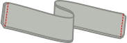

Vouw de tailleband dubbel in de lengte met de goede kanten naar buiten. Pers. This fold will be the top of your waistband.

## Stap 13: Bevestig de tailleband

Je kan de tailleband op twee manieren vastmaken. One is a bit simpler, but leaves an exposed seam on the inside. De andere is wat lastiger, maar verbergt wel alle rafelranden aan de binnenkant van de tailleband.

### De eenvoudige methode

Houd je tailleband dubbelgevouwen en schuif de elastiek erin. Make sure to align the place where the elastic is joined with the back of the waistband (opposite the eyelets).

Find the center front of your waistband (easy if there are eyelets, if not just fold it double), and align that with the center front seam of your pants. Make sure that your waistband is outside of your pants, with good sides together. Speld vast.

<Tip>

##### Knip je wandelaars

Als je vetergaatjes in je tailleband hebt gemaakt, dubbele controle of ze naar buiten worden geplaatst,
niet de binnenkant van je tailleband.

</Tip>

Leg vervolgens de middenruggen en speld samen en voeg extra pinnen om de tailleband toe indien nodig.

Stik de tailleband aan de spelers, zo dicht mogelijk bij het elastiek, maar stik niet in het elastiek.

It’s fine to not sew too close the first time around, and once your elastic is attached and encased, make a second round to sew it a bit more snugly.

Verwijder alle driegsteek aan de bovenkant van de zakdelen.

Werk de naad af met een overlock of een andere methode.

### De naadmethode in de kast

Open de tailleband. You will still be able to see the fold along its length, but you will be working with each side of the waistband individually.

Find the center front of your waistband (easy if there are eyelets, if not just fold it double), and align that with the center front seam of your pants. Make sure that your waistband is outside of your pants, with good sides together. Speld vast.

<Tip>

##### Breng je veters

Om er zeker van te zijn dat je oogdieren aan de buitenkant zullen verschijnen, zorg ervoor dat ze voor dit moment dichter bij de bovenkant van je
tailleband staan, boven de vouw.

</Tip>

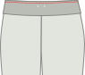

Leg vervolgens de middenrug van de tailleband gelijk met de middenmiddenachternaad. Speld vast. Then, add additional pins around the waistband as needed.

Stik de tailleband aan de broek.

Strijk de tailleband omhoog. Press the seam allowance in on the opposite side of the waistband, maintaining the fold along the center of the waistband.

Kort de tailleband, draai de helft van de tailleband naar binnen. Pin so that the seam allowance on the inside is just below the seam joining the waistband to the pants, and pin in place around the waistband. Stik van buitenaf in de sloot door, terwijl je de tailleband van de binnenste vat.

## Stap 14: Bereid de manchet elastisch voor

As you did with the waistband elastic, wrap the elastic for your cuff around your ankle and pull it tight until you get a good fit.

Markeer deze lengte, knip het elastiek en naai de uiteindes aan elkaar. Herhaal voor de andere manchet elastisch.

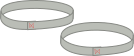

## Stap 15: Bevestig de manchetten

Plooi elke manchet met de goede kanten op elkaar, leg de korte randen samen. For each cuff, sew the short edges together, then press open. These will be inside the cuff, so you don't need to finish the edges of these seams unless your fabric is particularly likely to fray.

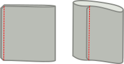

Plooi elke manchet dubbel langs de lengte, met de goede kanten naar buiten, en strijk. This fold will be the bottom of your cuffs.

## Stap 16: Bevestig de manchetten

Je zal je manchetten op dezelfde manier bevestigen als je de tailleband bevestigd hebt. As with the waistband, there are two options - a simpler choice, and a choice without exposed seams on the inside.

<Note>

Als je naaimachine een afneembaar bed heeft (meestal verwijderd om de "vrije arm" bloot te leggen voor het naaien van
mouwboorden), maakt dit het naaien van de manchetten makkelijker.

 </Note>

### De eenvoudige methode

Houd je manchetten dubbel, en plaats het elastiek erin.

Leg de naad in de manchet gelijk met de innaad van de broek. Make sure that your cuff is outside of your pants, with good sides together. Speld de rest van de weg rond de manchet vast.

<Tip>

##### De manchetten spelden

De elastiek zal de manchetten moeilijker vastmaken. Om zeker te zijn dat je manchetten gelijk vastzitten
aan de pants, plaats je tweede speld vanaf de eerste kant van de opening van de broekspijp. Je kunt
het elastiek rekken om ervoor te zorgen dat alles soepel opgaat Plaats dan je volgende spelden halverwege
tussen de eerste twee. Ga zo door! Speld halverwege andere spullen, totdat je er vertrouwen in hebt
er genoeg zijn.

</Tip>

Stik de manchet aan de broek opening, zo dicht mogelijk bij het elastiek, maar stik niet in het elastiek.

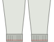

Werk de naad af met een overlock of een andere methode.

### De naadmethode in de kast

Open de manchet. You will still be able to see the fold along its length, but you will be working with each side of the cuff individually.

Leg de naad in de manchet gelijk met de innaad van de broek. Make sure that your cuff is outside of your pants, with good sides together. Speld de rest van de weg rond de manchet vast.

Stik de manchet aan de broek.

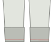

Strijk de manchet van de broek weg. Press the seam allowance in on the opposite side of the cuff, maintaining the fold along the center of the cuff.

Kort de manchet, draai de helft van de manchet naar binnen. Pin so that the seam allowance on the inside is just past the seam joining the cuff to the pants, and pin in place around the cuff. From the outside, stitch in the ditch, catching the inner cuff as you go.

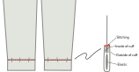

## Stap 17: Stik de manchetten en tailleband (optioneel)

Als je een breder manchet hebt, wil je misschien een horizontale lijn halverwege de manchet stikken. This will hold your elastic in place and help keep it from folding or twisting. Make sure to stretch the elastic evenly as you sew, so that it gathers the fabric evenly. (If you sew without stretching the elastic, you risk lumpy gathers and a leg opening too narrow to get your foot through.)

If you like the look, you can also sew more than one line of stitches, evenly spaced between the top and bottom of the cuff.

Je kunt hetzelfde doen voor de tailleband.

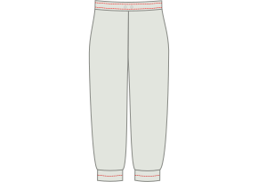

<Note>

Als je wenkbrauwen voor een koordje vaststikt, stik je een stiksel van stiksels boven de wandelgangen en een aparte lijn
onder de ogen verlaat een kanaal breed genoeg voor je tekenreeks.

</Note>

## Stap 18: Thread een tekenreeks rond de taille (optioneel)

If you put eyelets in your waistband, thread a drawstring through one eyelet, around the waist, and out of the other eyelet.

<Note>

Er zijn middelen om deze taak te vergemakkelijken, maar een die bijna iedereen heeft, is een eenvoudige veiligheidspanne.
Speld de veiligheidspeld vast aan één einde van je tekenreeks, en duwt deze vervolgens door het kanaal. De veiligheidspeld
is makkelijker te maneuveren door de stof, en het trekt de tekenreeks ermee op.

</Note>

## Stap 19: Geniet van je Pacotaarns!

Het is je gelukt! Hoe gaat het!

