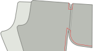
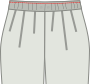

<Tip>

##### Пам'ятка про обробку швів

Перш ніж почати, вам потрібно визначитися з методом обробки швів або з тим, як ви будете прибирати
необроблені шви вздовж штанин, щоб запобігти їхньому розтиранню. Для цього є багато
варіантів. Найпоширенішими варіантами є обметування необроблених країв або використання французьких швів, щоб закрити
необроблені краї.

У цій інструкції ми припустимо, що ви використовуєте сермер для обробки швів, але ми
також надамо альтернативні варіанти. Інші варіанти обробки швів - обрізка їх рожевими ножицями
, прострочка зигзагом по краю шва, щоб він не обсипався, або обв'язка
косою бейкою.

</Tip>

## Крок 1: Конструюємо задні кишені

Ви плануєте вшити прорізні кишені в задній частині штанів Paco? Це так круто! Це, мабуть, найскладніша частина, і ми почнемо з неї. Якщо ні, ви можете пропустити і перейти до наступного кроку - підготовки передніх кишень.

Зробіть прорізні кишені на задній частині штанів, включаючи кишенькову сумку.

<Tip>

##### Прорізні кишені

Конструювання прорізних кишень - це техніка, яка використовується в різних видах одягу. Саме тому
відгалузився на окрему сторінку документації.

Існує як письмова документація, так і серія відеороликів, які показують, як це зробити, тому навіть якщо
ви ніколи раніше не робили прорізні кишені, ви впораєтесь з цим завданням.

[До документації про кишені для швів](https://freesewing.org/docs/sewing/double-welt-pockets/)

</Tip>

## Крок 2: Підготуйте передні кишені

Кишені вирізані з підкладкового матеріалу, що дозволяє заощадити на вазі та об'ємі, але також означає , що ви захочете заховати їх трохи всередину бокового шва, щоб підкладка не була видна. Клапан уздовж зовнішнього шва на кожній штанині призначений саме для цього.

Якщо ви використовуєте сермер, обріжте загнуті краї кишенькових деталей. Потім прострочіть уздовж довгих країв клапанів кишень.

## Крок 3: Прикріпіть кишені до штанів

Складіть [лицьовими боками разом](https://freesewing.org/docs/sewing/good-sides-together/), сумістіть мітки на краю кишені сумки з кінцями клапана вздовж зовнішнього шва передньої ніжки. Зшийте разом. Повторіть для другої ноги.

Тепер зробіть те ж саме із задніми ногами. Складіть лицьовими сторонами разом, сумістіть розмітку на краю кишені-сумки з кінцями клапана вздовж зовнішнього шва задньої штанини. Перед тим, як пришивати, переконайтеся, що ліва нога спереду і ззаду прикріплена до однієї кишені, а права нога спереду і ззаду - до іншої. Зшийте разом.

Притисніть усі шви до штанів (від кишенькової сумки).

<Note>

За бажанням, ви можете прострочити тут, на міліметр-два вглиб від шва з кожного боку кишені
сумки, щоб закріпити клапани і кишеню разом так, як ви їх притиснули.

</Note>

## Крок 4: Підготуйте бічні шви та кишені сумки

Тепер у вас повинно вийти два великих шматки, кожен з яких має передню і задню ніжки, прикріплені кишенькою.

Візьміть один із шматків і покладіть передню і задню ногу лицьовими сторонами разом. Вирівняйте зовнішній бічний шов так, щоб бічні шви деталей штанин збіглися, а краї кишенькової сумки були вирівняні, лицьовими сторонами разом.

## Крок 5: Зшийте бічні шви

Ви прошиєте два окремі шви, щоб зшити бокові шви, залишивши кишені відкритими.

Почніть з верхньої частини ніжок. Зшивайте вздовж бокового шва, повертаючи, коли дійдете до кишенькової сумки. Ви також можете вкоротити довжину стібка, щоб посилити кут отвору кишені. Виконайте боковий шов, знову повертаючи і закінчуючи у верхній частині кишені.

Далі ви закриваєте дно сумки-кишені і прошиваєте решту бокового шва. Почніть від нижнього краю сумки-кишені, прошиваючи по низу кишені, потім поверніть, коли дійдете до бокового шва штанів. Ви можете використовувати коротшу довжину стібка для перших кількох стібків бокового шва , щоб зміцнити дно отвору кишені. Прошийте весь бічний шов штанини.

Повторіть для другої ноги.

## Крок 6: Обробіть бічні шви

Оздоблення цих швів вимагає делікатності, особливо навколо верхніх частин кишень.

Верхню частину бокового шва було б складно обробити сервером, тому ми скористаємося зигзагоподібною строчкою . Починаючи з верхньої частини бокового шва, прострочіть зигзагоподібну строчку по необробленому краю шва припуску, обертаючи навколо отвору кишені. Продовжуйте виконувати зигзагоподібну строчку вгору по боковій стороні кишені, якщо ви вже не зшили кишені (в цьому випадку ви можете зупинитися, коли дійдете до кишені).

Нижній отвір кишені - щільний кут. Щоб завершити шов навколо цього кута, прострочіть зигзагоподібною строчкою необроблений край припуску на шов, починаючи з місця з'єднання з кишенею, повертаючи на куті і продовжуючи приблизно на 5 см (2 дюйми) вниз по боковому шву. Ви можете продовжити обробку бокового шва зигзагоподібною строчкою до самого низу. Крім того, ви можете прострочити боковий шов, не забувши зупинити лінію строчки трохи далі від кишені.

<Note>

Обов'язково закріпіть ці серпяні стібки. Вони не потраплять в інші шви, тому ризикують
розплутатися, якщо їх не убезпечити.

</Note>

Повторіть для другої ноги.

Притисніть бічні шви до лицьового боку.

<Note>

Це може здатися інтуїтивно незрозумілим, оскільки багато штанів припускають притискання бокових швів до спинки.
Однак, якщо ви використовуєте вшивні кишені, вам краще притиснути кишені до передньої частини штанів. Ваші
кишені будуть боротися з боковим швом, якщо ви притиснете його до спинки, тому ми притиснемо всі
до лицьового боку. Це призведе до більш гладкого покриття.

</Note>

<Note>

Кути кишенькового отвору - одне з найімовірніших місць для зносу або розривів, особливо
якщо ви часто користуєтеся кишенями. Якщо ви боїтеся, що кути кишень можуть розірватися, або
якщо ваша тканина більш делікатна, ви можете зміцнити отвори кишень закріпками вздовж лінії шва
, відразу за межами отворів кишень.

</Note>

## Крок 7: Прикріпіть кишенькову сумку до талії

Кишені в Paco закріплені на талії. Це означає, що ви можете покласти речі в кишені без того, щоб вони перетворилися на непривабливі шишки, які просто бовтаються на штанині.

Щоб закріпити кожну кишеню, сумістіть верх кишені з міткою вздовж лінії талії на викрійці . Прокладіть ряд наметочних стібків всередині припуску на шов, щоб утримати кишеню на місці.

## Крок 8: Зшийте та обробіть шви

Вирівняйте виворітні шви лицьовими сторонами один до одного, а потім застрочіть їх. Виконайте шви так само, як ви виконали бічні шви. Запрасуйте шви на виворітний бік.

## Крок 9: Зшийте та обробіть паховий шов

Щоб з'єднати окремі ніжки, виверніть одну ніжку лицьовою стороною назовні (неважливо, яку саме), а потім помістіть її всередину іншої ніжки, лицьовими сторонами разом. Тепер у вас повинно вийти те, що виглядає як одна штанина , з виворітними сторонами. Вирівняйте центр передньої частини, центр задньої частини і шви кожної штанини, потім приколіть по довжині пахового шва. Зшийте і обробіть паховий шов.

<Note>

Якщо ви шиєте від центру переду до центру спинки, легше тримати припуски на шви
притиснутими до спинки, коли вони проходять через машину.

</Note>

## Крок 10: Розмістіть вушка для шнурка (необов'язково)

Відзначте середину довжини вашого пояса. Складіть одну з деталей пояса вдвічі і позначте середину ширини (не враховуйте припуски на шви).

Трохи лівіше і правіше від цього місця ви можете додати два люверси для протягування шнурка. Тому що ваші штани Paco також мають резинку на поясі, це приємна деталь, але не обов'язкова.

<Tip>

##### Краще додати трохи підсилення

Якщо ви вибрали слизьку, драпіровану або тонку тканину, можливо, ви захочете додати трохи підсилення
за цими люверсами. Трохи флізеліну або залишки джинсової тканини підійдуть якнайкраще.

</Tip>

## Крок 11: Підготуйте поясну резинку

Не існує магічної формули довжини вашої еластичності. Отже, ви обертаєте його навколо талії і затягуєте до тих пір, поки не отримаєте гарну посадку. Пако скроєні так, щоб сидіти на високих стегнах, тому переконайтеся, що ваша резинка має достатню довжину, щоб комфортно сидіти на високих стегнах.

Відмітьте цю довжину, відріжте резинку і з'єднайте два кінці разом.

## Крок 12: Приєднайте пояс

Покладіть обидві частини пояса лицьовими сторонами один до одного і вирівняйте короткі краї. Зшийте короткі краї разом, потім натисніть відкрити. Вони будуть всередині пояса, тому вам не потрібно обробляти краї цих швів, якщо тільки ваша тканина не буде особливо схильна до зношування.

Складіть пояс вдвічі по довжині лицьовими боками назовні і припрасуйте. Ця складка буде верхньою частиною вашого пояса.

## Крок 13: Прикріпіть пояс

У вас є два варіанти кріплення пояса. Один трохи простіший, але залишає відкритий шов на внутрішній стороні. Інший варіант трохи складніший, але він закриває необроблені краї тканини.

### Простіший метод

Тримайте пояс складеним удвічі, а гумку помістіть всередину. Переконайтеся, що місце з'єднання гумки з задньою частиною пояса (навпроти люверсів) суміщено з задньою частиною пояса (навпроти люверсів).

Знайдіть центральну передню частину пояса (легко, якщо там є люверси, якщо їх немає, просто складіть його вдвічі), і сумістіть її з центральним переднім швом штанів. Переконайтеся, що пояс знаходиться зовні штанів, при цьому бокові сторони повинні бути добре з'єднані. Штифт на місці.

<Tip>

##### Зверніть увагу на петельки

Якщо ви зробили петельки на поясі, перевірте, щоб вони були розташовані назовні,
а не зсередини пояса.

</Tip>

Потім вирівняйте центральні частини спинки і приколіть, додавши додаткові шпильки навколо пояса, якщо потрібно.

Пришийте пояс до штанів якомога ближче до резинки, але не вшивайте його в резинку.

It’s fine to not sew too close the first time around, and once your elastic is attached and encased, make a second round to sew it a bit more snugly.

Видаліть усі наметочні стібки з верхніх частин кишенькових мішків.

Обробіть шов сервером або іншим способом.

### Метод закритого шва

Розстебніть пояс. Ви все ще зможете бачити складку по всій довжині, але працюватимете з кожною стороною пояса окремо.

Знайдіть центральну передню частину пояса (легко, якщо там є люверси, якщо їх немає, просто складіть його вдвічі) і сумістіть її з центральним переднім швом штанів. Переконайтеся, що пояс знаходиться зовні штанів , а бокові сторони з'єднані між собою. Штифт на місці.

<Tip>

##### Зверніть увагу на петельки

Щоб переконатися, що петельки опиняться на зовнішній стороні, переконайтеся, що вони знаходяться ближче до верхньої частини вашого
пояса, вище згину, поки що.

</Tip>

Потім сумістіть центр задньої частини пояса з центральним швом задньої частини. Штифт на місці. Потім додайте додаткові шпильки навколо пояса, якщо потрібно.

Пришийте пояс до штанів.

Притисніть пояс догори. Припуски шва припрасувати з протилежного боку пояса, зберігаючи складку по центру пояса.

Складіть пояс, відвернувши половину пояса всередину. Приколіть так, щоб припуск на шов з внутрішньої сторони був трохи нижче шва, що з'єднує пояс зі штанами, і закріпіть на місці навколо пояса. Із зовнішнього боку прострочіть у кюветі, захоплюючи внутрішній пояс по ходу роботи.

## Крок 14: Підготуйте манжету-гумку

As you did with the waistband elastic, wrap the elastic for your cuff around your ankle and pull it tight until you get a good fit.

Відмітьте цю довжину, відріжте резинку і з'єднайте два кінці разом. Повторіть для іншої манжети.

## Крок 15: З'єднайте манжети

Складіть кожну манжету лицьовими сторонами разом, вирівнявши короткі краї. Для кожної манжети зшийте короткі краї разом, а потім розправте. Вони будуть всередині манжети, тому вам не потрібно обробляти краї цих швів, якщо тільки ваша тканина не буде особливо схильна до зношування.

Складіть кожну манжету вдвічі по довжині лицьовими боками назовні і притисніть. Ця складка буде нижньою ваших манжет.

## Крок 16: Прикріпіть манжети

Манжети прикріплюються так само, як і пояс. Як і у випадку з поясом, є два варіанти - простіший вибір і вибір без відкритих швів зсередини.

<Note>

Якщо ваша швейна машина має знімну станину (зазвичай її знімають, щоб звільнити "вільну руку" для пришивання
манжетів рукавів), це полегшить пришивання манжетів.

 </Note>

### Простіший метод

Манжети складіть удвічі, а гумку помістіть всередину.

Вирівняйте шов на манжеті зі швом штанів. Переконайтеся, що манжета знаходиться ззовні штанів, при цьому добре прилягаючи один до одного. Приколіть на місці, а потім приколіть решту шляху навколо манжети.

<Tip>

##### Приколювання манжетів

Еластична стрічка ускладнить приколювання манжетів. Щоб переконатися, що манжети рівномірно
прикріплені до штанів, розмістіть другу шпильку з протилежного боку від отвору для штанин від першої. Ви можете
розтягнути гумку, щоб переконатися, що все вирівнялося, а потім розмістити наступні шпильки на півдорозі
між першими двома. Продовжуйте так, встромляючи шпильки на півдорозі між іншими, поки не відчуєте впевненість, що
достатньо.

</Tip>

Пришийте манжету до розрізу штанів, якомога ближче до резинки, але не вшивайте її в резинку.

Обробіть шов сервером або іншим способом.

### Метод закритого шва

Розстебни наручники. Ви все ще зможете бачити складку по всій довжині, але працюватимете з кожною стороною манжети окремо.

Вирівняйте шов на манжеті зі швом штанів. Переконайтеся, що манжета знаходиться за межами штанів, з гарними боками разом. Приколіть на місці, а потім приколіть решту шляху навколо манжети.

Пришийте манжету до штанів.

Відтисніть манжету від штанів. Припуски шва припрасувати з протилежного боку манжети, зберігаючи складку по центру манжети.

Складіть манжету, повернувши половину манжети всередину. Приколіть так, щоб припуск на шов з внутрішньої сторони знаходився відразу за швом, що з'єднує манжету зі штанами, і закріпіть на місці навколо манжети. Із зовнішнього боку прострочіть в кюветі, захоплюючи внутрішню манжету по ходу.

## Крок 17: Зшивання манжетів і пояса (необов'язково)

Якщо у вас широка манжета, можливо, ви захочете прошити горизонтальну лінію на половині манжети. Це утримає вашу резинку на місці і допоможе уникнути її згинання або скручування. Переконайтеся, що ви рівномірно розтягуєте еластичну під час шиття, щоб вона рівномірно збирала тканину. (Якщо ви шиєте без розтягування гумки, ви ризикуєте отримати грудки і занадто вузький отвір для ноги, через який не зможе пролізти нога).

If you like the look, you can also sew more than one line of stitches, evenly spaced between the top and bottom of the cuff.

Так само можна зробити і з поясом.

<Note>

Якщо ви вставляєте люверси для шнурка, прошийте лінію стібків над люверсами і окрему лінію
під люверсами, залишивши канал достатньо широким для шнурка.

</Note>

## Крок 18: Протягніть шнурок навколо талії (за бажанням)

If you put eyelets in your waistband, thread a drawstring through one eyelet, around the waist, and out of the other eyelet.

<Note>

Існують інструменти, які полегшують це завдання, але один з них, який є майже у кожного, - це звичайна шпилька.
Прикріпіть шпильку до одного кінця шнурка, а потім просуньте її в канал. Булавці
буде легше маневрувати в тканині, і вона буде тягнути за собою кулиску.

</Note>

## Крок 19: Насолоджуйтеся штанами Пако!

У тебе вийшло! Так тримати!

