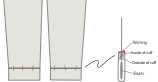
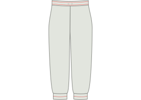

<Tip>

##### A note on seam finishes

Before you get started, you'll want to decide on your method of seam finishing, or how you tidy
up the raw seams along the legs of your pants to keep them from fraying. There are a lot of
options for this. Common choices are serging the raw edges, or using French seams to encase
the raw edges.

For these instructions, we'll assume that you are using a serger for seam finishes, but we'll
also provide alternatives. Other options for finishing seams include trimming them with pinking
shears, stitching a zig-zag along the edge of the seam to keep it from fraying, or binding with
bias tape.

</Tip>

## Step 1: Construct the back pockets

Are you planning to insert welt pockets in the back of your Paco pants? Is so, awesome! This is arguably the trickiest part, and we'll accomplish it first. If not, you can skip ahead to the next step, preparing the front pockets.

Construct the welt pockets at the back of your trousers, including the pocket bag.

<Tip>

##### Welt pockets

Constructing a welt pocket is a technique that is used is different garments. That is why it's
branched it off into its own documentation page.

There’s both written documentation and a video series that shows you how to do it, so even if
you’ve never made welt pockets before, you’ll be fine.

[To the welt pockets documentation](https://freesewing.org/docs/sewing/double-welt-pockets/)

</Tip>

## Step 2: Prepare the front pockets

Your pockets are cut from a lining material, which can save on weight and bulk, but also means that you'll want to hide them a little bit inside the side seam, so the lining doesn't show. The flap along the outside seam of each leg is for just this purpose.

If you are using a serger, serge the curved edges of your pocket pieces. Then, serge along the long edges of the pocket flaps.

## Step 3: Attach pockets to pants

With [good sides together](https://freesewing.org/docs/sewing/good-sides-together/), line up the markings on the edge of the pocket bag with the ends of the flap along the outside seam of the front leg. Sew together. Repeat for second leg.

Now do the same with the back legs. With good sides together, line up the markings on the edge of the pocket bag with the ends of the flap along the outside seam of the back leg. Before sewing, make sure that your left leg front and back are attached to one pocket, and your right leg front and back are attached to the other. Sew together.

Press all seams toward the pants (away from the pocket bag).

<Note>

Optional: You can understitch here, a millimeter or two in from the seam on each side of the pocket
bag, to secure the flaps and pocket bag all together the way you pressed them.

</Note>

## Step 4: Prepare the side seams and pocket bag

You should now have two big pieces, each with a front and back leg attached by a pocket.

Take one of the pieces, and place the front and back leg good sides together. Align the outer side seam, so that the side seam of the leg pieces match up, and the pocket bag edges are aligned, with good sides together.

## Step 5: Sew the side seams

You'll sew two separate seams to stitch up your side seams while leaving your pockets open.

Start at the top of the leg pieces. Sew along the side seam, pivoting as you reach the pocket bag. You can also shorten your stitch length here to reinforce the corner of the pocket opening. Follow the side seam, pivoting again and ending at the top of the pocket.

Next, you'll close the bottom of the pocket bag and stitch the rest of the side seam. Start at the bottom edge of the pocket bag, sewing along the bottom of the pocket, then pivoting when you get to the side seam of the pants. You can use a shorter stitch length for the first few stitches on the side seam, to reinforce the bottom of the pocket opening. Sew all the way down the leg side seam.

Repeat for second leg.

## Step 6: Finish the side seams

Finishing these seams requires a touch of delicacy, especially around the tops of the pockets.

It would be difficult to finish the top part of the side seam with a serger, so we'll use a zig-zag stitch. Starting at the top of the side seam, zig-zag stitch along the raw edge of the seam allowance, pivoting around the pocket opening. Continue the zig-zag stitch up the side of the pocket, unless you've serged your pockets already (in which case you can stop when you reach the pocket).

The bottom opening of the pocket is a tight corner. To finish the seam around this corner, zig-zag stitch the raw edge of the seam allowance, starting where it joins the pocket, pivoting at the corner and continuing about 5 cm (2 in.) down the side seam. You can continue finishing the side seam with a zig-zag stitch all the way down. Alternatively, you can serge the side seam, making sure to stop the line of serger stitches a little ways from the pocket.

<Note>

Make sure to secure these serger stitches. They won't be caught in any other seams, so they risk
unravelling if left unsecured.

</Note>

Repeat for second leg.

Press the side seams toward the front.

<Note>

This may feel counterintuitive, as a lot of pants suggest pressing the side seams to the back.
However, with inseam pockets, you'll want the pockets pressed toward the front of the pants. Your
pockets will be fighting your side seam if you press the seam to the back, so we'll press it all
to the front. This will will result in a smoother finish.

</Note>

<Note>

The corners of a pocket opening are one of the most likely places to wear out or tear, especially
if you use your pockets a lot. If you're worried about tearing at the corners of your pockets, or
if your fabric is more delicate, you can reinforce the pocket openings with bar tacks along the seam
line, just outside the pocket openings.

</Note>

## Step 7: Anchor pocket bag to waist

The pockets in Paco are anchored at the waist. This means that you can put things in your pockets without them becoming unsightly bump that’s just dangling around in your trouser leg.

To anchor each pocket, align the top of the pocket with the mark along the waistline of your pattern. Sew a line of basting stitches inside your seam allowance to hold the pocket in place.

## Step 8: Sew and finish the inseams

Align the inseams with good sides together, then sew up the inseams. Finish the seams the same way you finished the side seams. Press inseams to the back.

## Step 9: Sew and finish crotch seam

To attach the individual legs, flip one leg good side out (it doesn't matter which leg), then place it inside the other leg, good sides together. You should now have what looks like just one pant leg, with wrong sides visible. Align the center front, center back, and inseams of each leg, then pin along the length of the crotch seam. Sew and finish the crotch seam.

<Note>

If you sew from center front to center back, it's easier to keep your inseam seam allowances
pressed to the back as they feed through the machine.

</Note>

## Step 10: Place eyelets for the draw string (optional)

Mark the middle of your waistband length. Fold one of your waistband pieces double, and mark the middle of the width (do not take the seam allowance into account).

A bit to the left and right of this, you can add two eyelets to pass a drawstring through. Because your Paco pants have elastic in the waistband, as well, this is a nice detail, but is not required.

<Tip>

##### It’s best to add some reinforcement

If you've chosen a fabric that is slippery, drapey, or thin, you might want to add some reinforcement
behind these eyelets. A bit of interfacing or a leftover piece of denim will do just fine.

</Tip>

## Step 11: Prepare the waist elastic

There’s no magic formula for the length of your elastic. So you wrap it around your waist and pull it tight until you get a good fit. Paco is cut to sit at the high hip, so make sure your elastic is long enough to sit comfortably at the high hip.

Mark this length, cut the elastic, and join the two ends together.

## Step 12: Join the waistband

Place the two waistband pieces good sides together, and align the short edges. Sew the short edges together, then press open. These will be inside the waistband, so you don't need to finish the edges of these seams unless your fabric is particularly likely to fray.

Fold the waistband double along the length, with good sides out, and press. This fold will be the top of your waistband.

## Step 13: Attach the waistband

You have two options for attaching your waistband. One is a bit simpler, but leaves an exposed seam on the inside. The other is a bit more fiddly, but it encloses the raw edges of your fabric.

### The simpler method

Keep your waistband folded double, and place the elastic inside. Make sure to align the place where the elastic is joined with the back of the waistband (opposite the eyelets).

Find the center front of your waistband (easy if there are eyelets, if not just fold it double), and align that with the center front seam of your pants. Make sure that your waistband is outside of your pants, with good sides together. Pin in place.

<Tip>

##### Mind your eyelets

If you’ve made eyelets in your waistband, double check that they are placed towards the outside,
not the inside of your waistband.

</Tip>

Next, align the center backs and pin in place, adding additional pins around the waistband as needed.

Sew the waistband to the pants, as close to the the elastic as you can, but don’t sew into the elastic.

It’s fine to not sew too close the first time around, and once your elastic is attached and encased, make a second round to sew it a bit more snugly.

Remove any basting stitches from the tops of the pocket bags.

Finish the seam with a serger or other method.

### The enclosed seam method

Open the waistband. You will still be able to see the fold along its length, but you will be working with each side of the waistband individually.

Find the center front of your waistband (easy if there are eyelets, if not just fold it double), and align that with the center front seam of your pants. Make sure that your waistband is outside of your pants, with good sides together. Pin in place.

<Tip>

##### Mind your eyelets

To make sure your eyelets will end up on the outside, make sure they are closer to the top of your
waistband, above the fold, for now.

</Tip>

Next, align the center back of your waistband with the center back seam. Pin in place. Then, add additional pins around the waistband as needed.

Sew the waistband to the pants.

Press the waistband up. Press the seam allowance in on the opposite side of the waistband, maintaining the fold along the center of the waistband.

Refold the waistband, turning half the waistband to the inside. Pin so that the seam allowance on the inside is just below the seam joining the waistband to the pants, and pin in place around the waistband. From the outside, stitch in the ditch, catching the inner waistband as you go.

## Step 14: Prepare the cuff elastic

As you did with the waistband elastic, wrap the elastic for your cuff around your ankle and pull it tight until you get a good fit.

Mark this length, cut the elastic, and join the two ends together. Repeat for the other cuff elastic.

## Step 15: Join the cuffs

Fold each cuff with good sides together, aligning the short edges. For each cuff, sew the short edges together, then press open. These will be inside the cuff, so you don't need to finish the edges of these seams unless your fabric is particularly likely to fray.

Fold each cuff double along the length, with good sides out, and press. This fold will be the bottom of your cuffs.

## Step 16: Attach the cuffs

You will attach your cuffs the same way that you attached the waistband. As with the waistband, there are two options - a simpler choice, and a choice without exposed seams on the inside.

<Note>

If your sewing machine has a detachable bed (usually removed to expose the "free arm" for sewing
sleeve cuffs), this will make sewing the cuffs easier.

 </Note>

### The simpler method

Keep your cuffs folded double, and place the elastic inside.

Align the seam in the cuff with the inseam of the pants. Make sure that your cuff is outside of your pants, with good sides together. Pin in place, then pin the rest of the way around the cuff.

<Tip>

##### Pinning the cuffs

The elastic will make the cuffs more difficult to pin. To make sure that your cuffs are pinned evenly
to the pants, place your second pin on the opposite side of the leg opening from the first. You can
stretch the elastic to make sure that everything is lined up smoothly, then place your next pins halfway
between the first two. Continue this way, pinning halfway between other pins, until you feel confident
there are enough.

</Tip>

Sew the cuff to the pants opening, as close to the the elastic as you can, but don’t sew into the elastic.

Finish the seam with a serger or other method.

### The enclosed seam method

Open the cuff. You will still be able to see the fold along its length, but you will be working with each side of the cuff individually.

Align the seam in the cuff with the inseam of the pants. Make sure that your cuff is outside of your pants, with good sides together. Pin in place, then pin the rest of the way around the cuff.

Sew the cuff to the pants.

Press the cuff away from the pants. Press the seam allowance in on the opposite side of the cuff, maintaining the fold along the center of the cuff.

Refold the cuff, turning half the cuff to the inside. Pin so that the seam allowance on the inside is just past the seam joining the cuff to the pants, and pin in place around the cuff. From the outside, stitch in the ditch, catching the inner cuff as you go.

## Step 17: Stitching the cuffs and waistband (optional)

If you have wider cuff elastic, you may want to stitch a horizontal line halfway up the cuff. This will hold your elastic in place and help keep it from folding or twisting. Make sure to stretch the elastic evenly as you sew, so that it gathers the fabric evenly. (If you sew without stretching the elastic, you risk lumpy gathers and a leg opening too narrow to get your foot through.)

If you like the look, you can also sew more than one line of stitches, evenly spaced between the top and bottom of the cuff.

You can do the same for the waistband.

<Note>

If you put in eyelets for a drawstring, sew a line of stitches above the eyelets and a separate line
below the eyelets, leaving a channel wide enough for your drawstring.

</Note>

## Step 18: Thread a draw string around the waist (optional)

If you put eyelets in your waistband, thread a drawstring through one eyelet, around the waist, and out of the other eyelet.

<Note>

There are tools to make this task easier, but one that almost everyone has is a simple safety pin.
Pin the safety pin to one end of your drawstring, then push it through the channel. The safety pin
will be easier to maneuver through the fabric, and it will pull the drawstring along with it.

</Note>

## Step 19: Enjoy your Paco pants!

You did it! Way to go!

