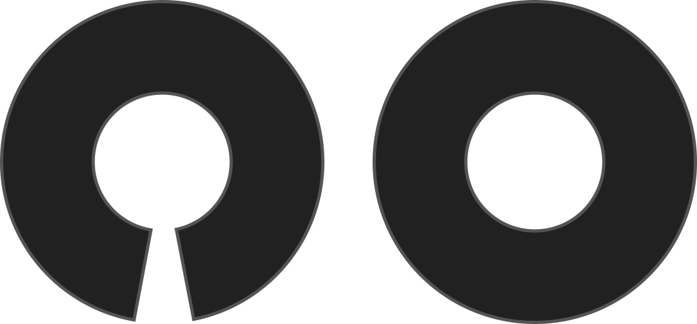

Wählen Sie 'Ja' für einen nahtlosen Kreis, der auf ein doppeltes Falten zugeschnitten wird. Da es keine Öffnungen hat, brauchen Sie ein elastisches Band.

<Note>

- Dies erzeugt einen Vollkreis, ohne die Option _Kreisprozent_ zu berücksichtigen.
- You may need to use the [gathering option](/docs/designs/sandy/options/gathering) to increase the waist circumference to fit over your seat/hips.
- You will need to set the [waistband overlap](/docs/designs/sandy/options/waistbandoverlap) to 0%.

</Note>

