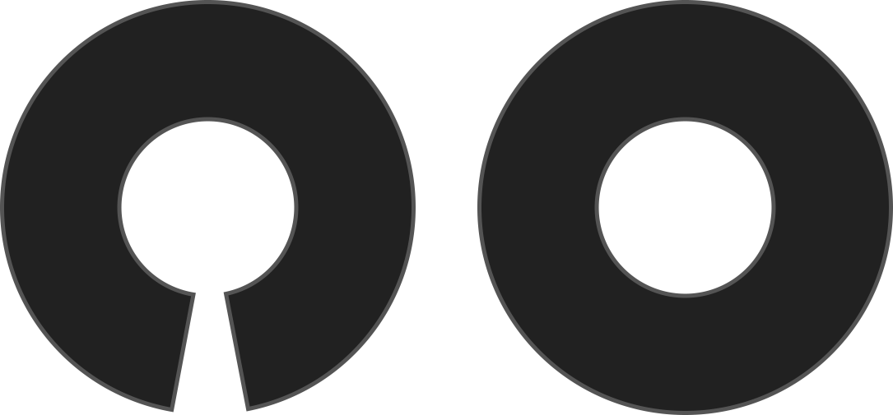

Sélectionnez 'oui' pour un cercle transparent, qui est coupé sur un double pli. Comme il n'a pas d'ouvertures, vous aurez besoin d'une bande de taille élastique.

<Note>

- This produces a full circle ignoring the _Circle percent_ option.
- You may need to use the [gathering option](sandy/options/gathering) to increase the waist circumference to fit over your seat/hips.
- You will need to set the [waistband overlap](sandy/options/waistbandoverlap) to 0%.

</Note>

## Effet de cette option sur le motif

