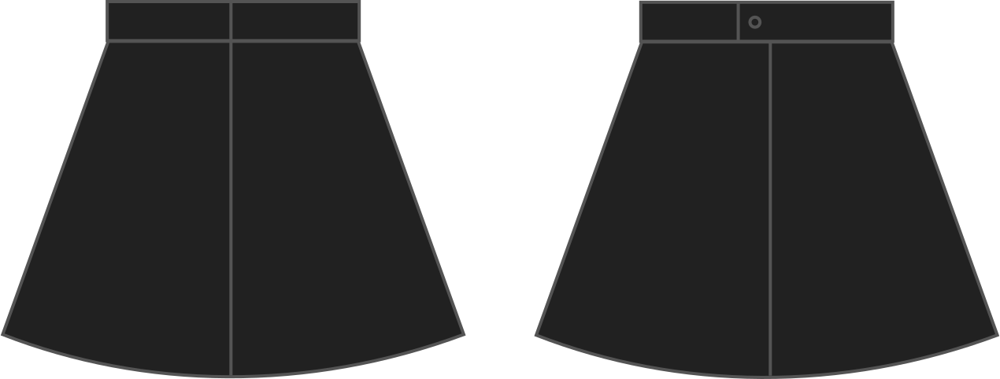

The length of the overlap between the ends of the waistband, to allow a button. 0 means no overlap, for example to place a zipper that goes all the way to the top of the waistband.

## Efecto de esta opción en el patrón

