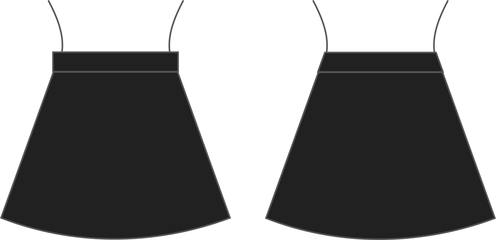

La forme de la ceinture. Droit facilite les choses, mais une ceinture arrondie s’adapte à votre corps si vous avez une juste différence entre la taille et les circonférences.

## Effet de cette option sur le motif

