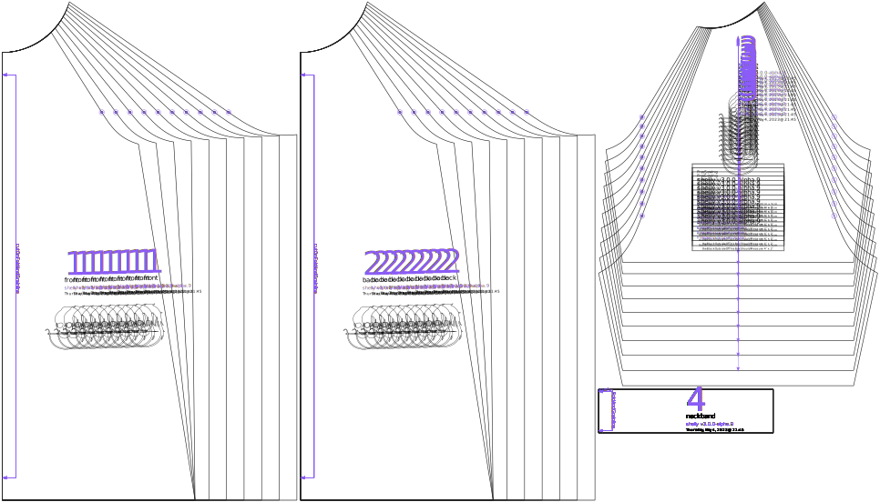

Controls how wide the shirt will be at your chest. Suggested values range from -30% for a tight sensory compression shirt made out of swim fabric, to 0% for a more casually fitted swim shirt, to +30% or more for a loose-fitting shirt made of less stretchy knit fabrics.

## Effect of this option on the pattern

