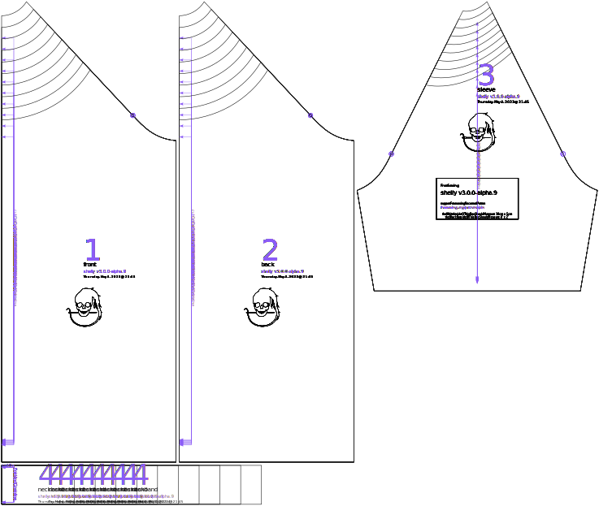

Controls how large the neck hole is. Keep in mind that most shirts have neck holes that are substantially larger than the wearer's neck, and that the neckband will further constrict the neck. 0% ease will make a very small neck hole that hugs the neck snugly and is hard to push over the head, even with stretch fabric. +50% will still make what's generally considered a tight neckband appropriate for a swim shirt. For t-shirts or for a loose fit, even larger values are recommended.

## Effect of this option on the pattern

