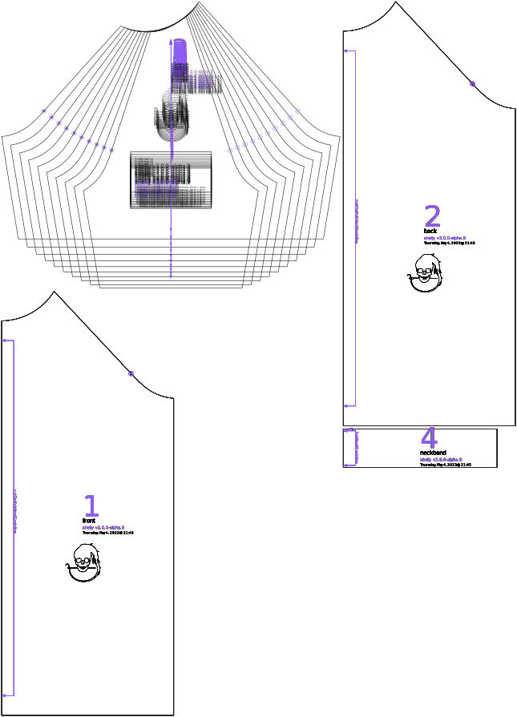

Affects how wide the sleeve is at the armhole on all shirts. For shirts that are less than 100% length, this option also affects how wide the sleeve is at the hem, with shorter sleeves being affected by this option to a greater degree, and longer sleeves being more affected by the wrist ease option. In most cases, this value should be set larger than chest ease, as the shoulders and arms are smaller and the same percentage of ease will translate to a smaller absolute ease. For compression clothes, shoulders also need more mobility than the chest, and very negative eases should generally be avoided for this option.

## Effect of this option on the pattern

