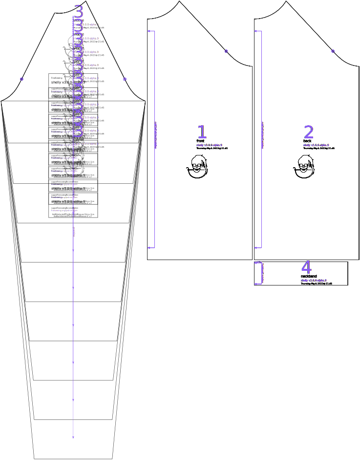

Controls the how long the sleeves of your shirt will be.
 - 15-30% will make short sleeves.
 - 75% will make three-quarter sleeves.
 - 100% will make long sleeves, stopping at the wrist.
 - 115% will make sleeves covering the knuckles, and is appropriate if using thumb holes.

## Effect of this option on the pattern

