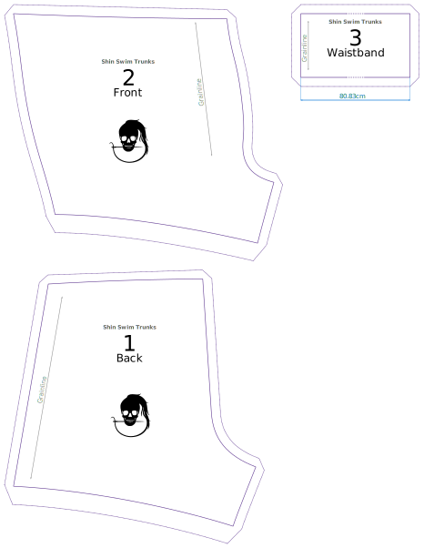

- Cut **2 backs** with good sides together
- Cut **4 fronts** 2 x 2 with good sides together
- Cut **1 waistband**

## Caveats

- To save paper, the waistband is not completely printed on the pattern since it's just a long rectangle. So look for the length indicator, and cut out a rectangle of that size.
- The hem allowance is double the standard seam allowance.

Shin is a very simply pattern, and consists of two main parts plus the waistband.

Below is a typical draft layout:

<Tip>

The [pattern notation guide][1] explains all the different markings and lines on your draft.

</Tip>
