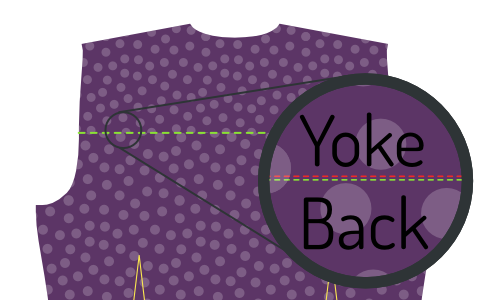
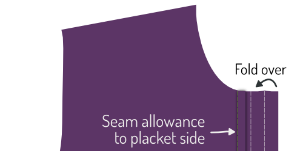
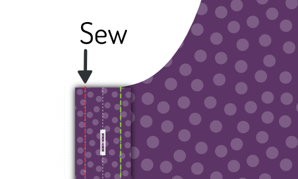
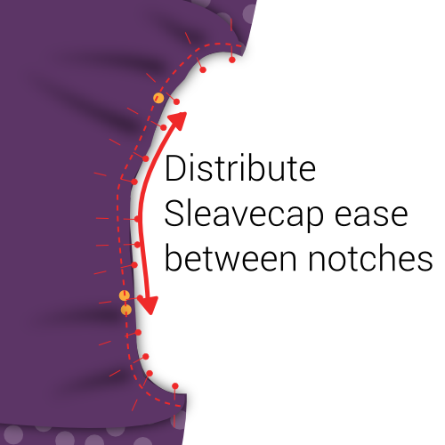

<Tip>

##### Folgen Sie dem Nähen mit Kelly und Julian

Kelly Hogaboom und Julian Collins haben eine Simon(e) mitnäht, und sie haben Videos von
alle Schritte.
Wenn Sie dieses Muster herstellen wollen, können Kelly und Julian Ihnen den Weg zum Ende weisen.

Du findest das gesamte Material auf Kellys Website
: [#simonsayssew mit kelly hogaboom & julian collins](https://agni.hogaboom.org/2020/07/simon-says-sew-with-kelly-hogaboom-and-julian-collins/)
</Tip>

### Schritt 1: Sicherungsschnittstelle

 

#### Drücken Sie die Schnittstelle zu Manschetten

Um zwei Manschetten herzustellen, haben Sie Ihr Manschettenstück viermal im Gewebe und zweimal in der Schnittstelle ausgeschnitten.

Drücken Sie für jede Manschette das Schnittstück auf die schlechte Seite des Manschettenstücks.

> Wenn die Innen- und Außenseite der Manschette der gleiche Stoff sind, spielt es keine Rolle, auf welche Manschette du sie drückst.
> 
> Ein beliebtes Detail im Stil ist jedoch, ein anderes Stoff für die Innenseite der Manschette zu haben. Achten Sie in diesem Fall darauf, die Schnittstelle zu dem Stück zu drücken, das Sie sein wollen, die Außenseite Ihrer Manschette zu sein.

> Je nachdem, welche Manschette Sie ausgewählt haben, ist die Form der Manschette unterschiedlich.
> 
> In der ersten Abbildung siehst du sowohl eine runde als auch eine französische Manschette als Beispiel.
> 
> In den Illustrationen wird die runde Barrel Manschette nach vorn verwendet, aber der Prozess ist der gleiche für die anderen Manschetten.

#### Vlieseline an Kragen, Unterkragen und Kragenständer bügeln

Um Ihren Kragen herzustellen, müssen Sie einen Unterkragen, einen Kragen und zwei Kragenständer schneiden. All dies sowohl im Gewebe als auch in der Schnittstelle.

Drücken Sie für jedes Stück auf die schlechte Seite.

### Schritt 2: Bereiten Sie die Manschetten vor

#### Nähschicht zusammen

Platzieren Sie beide Teile Ihrer Manschette (eine mit Schnittstelle, eine ohne Schnittstelle) zusammen mit den guten Seiten und nähen Sie sie an der Standardnaht zusammen.

> **Stell sicher, dass du**
> 
> - Nähen Sie nicht die Seite, die wir später an den Ärmel befestigen werden
> - Stoppe am Abstand der Naht von der Kante auf der Ärmelseite

#### Nahtzuweisung kürzen

Bevor wir dein Bündchen umdrehen, müssen wir die Nahtzugabe zurückschneiden, um den Stoff zu entfernen.

#### Drücken Sie die Naht zurück

Falte die Nahtzugaben auf beiden Seiten der Manschette zurück, wo die Manschette am Ärmel befestigt ist, und bügle sie nach unten.

> Wenn man früher zu weit am Rand genäht ist, muss man ein paar Nähte aufnehmen.

#### Schalte Manschette um und drücke

Drehen Sie Ihre Manschette mit den guten Seiten aus, und geben Sie ihr eine gute Presse.

> Wenn du deine Manschetten bügelst, achte darauf, dass du die Naht ein wenig auf die Rückseite der Manschette rollst, damit der innere Stoff der Manschette nicht sichtbar ist.

Du kannst nun deine Manschetten beiseite, wir werden sie später anhängen.

### Schritt 3: Bereiten Sie den Kragen vor

#### Nähen Kragen und Unterkragen zusammen

Lege beide Kragenteile mit den _guten Seiten zusammen_und nähe sie mit der normalen Nahtzugabe zusammen.

#### Nahtzuweisung kürzen

Bevor wir deinen Kragen umdrehen, müssen wir die Nahtzugabe zurückschneiden, um den Stoff zu entfernen.

#### Kragen drehen und drücken

Drehen Sie Ihren Kragen mit den guten Seiten aus, erhalten Sie diese Tipps so Pointy wie möglich, und geben Sie ihm eine gute Presse.

> Wenn Sie den Kragen drücken, denken Sie daran, dass der Unterkragen etwas enger ist.
> 
> Wenn du die nicht genähten Seiten ausrichtest, Dies führt dazu, dass die Naht nach der Rückseite des Kragens rollt, um zu gewährleisten, dass die Innenstruktur des Kragens nicht sichtbar ist.

#### Obere Stickkragen

Obere Naht am Rand des Kragens. Dadurch wird die Nahtzulage versperrt und ein knuspriges Aussehen erreicht.

> Wie weit Sie von der Kante oben sticken, ist eine Stilauswahl. Es ist oft ein bisschen weniger als die Standard Nahtzugabe. Werfen Sie einen Blick auf einige bestehende Hemden, um sich eine Idee zu machen.

### Schritt 4: Kragen- und Kragenstand verbinden

#### Platziere Kragen zwischen Kragen und Baste an Ort

Markieren Sie den Mittelpunkt des Kragens und der Kragen steht mit einem Pin. Der mittlere Punkt jedes Kragenständers ist eigentlich etwas außerhalb der Mitte, da das eine Ende länger als das andere ist. Stattdessen finden Sie den mittleren Punkt zwischen den beiden Noten.

Platziere zuerst einen Kragen mit der guten Seite nach oben, dann deinen Kragen mit dem nach oben gerichteten Unterkragen (und die nicht genähte Seite oben), und schließlich der zweite Kragen stehen mit der guten Seite.

Dein Kragen sollte zwischen den beiden Kragenständern sitzen und die Mittelpunkte (an denen du die Stecknadel platziert hast) sollten aufeinander ausgerichtet sein.

> Die Art und Weise, wie die Dinge aussehen, hängt ein wenig von Ihrer Kragenauswahl ab, aber im Allgemeinen wird Ihr Kragen nach unten gebogen, und Ihr Kragenstand wird nach oben gebogen.
> 
> Um das alles in Einklang zu bringen, werden wir das zusammenfügen und nicht anpinnen. Ihr Kragen ist ein wichtiger Teil Ihres Hemdes, daher lohnt es sich, diese zu backen.

Ersetzen Sie zunächst die Pins mit der Markierung der Mitte durch einen Pin, der alle Teile zusammenpinnt.

Nun beginnen Sie mit dem Basten von diesem Pin und arbeiten Sie Ihren Weg in die Ecke des Kragens, um sicherzustellen, dass beide Kanten des Stoffes.

Wenn Sie die Ecke des Kragens erreichen, gehen Sie weiter und ziehen Sie das Ende der beiden Kragen zusammen.

Wenn du eine Seite geschafft hast, fängst du wieder bei deinem Stift in der Mitte an und machst die andere Seite. Wenn Sie mit dem Basten fertig sind, können Sie den Pin herausnehmen.

#### Nähen Sie Ihren Kragen an den Kragenständern

Nähen Sie am Rand Ihres Kragenständers unter Einhaltung der üblichen Nahtzugabe.

> Achten Sie darauf, 2 cm vor der Kante zu stoppen (doppelt so viel wie die Standardnahterlaubnisse), da wir im nächsten Schritt die Naht überklappen. und wir müssen die Kragenständer ausreichend voneinander getrennt lassen, um das Hemd später zwischen ihnen hineinzurutschen.

#### Kantennahterlaubnis nach hinten drücken und den Kragen drücken

Falten Sie die Naht des Kragenständers auf der nicht genähten Seite zurück und drücken Sie sie nach unten.

> Im mittleren Teil wird das Drücken des Nahtzuges leicht sein. Aber in Richtung der Spitzen Ihres Kragens, wird dies ohne Drücken von Falten in Ihrem Kragen schwierig sein.
> 
> Drücke sie so gut wie möglich, ohne Falten in deinem Kragen zu machen. Wir drücken dies erneut, nachdem wir den Kragen raus geworfen haben.

#### Kragenstand drehen und drücken

Drehen Sie Ihren Kragen mit den guten Seiten aus, und geben Sie ihm eine gute Presse. Achten Sie darauf, dass die Naht auf dem Kragenständer nach innen gefaltet bleibt.

Sie können jetzt Ihren Kragen beiseite, wir befestigen ihn später.

### Schritt 5: Optional: Nähen in Ihrem Label

Unser nächster Schritt ist, das Joch zu befestigen. Aber das Joch ist ein großartiger Ort, um Ihr Label zu setzen. Wenn Sie das also tun möchten, können wir damit anfangen.

Wählen Sie ein Joch und Sie können Ihr Etikett in der Mitte (auf der guten Seite) nähen.

### Schritt 6: Trete den Yokes auf die Rückseite ein

 

Platziere ein Joch mit der guten Seite. Darüber hinaus legen Sie den Rücken mit der guten Seite nach oben, indem Sie die Naht dort ausrichten, wo sie am Joch angebracht werden muss.

Schließlich, platzieren Sie Ihr zweites Joch auf den Rücken, aber mit der guten Seite.

Dein Rücken sollte jetzt zwischen den guten Seiten deiner beiden Joche liegen.

Wenn dies der Fall ist, nähen Sie sie entlang der Rückennähte und achten Sie darauf, dass die Nahtzuweisung eingehalten wird.

> Wenn Sie ein Label in Schritt 1 hinzugefügt haben, stellen Sie sicher, dass das Joch mit Ihrem Label auf die schlechte Seite des Rückens gesetzt wird.

Wenn Sie fertig sind, vergessen Sie nicht, ihm eine gute Presse zu geben, um die Naht flach zu machen.

### Schritt 7: Kantenstich das Joch

Mit Ihren Jokes auf der Rückseite werden wir Kantenstich entlang der Naht, die wir gerade gemacht haben, auf der Joch Seite.

> Falte den inneren Joch aus dem Weg. Unsere Randnähte erfassen die äußere Passe, das Rückenteil und alle Nahtzugaben, aber nicht die innere Passe.

Nähen Sie einfach direkt neben der Naht und verbinden Sie das äußere Joch zur Rückseite.

> Kantenstich ist wie oben geheftet, aber direkt neben der Naht

### Schritt 8: Hintergrunddarts schließen

  

> Abhängig von Ihren Messungen kann es sein, dass Ihr Muster überhaupt keine Rückendarts hat. In diesem Fall fahren Sie mit dem nächsten Schritt fort.

Ihr Muster kann Rückendart haben oder nicht. Wenn er sie hat, sollten Sie sie jetzt schließen.

Platziere deinen Rücken mit der guten Seite nach oben und falten Sie es von der Seitennaht zurück, so dass die Falte von oben bis unten läuft.

Machen Sie das gleiche für den anderen Dart, so dass beide Seiten geklappt werden.

Fühlen Sie sich frei zu drücken in dieser Kreise, es wird Ihnen helfen, sauber nähen die Darts.

Nähen Sie über die Linie, die den Dart markiert, um die Darts zu schließen. Achten Sie darauf, dass die Darts oben und unten genau dort sind, wo sie sein müssen. Wenn der eine Dart höher sitzt als der andere, wird er schlecht aussehen.

Wenn du fertig bist, vergiss nicht, ihm eine gute Presse zu geben. Drücken Sie den zusätzlichen Stoff des Darts in Richtung der Seitennaht.

### Schritt 9: Bereiten Sie den Tastenplatz vor

> Wenn du einen Platz gewählt hast, kannst du die ersten beiden Unterschritte überspringen und zum [Button-Platzhalter](#fold-the-button-placket) Falten gehen.

#### Nähen auf Knopf-Platzhalter

Wenn Sie eine separate Schaltflächenplatzierung gewählt haben, nähen Sie sie auf das Stück vorne rechts.

Platziere die Vorderseite rechts (Teil 1) mit der guten Seite nach oben und platzieren Sie den Button Placket (Teil 1b) mit der guten Seite nach unten, um die Naht auszurichten.

Nähen Sie es mit der standardmäßigen Nahtzugabe.

#### Drücken Sie Nahtzugriff auf die Platzierungsseite

Platzieren Sie Ihre Vorderseite mit der guten Seite nach unten und drücken Sie die Nahtmenge auf die Tastenseite.

#### Tastenplatzierung falten

Nun falten Sie über die Tastenplatzierung auf der ersten Faltlinie, und drücken Sie diese Falte an der Stelle.

Dann falten Sie die Platte noch einmal und sorgen Sie dafür, dass der Stoff sich über die Naht hinaus ausdehnt, die Ihr Platz an der Vorderseite verbindet.

Wenn Sie zufrieden sind, drücken Sie die gefaltete Platte.

#### Nähen Sie den gefalteten Platzhalter

> Das ist der klassische Ansatz. Wenn Sie den nahtlosen Schaltflächen-Stil gewählt haben, müssen Sie das nicht tun.
> 
> Anstatt die Platte zu nähen, lassen Sie sie einfach falten. Wenn wir die Tasten später befestigen, werden die Falten gesichert.

Von der guten Seite Ihres Hemdes nähen Sie das gefaltete Plakat durch Nähen im Graben.

Um dies zu tun, nähen Sie genau auf Ihrer früheren Naht. Da du den Stoff deiner Leiste ein wenig über diese Naht hinaus gefaltet hast, wird sie hinten eingeklemmt, wodurch deine gefaltete Leiste fixiert und die Nahtzugabe innen festgehalten wird.

### Schritt 10: Bereiten Sie das Buttonhole Placket vor

> Wenn Sie einen ausgewachsenen Platz gewählt haben, können Sie die ersten beiden Unterschritte überspringen und einen klassischen Knopflochplatz verstehen.

#### Nähen auf dem Knopflochplatz

Wenn Sie einen separaten Knopflochplatz gewählt haben, nähen Sie ihn in das Stück vorne links.

Platziere die Vorderseite links (Teil 2) mit der guten Seite nach oben und platzieren Sie das Buttonhole Placket (Teil 2b) mit der guten Seite, um die Naht auszurichten.

Nähen Sie es mit der standardmäßigen Nahtzugabe.

Wenn du fertig bist, vergiss nicht, ihm eine gute Presse zu geben. Drücken Sie die Nahtmenge auf die Seitenseite.

#### Drücken Sie die Naht Erlaubnis auf die Platzhalterseite

Platzieren Sie Ihre Vorderseite mit der guten Seite nach unten und drücken Sie die Nahtzuweisung auf die Seite des Buttonlochs.

#### Ein klassisches Knopflochplacket verstehen

> Wenn Sie ein nahtloses Platzieren gewählt haben, sollten Sie die Schritte der Tastenplatzierung befolgen, da die Konstruktion identisch ist.
> 
> Die folgenden Schritte sind für einen klassischen Knopflochplatz vorgesehen.

Ihr Platzhalter hat einen Haufen Zeilen, also lassen Sie uns zuerst klarstellen, was sie sind:

- Die Knopflochlinie hat lange Bindestriche mit Knöpfen. Es markiert, wohin die Buttonlöcher gehen sollen
- Die beiden Faltlinien haben lange Bindestriche und sitzen in gleicher Entfernung rechts und links von der Tastenlochlinie
- Die zwei+zwei Nählinien sind gepunktete Linien, die in gleicher Entfernung jeder Faltlinie sitzen

#### Rückennahterlaubnis kürzen

> Wenn Sie einen ausgewachsenen Platz gewählt haben, gilt dies nicht.

Die Nahtzugabe, wo Sie Ihren Knopflochplatz auf der Vorderseite genäht haben, sollte in Ihren gefalteten Platz passen.

Dazu die Nahtzuweisung zurückdrehen, so dass sie nicht über die erste Faltlinie auf dem Platzhalter hinausgeht.

#### Knöpfchen-Platzhalter falten

 

Falten Sie die Platte auf der ersten Faltlinie. Drücken Sie die Falte an der Stelle.

Dann falten Sie das Teil, das Sie gerade wieder gefaltet haben, dieses Mal auf der zweiten Faltlinie. Drücken Sie auch diese Falte.

> Wenn Ihr Platzhalter gefaltet und gedrückt wird, platzieren Sie ein paar Pins entlang der Länge Ihres Platzhalters, um zu verhindern, dass sich die Dinge umdrehen

#### Nähen Sie den Knopflochplatz

 

Nähen Sie die erste Nählinie, die der Kante am nächsten ist.

Dann drehen Sie Ihr Shirt um, damit die gute Seite aufwärts ist, und Ihr Stick ist auch hoch. Dann nähen Sie an der zweiten Nählinie.

> Diese beiden Linien werden immer sichtbar sein, also achten Sie darauf, dass sie sauber bleiben

#### Drücken Sie den Knopflochplatz

Herzlichen Glückwunsch, Sie haben einen klassischen Knopflochplatz gemacht.

Drücke nun das Baby. Sie wissen, dass Sie es wollen.

### Schritt 11: Die Schulternähte schließen

> **Lass uns ein Burrito erschaffen**
> 
> Wir werden die Schulternähte mit einer Technik schließen, die allgemein als **Burrito-Methode**bekannt ist.
> 
> Wenn Sie mit der Burrito-Methode vertraut sind, wissen Sie bereits, was zu tun ist. Wenn nicht, lesen Sie weiter für einen geschickten Weg, um die Schulternähte Ihres Hemdes sauber zu schließen und alle unvollendeten Kanten aus dem Blick zu sperren.

#### Pin die Fronten nach außen

 

Platzieren Sie Ihren Rücken mit der guten Seite nach oben, aber achten Sie darauf, das innere Joch nach unten zu falten (wie die gepunktete Linie veranschaulicht.

Legen Sie Ihre Fronten auf den Rücken mit den guten Seiten nach unten. Pin vorne an der Schulternaht, gute Seiten zusammen.

#### Rollen, rollen, Hemd rollen, Nähen und Nähen

Roll den Rücken hoch und die Fronten beginnen am Sam. Bringe sie in eine saubere Wurst nach oben, bis du das gesamte abgewiesene Joch sehen kannst.

Jetzt können Sie das innere Joch über Ihre Walzwurst ziehen, um die Schulternähte mit dem anderen Joch und den anderen Fronten auszurichten.

Nähen Sie sie an Ort und nähen Sie dann die Schulternähte, Achten Sie darauf, Ihre Wurst (oder Burrito-Füllung) aus dem Weg zu räumen, damit sie nicht in der Naht gefangen wird.

> Hergestellt um die aktuelle Nahtlinie auszurichten. Durch die ungleichen Winkel an der Halsöffnung ist der Stoffrand oft länger als auf der anderen Seite.
> 
> Die Nahtlinien sind jedoch gleich lang, also achte darauf, dass du sie mithilfe der Einkerbungen sorgfältig aufeinander abstimmst.

#### Innen durch den Nackenöffner drehen

Wenn Sie beide Schulternaht nähen, erreichen Sie durch die Nackenöffnung und ziehen Sie die Rücken- und Frontteile nach innen aus.

#### Drücke die Schulternähte

Du hast all diese Arbeit gemacht, so jetzt stelle sicher, dass du es super scharf aussiehst, indem du ihm eine gute Presse gibt. Achten Sie darauf, dass die Naht zwischen Ihren Yokes schön und flach ist.

### Schritt 12: Kantenstich die Schulternähte des Joch

So wie wir in Schritt 3 die untere Naht des Joch mit Kanten geheftet haben, werden wir das Joch auch an den Schulternähten einnähen.

Da Sie gerade diese Schulternaht gedrückt haben, sollte alles schön und flach liegen, und Sie müssen nur einen Stitch direkt neben der Naht betreiben.

> Vergewissern Sie sich, dass Sie die Naht nicht auf dem vorderen Teil, sondern auf dem Jokerteil einstichten.

### Schritt 13: Bauen Sie den Ärmelplatz

#### Nähen im Manschettenwächter

  

- Platzieren Sie Ihren Ärmel mit der guten Seite nach unten, und Ihre Manschettenwächter nach oben, auch mit der guten Seite.
- Legen Sie den Rand Ihres Manschettenwächters (alias Sleeve Placket Unterklappen) mit dem Schnitt in Ihrem Ärmel, auf der Seite kürzer zur Seitennaht.
- Nähen Sie nun entlang der Faltlinie, die auf der Manschettenwand markiert ist, näher an der Kante.

> Wenn du beim Ausschnitt deiner Musterstücke nicht in den Ärmel geschnitten hast, an dem der Ärmel eingefügt werden muss Sie müssen das zuerst tun.

- Falte über die Manschettenwache und drücke diese Naht.
- Drehen Sie Ihren Ärmel mit der guten Seite nach oben und bringen Sie Ihre Manschettenwächter durch den Schlitz in den Ärmel.
- Falten Sie es zweimal auf die Linien, so dass die unfertige Naht nach innen geklebt ist.
- Mache deine Falten so, dass die obere Falte etwas weiter als die Naht sitzt, die du bereits gemacht hast.
- Drücken Sie alles nach unten und dann Kantenstich die Manschettenwache.

#### Falten und platzieren drücken

Origami Zeit! Die Überlappung der Ärmel erfolgt mit den markierten Faltlinien als Anleitung. Dies wird viel einfacher sein, wenn Sie zwischen den beiden Seiten drücken.

- Zuerst die äußeren Kanten des Platzes nach innen falten.
- Dann faltest du das Ganze in der Hälfte.
- Dann falten Sie beide Spitzen in eine schöne spitzige Form.
- Jetzt geben Sie ihr eine letzte gute Presse.

#### Platzhalter an Stelle anheften

 

Legen Sie den Ärmel nach unten mit der guten Seite. Die Wache, die wir früher genäht haben, sitzt gegen den anderen unfertigen Stoffrand, wo du in deinen Ärmel geschnitten hast.

Platzieren Sie Ihr Plakat um diese Kante, eine Seite über ihr, einen darunter.

Sie müssen den Platzhalter auf den Ärmel schieben, bis sich die Mitte des Platzes an den Schnitt im Ärmel orientiert.

Die Idee ist, dass die Platte die unfertige Kante schließt, aber auch die Wache der anderen Kante bedeckt.

Wenn Sie es dort haben, wo Sie es wollen, kleben Sie die Platzierung nach unten.

#### Nähen Sie den Ärmel Placket

Beginnen Sie am Rand des Ärmels (die Unterseite des Ärmelpflasters) und den Kantenstich nach oben.

Gehen Sie um die Spitze und fahren Sie auf der anderen Seite (die Faltseite), bis Sie den Punkt erreicht haben, an dem Ihre Wache endet.

Nähen Sie dann waagerecht an die andere Seite der Leiste, um sie fertigzustellen.

> Ich habe hier eine zusätzliche Illustration hinzugefügt, die nur die Umrisse des Platzhalters anzeigt. Sie können sehen, dass das Ende der Wache in unserem Heften des Platzes gefangen ist und somit sauber verklebt ist.

### Schritt 14: In Ärmeln setzen

#### Denken Sie daran, dies ist eine flachgelockte Naht

> **Careful with the extra seam allowance for the flat-felled seam** There is extra seam allowance on the sleeve to allow for the creation of the flat-felled seam.
> 
> Seien Sie also darauf bedacht, nicht den Stoffrand auszurichten, sondern die Naht so auszurichten, dass der Ärmel 1 cm aussetzt.

#### Pin-Hülse an Ort und Stelle

Verteilen Sie Ihr Shirt offen, so dass sowohl Vorder- als auch Rückseite flach mit ihren guten Seiten nach oben liegen.

Lege nun deinen Ärmel mit der guten Seite nach unten auf, so dass die Oberseite des Ärmels mit der Schulternaht übereinstimmt.

> Achte darauf, dass dein Ärmel nicht symmetrisch ist. Achte also darauf, dass die hintere Kerbe (⊗) und der Manschettenschutz auf der Rückseite und die vordere Kerbe (⊙) auf der Vorderseite sind.
> 
> Beachte auch, dass die hintere Kerbe (⊗) am Ärmel keine entsprechende Kerbe auf der Rückseite des Hemdes hat. Das liegt daran, dass sie mit der Naht übereinstimmen sollte, an der deine Passe mit dem Rücken verbunden ist.

Jetzt musst du den Ärmel an das Armloch anbringen. Um dies zu tun, achten Sie auf:

- Stelle den Anfang und das Ende des Ärmelkopfes an den Anfang und das Ende des Armlochs fest
- Passen Sie die Noten auf dem Ärmelkopf an die Noten auf der Rückseite und auf der Vorderseite an
- Verteilen Sie die Ärmel Leichtigkeit auf die Noten wie gezeigt

#### Einfaches Verteilen von Ärmelkappen

Die Standard-Ärmel-Leichtigkeit für dieses Muster ist 0,5cm. Wenn Sie die Ärmel bequem haben, müssen Sie diese zusätzliche Länge gleichmäßig auf die Noten verteilen, wie sie gezeigt werden.

> Wenn Sie sich nicht sicher sind, welche Leichtigkeit die Ärmel ist, werfen Sie einen Blick in die [-Dokumentation für die Option „Sleevecap ease“-Muster](/docs/designs/simon/options/sleevecapease).

#### Ärmel in Armloch nähen

Wenn du deinen Ärmel ordentlich in dein Armband gesteckt hast, nähe ihn an Platz. Seien Sie vorsichtig und vermeiden Sie Falten im Teil zwischen den Noten, wo Sie in der Ärmel Leichtigkeit erleichtert werden müssen.

> Selbstredend zu sagen, aber ich sage es trotzdem: Wiederholen Sie diesen Schritt für den anderen Ärmel.

### Schritt 15: Flach fallende Rüstungsnaht

#### Drücken Sie die Naht Erlaubnis auf eine Seite

Lege deine frisch genähte Ärmelnaht mit der guten Seite nach unten

Wir werden die Nahtzuweisung beiseite schieben. Um dies zu tun, identifizieren Sie die Nahtzugabe, die breiter ist (für die flache Nahtnaht).

Die längere Nahtmenge muss zusätzlich zu den kürzeren (Standard Nahtzustand) liegen.

Sobald Sie das überprüft haben, drücken Sie die Nahtzugabe.

#### Unter zusätzlichem Nahtzuwachs falten

Nun falten Sie die zusätzliche Nahtzuweisung für die flache Naht unter der üblichen Nahtzugabe.

Du kannst die Pins verwenden, um sie an der Stelle zu halten, aber es ist einfacher, sie einfach zu drücken.

> Das wird relativ einfach an den geraden Teilen der Naht sein, aber etwas komplizierter an den gebogenen Abschnitten. Nehmen Sie sich Zeit, und bei Bedarf können Sie in die zusätzliche Nahtmenge schneiden, um es zu ermöglichen, offen oder biegen.

#### Nähen Sie die flachgeschlagene Naht

Von der schlechten Seite des Stoffes aus nähen Sie die Nahtzufuhr an der Kante, wo sie unter die andere Nahtzulage gefaltet ist.

Hier ist es wichtig, dass du einen gleichmäßigen Abstand zur Naht deines Ärmels einhältst. Wenn Sie einen Holzfuß für Ihre Nähmaschine haben, hilft Ihnen das weiter. Aber wenn nicht, seien Sie nur vorsichtig.

> Es ist wichtiger, die Ärmelnaht zu halten und sogar zu entfernen, als genau am Fadenrand zu nähen. Im Idealfall sitzt die Falte ohnehin in gleichmäßiger Entfernung, aber wenn nicht, vergewissern Sie sich, dass sie parallel zur Ärmelnaht näht. Auch wenn das bedeutet, dass Sie ein bisschen von der gefalteten Kante abweichen.

#### Drücke die flache Naht

Wenn alles erledigt ist, drücken Sie die flachgeschliffene Naht von der guten Seite, so dass sie schön und flach liegt.

### Schritt 16: Schließen Sie die Seiten/Ärmel Nähte

 

Platzieren Sie Ihr Shirt mit den guten Seiten zusammen, und nähen Sie die Seite und die Ärmel Nähte, um das Hemd zu schließen.

> Auf den Ärmeln und den Vorderseiten wird ein zusätzlicher Nahtzuschlag gewährt, um die flache Naht herzustellen. Achten Sie daher darauf, den Stoffrand nicht auszurichten, sondern die Naht so auszurichten, dass die zusätzliche Nahtmenge 1 cm beträgt.

### Schritt 17: Flach fiel die Seite/Ärmel Nähte

#### Drücken Sie die Naht Erlaubnis auf eine Seite

Wir werden die Nahtzuweisung beiseite schieben. Um dies zu tun, identifizieren Sie die Nahtzugabe, die breiter ist (für die flache Nahtnaht).

Die längere Nahtmenge muss zusätzlich zu den kürzeren (Standard Nahtzustand) liegen.

Sobald Sie das überprüft haben, drücken Sie die Nahtzugabe.

#### Unter zusätzlichem Nahtzuwachs falten

Nun falten Sie die zusätzliche Nahtzuweisung für die flache Naht unter der üblichen Nahtzugabe.

Du kannst die Pins verwenden, um sie an der Stelle zu halten, aber es ist einfacher, sie einfach zu drücken.

> Das wird relativ einfach an den geraden Teilen der Naht sein, aber etwas komplizierter an den gebogenen Abschnitten. Nehmen Sie sich Zeit, und bei Bedarf können Sie in die zusätzliche Nahtmenge schneiden, um es zu ermöglichen, offen oder biegen.

#### Nähen Sie die flachgeschlagene Naht

Von der schlechten Seite des Stoffes aus nähen Sie die Nahtzufuhr an der Kante, wo sie unter die andere Nahtzulage gefaltet ist.

Wichtig dabei ist, dass du einen gleichmäßigen Abstand zur Naht deines Ärmels einhältst. Wenn Sie einen Holzfuß für Ihre Nähmaschine haben, hilft Ihnen das weiter. Aber wenn nicht, seien Sie nur vorsichtig.

> Es ist wichtiger, die Ärmelnaht zu halten und sogar zu entfernen, als genau am Fadenrand zu nähen. Im Idealfall sitzt die Falte ohnehin in gleichmäßiger Entfernung, aber wenn nicht, vergewissern Sie sich, dass sie parallel zur Ärmelnaht näht. Auch wenn das bedeutet, dass Sie ein bisschen von der gefalteten Kante abweichen.

#### Drücke die flache Naht

Wenn alles erledigt ist, drücken Sie die flachgeschliffene Naht von der guten Seite, so dass sie schön und flach liegt.

### Schritt 18: Befestige Manschetten an Ärmel

#### Pin Manschette an Stelle

Du musst den Ärmel zwischen die beiden Lagen deines Bündchens legen und dabei darauf achten, dass die gute Seite des Stoffes an der Seite deines Bündchens anliegt, auf der die Einlage angebracht ist.

Sie müssen diesen Platz anpinnen, denn je nachdem, wie lange Ihr Sleeve-Placket ist, Es könnte schwierig oder gar unmöglich sein, diese zu flachen.

Beachten Sie auch, dass Ihre Ärmelkante länger als Ihre Manschette ist (wie viel länger hängt von der Ärmel Drape). Du musst ein oder ein paar Falten in deinem Ärmel herstellen, um dafür zu passen.

> Dein Schnittmuster enthält Hilfslinien auf dem Ärmel, die dir helfen, die Falten zu platzieren.

> Nehmen Sie sich Zeit, alles sorgfältig zu fixieren. Das Bündchen wird später an der Kante abgesteppt, deshalb ist es wichtig, dass die Vorder- und Rückseite des Bündchens gut zusammenpassen.

#### Kantenstich Manschetten an Ärmel

Sobald alles fixiert ist, wird der Rand am Rand der Manschette geheftet, um sie an der Ärmel zu befestigen.

Es ist wichtig, dass du sowohl die äußere als auch die innere Schicht deines Bündchens an der Kante erwischst.

> Vergewissern Sie sich, dass die Kantenstich von der Außenseite (die gute Seite des Ärmels) und halten Sie sie parallel zur Manschettenkante.

Wenn du fertig bist, gib deinen Manschetten eine gute Presse.

#### Obere Stich die Manschetten

> Drücken Sie Ihre Manschetten bevor Sie dies tun.

Hochsticheln um die Manschette in einem Abstand vom Kantenrand, das etwas geringer ist als die Nahtzugabe. Gehen Sie den ganzen Weg um Ihre Manschette.

### Schritt 19: Den Kragen anhängen

#### Kragen an Ort einfügen

Dies ist eine wichtige Naht, daher werden wir diese an der richtigen Stelle platzieren, um sicherzustellen, dass sie genau richtig sitzt, bevor wir sie nähen.

Beginnen Sie mit der Mitte zurück und legen Sie die Naht des Rückenteils zwischen Ihren beiden Kragenständern. Bearbeite dich um die eine Seite herum und dann die andere.

Achten Sie darauf, dass Sie die reguläre Nahtzuweisung respektieren und - wichtig - jegliche Falten vermeiden.

> Während Ihr Kragenständer relativ geradlinig ist, werden wir es zu einem im Grunde genommen Loch in Ihrem Hemd nähen.
> 
> Das ist ein bisschen kompliziert, also achten Sie besonders auf die Teile, die am meisten gekrümmt sind: wo der Rücken verbindet die Fronten.

#### Kantenstichkragen an Stelle

 

Wenn du zufrieden bist mit der Art und Weise, wie du deinen Kragen an Ort und Stelle verankert hast, ist es an der Zeit, diese Sache nach unten zu nähen.

Wir beginnen in der hinteren Mitte und nähen rund um den Kragensteg.

#### Nähen am Kragenrand

Um Ihrem Kragen mehr Körper zu geben und ihn fest zu sichern, werden wir am oberen Rand des Kragenständers nähen.

Nähen Sie etwa die Hälfte der Naht von Ihrer früheren Kantenstichung. Achten Sie darauf, ein paar cm vor dem Ende des Kragens zu stoppen.

> Sie müssen ein paar cm vor dem Ende des Kragens stoppen (beachte: das Ende des Kragens, so dass diese Naht vollständig bedeckt ist, wenn der Kragen heruntergeklappt wird.

#### Drücke den Kragen

Jetzt da der Kragen angehängt ist, geben Sie ihm eine gute Presse.

### Schritt 20: Hem dein Hemd

  

Zeit, den Saum zu beenden (das ist das Teil, das du in deiner Hose steckst).

Schließen Sie die Hälfte der Saummenge ab und drücken Sie nach unten. Dann klappen Sie wieder und drücken Sie erneut.

Nun nähst du an der oberen Kante entlang, um den Saum fertigzustellen.

### Schritt 21: Tastenlöcher erstellen

Wenn Sie dies nicht zuerst getan haben, markieren Sie alle Orte, an denen Sie Buttonlöcher haben sollten.

Sie sitzen entlang der Frontschließung und an Ihren Manschetten.

Wenn Sie sie markiert haben, machen Sie dort Schaltflächen.

### Schritt 22: Buttons anhängen

Schließen Sie Ihr Shirt ab, um den Platz der Buttonlöcher auf die Tastenseiten zu übertragen.

Wenn Sie markiert haben, wo Buttons gehen sollen, nähen Sie sie ein.

> Anstatt die Position der Tasten aus dem Muster zu markieren, ziehe ich es vor, die Position der erzeugten Tasten zu übertragen.
> 
> Auf diese Weise, wenn ein Knopfloch ein bisschen an der Stelle sitzt, wird der Knopf einfach folgen.

