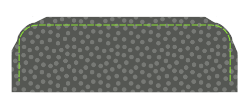
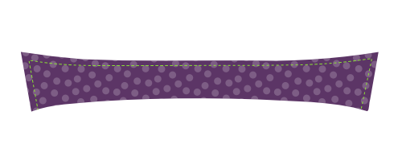
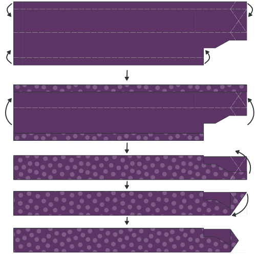
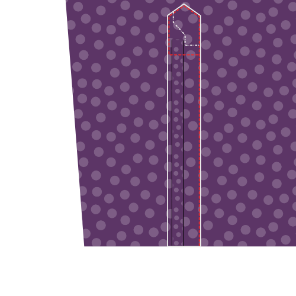
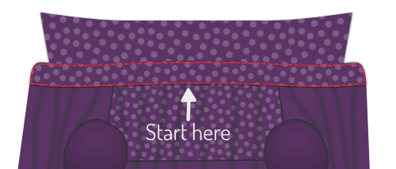

<Tip>

##### Siga la costura junto con Kelly y Julian

Kelly Hogaboide y Julian Collins hicieron una costura Simon(e) , y tienen videos de
todos los pasos.
Si estás buscando este patrón, Kelly y Julian pueden guiarte a empezar a terminar.

You can find all the material's on Kelly's
site: [#simonsayssew with kelly hogaboom & julian collins](https://kelly.hogaboom.org/2020/07/simon-says-sew-with-kelly-hogaboom-and-julian-collins/)

</Tip>

### Paso 1: Fusionar interfaz

 

#### Interfaz de prensa a tazas

To make two cuffs, you have cut out your cuff piece four times in fabric, and twice in interfacing.

For each cuff, press the interfacing piece to the bad side of the cuff piece.

> Si el interior y el exterior de tu taza son el mismo tejido, no importa a qué pieza de corte lo pulsas.
> 
> Sin embargo, un detalle de estilo popular es tener un tejido diferente para el interior del tazón. En este caso, asegúrese de pulsar la interfaz con la pieza que desea ser el exterior de su taza.

> Dependiendo de qué corte haya elegido, la forma del corte será diferente.
> 
> In the first illustration, you can see both a round barrel cuff and a French cuff as examples.
> 
> En el futuro, el cubo redondo se utilizará en las ilustraciones, pero el proceso es el mismo para las otras tazas.

#### Press interfacing to collar, undercollar and collar stand

To make your collar, you need to cut one undercollar, one collar, and two collar stands. All of this both in fabric and interfacing.

For each piece, press the interfacing piece to the bad side.

### Paso 2: Prepara los cuffs

#### Difunde juntos

Place both parts of your cuff (one with interfacing, one without) together with the good sides, and sew them together at the standard seam allowance.

> **Ensure you**
> 
> - No coser juntos el lado que nos uniremos a la manga más tarde
> - Detener en la distancia de costura desde el borde del lado de la manga

#### Recortar permisos de costura

Before we flip your cuff over, we need to trim back the seam allowance to remove bulk.

#### Presione la costura posterior

Fold back the seam allowances on each side of the cuff where the cuff attaches to the sleeve, and press them down.

> Si te has costado demasiado a lo largo del borde antes, tendrás que deseleccionar unas cuantas stitches.

#### Da la vuelta y presiona

Flip your cuff with the good sides out, and give it a good press.

> When pressing your cuffs, make sure to roll the seam a bit to the backside of the cuff to guarantee that the inner fabric of the cuff is not visible.

You can now put your cuffs aside, we'll attach them later.

### Paso 3: Prepara el cuello

#### Difunde cuello y cuello bajo

Place both collar parts with the _good sides together_, and sew them together at the standard seam allowance.

#### Recortar permisos de costura

Before we flip your collar over, we need to trim back the seam allowance to remove bulk.

#### Gira el collar y presiona

Flip your collar with the good sides out, get those tips as pointy as possible, and give it a good press.

> Cuando presione el cuello, recuerde que el guante inferior es un poco más estrecho.
> 
> Cuando alineas los lados no cocidos, esto hará que la costura se mueva hacia la parte trasera del cuello para garantizar que la tela interna del cuello no es visible.

#### Cuello de empate

Top-stitch along the edge of the collar. This locks down the seam allowance and makes for a crisp look.

> Qué tan lejos de la parte superior del borde es una elección de estilo. A menudo es un poco menor que la franquicia de costura estándar. Echa un vistazo a algunas camisetas existentes para hacerte una idea.

### Paso 4: Únete al collar y al collar

#### Coloca el cuello entre los soportes de cuello y baste en su lugar

Mark the middle point of your collar and your collar stands with a pin. The middle point of each collar stand is actually slightly off-center since one end is longer than the other. Instead, find the middle point between the two notches.

First place a collar stand with the good side up, then your collar with the undercollar facing up (and the non-sewn side at the top), and finally the second collar stand with the good side down.

Your collar should sit between your two collar stands, and the middles (where you placed your pin) should be aligned.

> La forma en que las cosas se vean dependerá un poco de tus opciones de cuello, pero en general su cuello se va a doblar hacia abajo, y su soporte de cuello se doblará hacia arriba.
> 
> Para alinear todo esto, vamos a bastarlo juntos, en lugar de fijarlo. Tu cuello es una parte importante de tu camiseta, así que vale la pena degustar esto.

First, replace the pins marking the middle with a pin that pins all parts together.

Now, start basting from this pin and work your way to the corner of the collar, making sure to align both edges of the fabric.

When you reach the corner of your collar, keep going and baste the end of both collar stands together.

When you've done one side, start from your pin in the middle again and do the other side. When you're done basting, you can take out the pin.

#### Difunde tu cuello hasta los stands de cuello

Sew along the edge of your collar stand, respecting the standard seam allowance.

> Asegúrate de parar 2cm antes del borde (dos veces la franquicia estándar de costura) ya que en el siguiente paso vamos a doblar la franquicia de costura y tenemos que dejar los soportes de cuello lo suficientemente separados para deslizar la camisa entre ellos más adelante.

#### Doble hacia atrás y presiona la franquicia de costura

Fold back the seam allowance of your collar stand on the non-sewn side and press it down.

> En la parte central, pulsar hacia abajo la franquicia de costura será fácil. Pero hacia las puntas de su cuello, hacerlo será complicado sin pulsar pliegues en su cuello.
> 
> Press it as best as you can without making folds in your collar. Presionaremos esto de nuevo después de voltear el cuello.

#### Da la vuelta al collar y presiona

Flip your collar stand with the good sides out, and give it a good press. Make sure to keep the seam allowance on the collar stand folded inwards.

You can now put your collar aside, we'll attach it later.

### Paso 5: Opcional: Empuje en su etiqueta

Our next step is to attach the yoke. But the yoke is a great place to put your label. So if you'd like to do that, we might as well start with that.

Pick one yoke, and you can sew your label on it in the center (on the good side).

### Paso 6: Únete a la espalda

 

Place one yoke with the good side up. On top of that, place your back with the good side up, aligning the seam where it needs to be attached to the yoke.

Finally, place your second yoke on top of the back, but with the good side down.

Your back should now be sandwiched between the good sides of your two yokes.

If that's the case, sew them in place along the back/yoke seam, making sure to respect the seam allowance.

> Si ha añadido una etiqueta en el paso 1, asegúrese de poner el yugo con la etiqueta en el lado malo de la espalda.

When you're done, don't forget to give it a good press to make the seam lie flat.

### Paso 7: Enrollar el yugo

With your yokes attached to the back, we are going to edge-stitch along the seam we just made, on the yoke side.

> Doble el yugo interior fuera del camino. Our edge stitching will catch the outer yoke, back and all the seam allowances, but not the inner yoke.

Just sew right next to the seam joining the outer yoke to the back.

> Encender los bordes es como la parte superior, pero justo al lado de la costura

### Paso 8: Cierra los dardos traseros

  

> Dependiendo de sus mediciones, es posible que su patrón no tenga dardos atrás. En ese caso, pasemos al siguiente paso.

Your pattern may or may not have back darts. If it has them, you should close them now.

Place your back down with the good side up, and fold it back from the side seam so the fold runs from the top to the bottom of your dart.

Do the same for the other dart, so that both sides are folded back.

Feel free to gently press in this crease, it will help you to neatly sew the darts.

Sew across the line marking the dart to close the darts. Be careful to make sure the top and bottom of your darts are precisely where they need to be. If one dart sits higher than the other, it will look bad.

When you're done, don't forget to give it a good press. Press the extra fabric of the dart towards the side seams.

### Paso 9: Prepara la posición del botón

> Si has elegido un placket de grown-on, puedes saltar los dos primeros sub-pasos y saltar a [Plegar el placket de botón](#fold-the-button-placket).

#### Difusión en la placket de botones

If you have chosen a separate button placket, sew it to the Front Right piece.

Place the Front Right (piece 1) down with the good side up, and place the Button Placket (piece 1b) on top of it with the good side down, making sure to align the seam.

Sew it in place with the default seam allowance.

#### Presione el permiso de costura al lado del placket

Place your front with the good side down, and press the seam allowance to the button placket side.

#### Plegar la placket de botones

Now, fold over the button placket on the first fold line, and press this fold in place.

Then, fold the placket over again, making sure to have the fabric extend just beyond the seam that joins your placket to the front.

When you're happy, press the folded placket.

#### Navegar por la placa plegada

> Este es el enfoque clásico. Si ha elegido el estilo de placket sin costuras, no tiene que hacer esto.
> 
> En lugar de coser la placa, simplemente déjala doblada. Los pliegues se asegurarán cuando sujetemos los botones más tarde.

From the good side of your shirt, sew down the folded placket by stitching in the ditch.

To do so, sew exactly on top of your earlier seam. Since you folded the fabric of your placket a bit past this seam, it will get caught at the back, fixing your folded placket in place, and locking the seam allowance inside.

### Paso 10: Prepara el conjunto de posición del botón

> Si ha elegido un placket, puede omitir los dos primeros subpasos y saltar a Enderstanding un clásico placket.

#### Difusión en la placa del agujero del botón

If you have chosen a separate buttonhole placket, sew it to the Front Left piece.

Place the Front Left (piece 2) down with the good side up, and place the Buttonhole Placket (piece 2b) on top of it with the good side down, making sure to align the seam.

Sew it in place with the default seam allowance.

When you're done, don't forget to give it a good press. Press the seam allowance towards the placket side.

#### Presione el permiso de costura al lado del placket

Place your front with the good side down, and press the seam allowance to the buttonhole placket side.

#### Entendiendo un clásico conjunto de agujero de botón

> Si ha elegido una placa sin fisuras, debe seguir los pasos de la placa del botón, ya que la construcción es idéntica.
> 
> Los siguientes pasos son para una placa clásica de agujero de botón.

Your placket has a bunch of lines on it, so let's first clarify what they are:

- La línea del agujero del botón tiene guiones largos con agujeros de botones en ella. Marca a dónde deben ir los agujeros de los botones
- Las dos líneas plegables tienen guiones largos y se sientan a una distancia igual a la derecha e izquierda de la línea del orificio del botón
- Las dos líneas de coser son líneas punteadas que se sientan a la misma distancia de cada línea plegable

#### Recortar la costura posterior

> Si ha elegido una placa para crecer, esto no es aplicable.

The seam allowance of where you sewed your buttonhole placket to your front should fit inside your folded placket.

For that, trim back the seam allowance so that it doesn't extend beyond the first fold line on the placket.

#### Plegar la placket del agujero del botón

 

Fold the placket on the first fold line. Press the fold in place.

Then, fold the part you just folded again, this time on the second fold line. Press this fold in place too.

> Cuando tu placket esté plegado y presionado, coloca unos cuantos pines a lo largo de la longitud de tu placket para evitar que las cosas cambien de lugar

#### Mantiene la placa del agujero del botón

 

Sew on the first sew line, closest to the edge.

Then, flip your shirt over so that the good side is up, and your placket is up too. Then sew on the second sew line.

> Estas dos líneas de la parte superior siempre serán visibles, así que asegúrate de mantenerlas bien claras

#### Pulsar la placket del botón

Congratulations, you made a classic buttonhole placket.

Now press that baby. You know you want to.

### Paso 11: Cierra las costuras del hombro

> **Cosas un burrito**
> 
> We are going to close the shoulder seams with a technique that is commonly known as the **burrito method**.
> 
> Si estás familiarizado con el método burrito, ya sabes qué hacer. Si no es así, sigue leyendo una manera inteligente de cerrar las costuras hombreras de tu camisa mientras bloquea todos los bordes inacabados fuera de la vista.

#### Anclar el frente al yugo exterior

 

Place your back down with the good side up, but be careful to fold the inner yoke downward (as illustrated by the dotted line.

Place your fronts on your back, with the good sides down. Pin fronts to the yoke at the shoulder seam, good sides together.

#### Rellenar, rodar y girar la camiseta, alfilar y coser tu costura

Roll up your back and fronts starting at the hem. Roll them into a neat sausage upwards until you can see the entire turned down yoke.

Now, you can flip the inner yoke over your rolled sausage to align the shoulder seams with the other yoke and fronts.

Pin them in place, and then sew the shoulder seams, making sure to keep your sausage (or burrito stuffing) out of the way so it doesn't get caught in the seam.

> Asegúrese de alinear la línea de costura real. Debido a los ángulos desiguales en la apertura del cuello, el borde de la tela es a menudo más largo en un lado que en el otro.
> 
> However, the seamlines are the same length, so make sure to match them carefully using the notches.

#### Voltear hacia fuera a través de la apertura del cuello

When you've sewn both shoulder seams, reach in through the neck opening, and pull out the back and front parts to inside-out your burrito.

#### Presione las costuras del hombro

You did all this work, so now make sure you make it look super sharp by giving it a good press. Make sure that the seam allowance between your yokes lies nice and flat for that.

### Paso 12: Une el borde de las costuras del hombro del yugo

Just as we've edge-stitched the bottom seam of the yoke in Step 3, we're going to edge-stitch the yoke at the shoulder seams too.

Since you've just pressed these shoulder seams, everything should lie nice and flat, and you just need to run a stitch right next to the seam.

> Asegúrate de enganchar en la parte del yugo, donde cogerás toda la franquicia de costura, y no en la parte delantera.

### Paso 13: Construir la placa de manga

#### Difunde en la guardia de corte

  

- Coloca tu manga con el lado bueno hacia abajo, y tu guardia de taza en la parte superior, también con el lado bueno hacia abajo.
- Alínea el borde de tu guardia de taza (parte inferior de placket de manga) con el corte en la manga, en el lado más corto a la costura lateral.
- Ahora coser a lo largo de la línea plegable marcada en la guardia de la corte, más cercana al borde.

> Si durante el corte de las piezas de tu patrón no has cortado en la manga en la línea en la que la placa de manga necesita ser colocada, necesita hacer eso primero.

- Doble sobre la guardia y presiona esta costura.
- Da la vuelta a la manga con el lado bueno y trae tu guardia a través de la cortada en la manga.
- Doble dos veces en las líneas para que la costura inacabada sea escondida hacia dentro.
- Make your folds so that the upper fold sits ever so slightly further than the seam you already made.
- Presiona todo hacia abajo, y luego tira el guardia de corte en su lugar.

#### Plegar y pulsar el placket

Origami time! We're going to fold the sleeve placket overlap using the marked fold lines as our guide. This will be a lot easier if you press between each fold.

- Primero, doblar los bordes externos de la placeta hacia dentro.
- Next, fold the entire thing in half.
- Luego, doblézcalo ambos consejos en una forma puntiaguda.
- Ahora démosle una buena prensa final.

#### Fijar placket en su lugar

 

Place your sleeve down with the good side up. The guard we have sewn in earlier sits against the other unfinished fabric edge of where you cut into your sleeve.

Place your placket around that edge, one side above it, one underneath.

You need to slide the placket onto your sleeve until the middle of it (the tip) aligns with the cut in your sleeve.

The idea is that the placket closes up the unfinished edge, but also covers the guard of the other edge.

When you've got it where you want it, pin the placket down.

#### Difunde la placa de manga

Start at the edge of the sleeve (the bottom of the sleeve placket) and edge-stitch along the edge upwards.

Go around the tip, and come down again on the other side (the fold side) until you have passed the point where your guard ends.

Then, sew horizontally to the other side of the placket to finish.

> He incluido aquí una ilustración extra que sólo muestra el contorno de la placket. Usted puede ver que el final de la guardia se encuentra atrapado en nuestro enganche de la placeta, y por lo tanto está bien escondido.

### Paso 14: Establecer en mangas

#### Recuerda, esta es una costura plana

> **Careful with the extra seam allowance for the flat-felled seam** There is extra seam allowance on the sleeve to allow for the creation of the flat-felled seam.
> 
> Como tal, tenga cuidado de no alinear el borde de la tela, pero alinear la costura para que la manga se sienta por 1cm.

#### Pin sleeve in place

Spread your shirt open so that both fronts and back lie flat with their good sides up.

Now place your sleeve on top with the good side down, matching the top of the sleeve with the shoulder seam.

> Be careful, your sleeve is not symmetric, so be sure to have the back notch (⊗) and cuff guard on the back side, and the front notch (⊙) on the front side.
> 
> Also note that the back notch (⊗) on the sleeve does not have a corresponding notch on the back of the shirt. That's because it should match up with the seam where your yoke joins the back.

You now need to pin the sleeve to the armhole. To do so, make sure to:

- Haz coincidir el inicio y el final de la cabeza de manga con el principio y el final del orificio
- Coincide las muñecas en la cabeza de manga con las muñecas en la parte trasera y frontales
- Distribuye la facilidad de manga entre las muñecas como se muestra

#### Distribute sleevecap ease

The default sleevecap ease for this pattern is 0.5cm. If you have sleevecap ease, you need to distribute that extra length evenly between the notches as shown.

> If you are unsure what sleevecap ease is, have a look at the [documentation for the sleevecap ease pattern option](/docs/patterns/simon/options/sleevecapease).

#### Golpea la manga en el orificio

When you've got your sleeve neatly pinned in your armhole, sew it in place. Be careful to avoid any pleats in the part between the notches where you need to ease in the sleevecap ease.

> No hace falta decir, pero lo diré de todos modos: Repita este paso para la otra manga.

### Paso 15: Costura plana del orificio

#### Presione el permiso de costura a un lado

Lay down your freshly sewn sleeve seam with the good side down

We are going to press the seam allowance to one side. To do so, identify the seam allowance that is wider (for the flat-felled seam).

The longer seam allowance needs to lie on top of the shorter (standard seam allowance).

Once you have verified that, press down the seam allowance.

#### Plegar bajo la costura extra

Now, fold the extra seam allowance for the flat-felled seam under the standard seam allowance.

You can use pins to hold this in place, but it's simpler to just press it.

> Esto será relativamente fácil en las partes rectas de la costura, pero un poco más complicado en las secciones curvadas. Tómese su tiempo y, si es necesario, puede cortar en la franquicia extra de costura para permitirle abrir o doblar.

#### Difunde la costura plana

Now, from the bad side of the fabric, sew the seam allowance down just at the edge where it folds under the other seam allowance.

Here it is important to keep an even distance from the seam of your sleeve. If you have a felling foot for your sewing machine, it will help you with that. But if not, just be careful.

> Es más importante mantener e incluso alejarse de la costura de manga que coser exactamente al borde del plegado. Idealmente, el pliegue se sienta a una distancia uniforme de todos modos, pero si no lo hace, asegúrese de coser paralelo a la costura de manga. Incluso si eso significa que se desvia un poco del borde doblado.

#### Presione la costura plana

When it's all done, press the flat-felled seam from the good side so it lies nice and flat.

### Paso 16: Cierre las costuras laterales/manga

 

Place your shirt with the good sides together, and sew the side and sleeve seams to close the shirt.

> En la manga y en los lados delanteros hay una franquicia extra de costura que permite la creación de la costura llana. Como tal, tenga cuidado de no alinear el borde del tejido, pero alinear la costura para que la costura adicional se sienta hacia fuera 1cm.

### Paso 17: La costura lateral o manga

#### Presione el permiso de costura a un lado

We are going to press the seam allowance to one side. To do so, identify the seam allowance that is wider (for the flat-felled seam).

The longer seam allowance needs to lie on top of the shorter (standard seam allowance).

Once you have verified that, press down the seam allowance.

#### Plegar bajo la costura extra

Now, fold the extra seam allowance for the flat-felled seam under the standard seam allowance.

You can use pins to hold this in place, but it's simpler to just press it.

> Esto será relativamente fácil en las partes rectas de la costura, pero un poco más complicado en las secciones curvadas. Tómese su tiempo y, si es necesario, puede cortar en la franquicia extra de costura para permitirle abrir o doblar.

#### Difunde la costura plana

Now, from the bad side of the fabric, sew the seam allowance down just at the edge where it folds under the other seam allowance.

Important here is to keep an even distance from the seam of your sleeve. If you have a felling foot for your sewing machine, it will help you with that. But if not, just be careful.

> Es más importante mantener e incluso alejarse de la costura de manga que coser exactamente al borde del plegado. Idealmente, el pliegue se sienta a una distancia uniforme de todos modos, pero si no lo hace, asegúrese de coser paralelo a la costura de manga. Incluso si eso significa que se desvia un poco del borde doblado.

#### Presione la costura plana

When it's all done, press the flat-felled seam from the good side so it lies nice and flat.

### Paso 18: Adjunta los cortes para mangas

#### Fijar corte en su lugar

You need to insert the sleeve between the two layers of your cuff, making sure that the good side of the fabric sits against the side of your cuff that has the interfacing applied to it.

You will need to pin this in place, because depending on how long your sleeve placket is, it might be hard or even impossible to get this to lie flat.

Also note that your sleeve edge will be longer than your cuff (how much longer depends on the sleeve drape). You need to make one or a few folds in your sleeve to accommodate for this.

> Your pattern contains helplines on the sleeve to help you place the folds.

> Tómese su tiempo para fijar todo cuidadosamente en su lugar. We are going to edge-stitch this later, so it's important that the front and back of your cuff align nicely.

#### Unir filos para mangas

Once everything is pinned in place, edge stitch along the edge of your cuff to attach it to your sleeve.

It's important to catch both the outer and inner layer of your cuff on the edge.

> Asegúrate de enganchar desde el lado de la capa exterior (el lado bueno de la manga) y mantenerlo paralelo con el borde de la manga.

When you're done, give your cuffs a good press.

#### Unir las vajillas

> Asegúrate de pulsar tus tazas antes de hacer esto.

Top-stitch around your cuff at a distance from the edge that is a bit less than your seam allowance. Go all the way around your cuff.

### Paso 19: Adjuntar el collar

#### Baste el cuello en su lugar

This is an important seam, so we are going to baste this in place to make sure it sits exactly right before we sew it.

Start at the center back, and place the seam allowance of your back part between your two collar stands. Work your way around one side, and then do the other.

Make sure to respect the standard seam allowance and - important - avoid any wrinkles.

> Mientras que su soporte de cuello está relativamente recto, vamos a coser a lo que es esencialmente un agujero en su camisa.
> 
> Eso es un poco complicado, así que ten mucho cuidado en aquellas partes que están más curvadas: donde la parte trasera se une a los frentes.

#### Collar el borde en su lugar

 

When you're happy with how you've basted your collar in place, it's time to sew that thing down.

We're going to start at the center-back and sew all the way around the collar stand.

#### Divertirse a lo largo del borde del cuello

To give more body to your collar, and firmly secure it in place we're going to sew along the top edge of the collar stand.

Sew about half the seam allowance from your earlier edge-stitching. Make sure to stop a few cm before the end of the collar.

> Tienes que parar unos pocos cm antes del final del collar (nota: el final del collar, no el final del soporte de cuello) para que esta costura esté completamente cubierta cuando el cuello se pliegue.

#### Presione el cuello

Now that your collar is attached, give it a good press.

### Paso 20: Maneja tu camisa

  

Time to finish the hem (that's the part you tuck in your trousers).

Fold up half of the hem allowance and press down. Then, fold up again and press again.

Now, sew along the upper edge to finish the hem.

### Paso 21: Crear botones

If you haven't done so initially, mark all the places you should have buttonholes.

They sit along the front closure and at your cuffs.

When you've marked them, make buttonholes there.

### Paso 22: Adjuntar botones

Pin your shirt closed to transfer the place of the buttonholes to the button sides.

When you've marked where buttons should go, sew them on.

> En lugar de marcar la ubicación de los botones del patrón, prefiero transferir la ubicación de los agujeros de botones creados.
> 
> De esta manera, si un orificio de botón se sienta un poco fuera de lugar, el botón simplemente lo seguirá.

