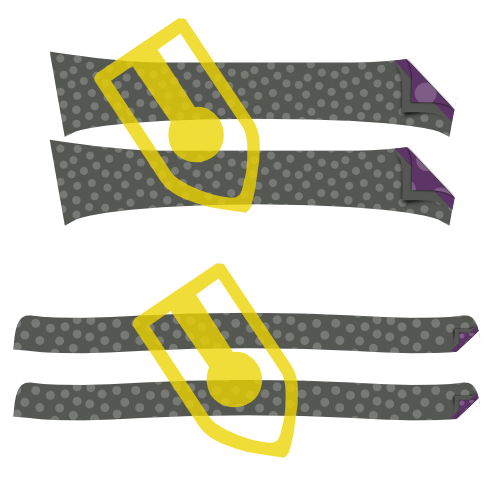
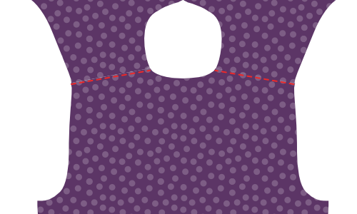
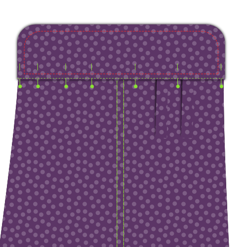

<Tip>

##### Siga la costura junto con Kelly y Julian

Kelly Hogaboide y Julian Collins hicieron una costura Simon(e) , y tienen videos de
todos los pasos.
Si estás buscando este patrón, Kelly y Julian pueden guiarte a empezar a terminar.

You can find all the material's on Kelly's
site: [#simonsayssew with kelly hogaboom & julian collins](https://agni.hogaboom.org/2020/07/simon-says-sew-with-kelly-hogaboom-and-julian-collins/)
</Tip>

### Paso 1: Fusionar interfaz

 

#### Interfaz de prensa a tazas

Para hacer dos tacos, has cortado tu pieza de corte cuatro veces en tela y dos veces en interfaz.

Para cada tazón, presione la pieza de enganche hacia el lado malo de la pieza.

> Si el interior y el exterior de tu taza son el mismo tejido, no importa a qué pieza de corte lo pulsas.
> 
> Sin embargo, un detalle de estilo popular es tener un tejido diferente para el interior del tazón. En este caso, asegúrese de pulsar la interfaz con la pieza que desea ser el exterior de su taza.

> Dependiendo de qué corte haya elegido, la forma del corte será diferente.
> 
> En la primera ilustración, puedes ver como ejemplos un puño redondo de barril y un puño francés.
> 
> En el futuro, el cubo redondo se utilizará en las ilustraciones, pero el proceso es el mismo para las otras tazas.

#### Plancha la entretela en el cuello, el subcuello y el soporte del cuello

Para hacer tu collar, tienes que cortar un collar, un collar y dos soportes de collar. Todo esto tanto en tela como en interfaces.

Para cada picoteo, presione la pieza de enlace hacia el lado malo.

### Paso 2: Prepara los cuffs

#### Difunde juntos

Coloque ambas partes del corte (una con interfaces, otra sin interfaz) junto con los lados buenos, y coser juntos en la costura estándar.

> **Asegúrate de que**
> 
> - No coser juntos el lado que nos uniremos a la manga más tarde
> - Detener en la distancia de costura desde el borde del lado de la manga

#### Recortar permisos de costura

Antes de darle la vuelta al puño, tenemos que recortar el margen de costura para eliminar el bulto.

#### Presione la costura posterior

Dobla hacia atrás los márgenes de costura de cada lado del puño, donde éste se une a la manga, y presiónalos.

> Si te has costado demasiado a lo largo del borde antes, tendrás que deseleccionar unas cuantas stitches.

#### Da la vuelta y presiona

Invierte el coño con los lados buenos, y dale una buena prensa.

> Cuando planches los puños, asegúrate de enrollar un poco la costura hacia el revés del puño para garantizar que no se vea la tela interior del puño.

Ahora puedes dejar tus cortes a un lado, los adjuntaremos más tarde.

### Paso 3: Prepara el cuello

#### Difunde cuello y cuello bajo

Coloca las dos partes del cuello con los lados bien juntos __, y cóselas con el margen de costura estándar.

#### Recortar permisos de costura

Antes de darle la vuelta al cuello, tenemos que recortar el margen de costura para eliminar el bulto.

#### Gira el collar y presiona

Voltee el cuello con los lados buenos, obtenga esos consejos tan puntiagudos como sea posible, y le dé una buena prensa.

> Cuando presione el cuello, recuerde que el guante inferior es un poco más estrecho.
> 
> Cuando alineas los lados no cocidos, esto hará que la costura se mueva hacia la parte trasera del cuello para garantizar que la tela interna del cuello no es visible.

#### Cuello de empate

Mezclar a lo largo del borde del cuello. Esto bloquea la costura y hace un aspecto crujiente.

> Qué tan lejos de la parte superior del borde es una elección de estilo. A menudo es un poco menor que la franquicia de costura estándar. Echa un vistazo a algunas camisetas existentes para hacerte una idea.

### Paso 4: Únete al collar y al collar

#### Coloca el cuello entre los soportes de cuello y baste en su lugar

Marque el punto medio de su cuello y su cuello esté con un pin. El punto medio de cada stand de cuello está en realidad ligeramente fuera de centro, ya que un extremo es más largo que el otro. En cambio, se encuentra el punto medio entre las dos notas.

Primero coloca un soporte de cuello con el lado bueno, luego tu cuello con el guante hacia arriba (y el lado no coser en la parte superior), y finalmente el segundo cuello con el lado bueno abajo.

Tu collar debe asentarse entre los dos soportes, y los centros (donde colocaste el alfiler) deben estar alineados.

> La forma en que las cosas se vean dependerá un poco de tus opciones de cuello, pero en general su cuello se va a doblar hacia abajo, y su soporte de cuello se doblará hacia arriba.
> 
> Para alinear todo esto, vamos a bastarlo juntos, en lugar de fijarlo. Tu cuello es una parte importante de tu camiseta, así que vale la pena degustar esto.

Primero, sustituya los pines marcando el medio por un pin que engancha todas las partes juntos.

Ahora, comience a tocar desde este alfiler y trabaje hasta el rincón del cuello, asegurándose de alinear ambos bordes de la tela.

Cuando llegues a la esquina de tu cuello, sigue bajando y golpeando el final de ambas paradas de cuello juntos.

Cuando hayas hecho un lado, vuelve a empezar desde tu clavija en el centro y haz el otro lado. Cuando termines de cocido, puedes sacar el pin.

#### Difunde tu cuello hasta los stands de cuello

Diviértete en el borde de tu quiosco de cuello respetando la franquicia de costura estándar.

> Asegúrate de parar 2cm antes del borde (dos veces la franquicia estándar de costura) ya que en el siguiente paso vamos a doblar la franquicia de costura y tenemos que dejar los soportes de cuello lo suficientemente separados para deslizar la camisa entre ellos más adelante.

#### Doble hacia atrás y presiona la franquicia de costura

Doblar la costura de su cuello en el lado no coser y presionarlo hacia abajo.

> En la parte central, pulsar hacia abajo la franquicia de costura será fácil. Pero hacia las puntas de su cuello, hacerlo será complicado sin pulsar pliegues en su cuello.
> 
> Presiónalo lo mejor que puedas sin hacer pliegues en el cuello. Presionaremos esto de nuevo después de voltear el cuello.

#### Da la vuelta al collar y presiona

Invierte tu pie de cuello con los lados buenos, y dale una buena prensa. Asegúrate de mantener la franquicia de costura en el stand de cuello doblada hacia dentro.

Ahora puedes dejar tu cuello a un lado, lo adjuntaremos más tarde.

### Paso 5: Opcional: Empuje en su etiqueta

Nuestro siguiente paso es adjuntarlo. Pero el yugo es un buen lugar para poner tu etiqueta. Así que si quieres hacer eso, podríamos empezar con eso.

Elige un yoque, y puedes coser tu etiqueta en el centro (en el lado bueno).

### Paso 6: Únete a la espalda

 

Coloque un yugo con el lado bueno arriba. Por encima de eso, coloque la espalda con el lado bueno, alineando la costura donde se debe sujetar al yugo.

Por último, coloque su segundo yugo en la parte superior de la espalda, pero con el lado bueno abajo.

Tu espalda debe estar ahora entre los lados buenos de tus dos yugos.

Si ese es el caso, coser en su lugar a lo largo de la costura/yuga, asegurándose de respetar la costura permitida.

> Si ha añadido una etiqueta en el paso 1, asegúrese de poner el yugo con la etiqueta en el lado malo de la espalda.

Cuando hayas terminado, no olvides darle una buena prensa para que la costura sea plana.

### Paso 7: Enrollar el yugo

Con tus yemas pegados a la espalda, vamos a doblar a lo largo de la costura que acabamos de hacer, en el lado del yugo.

> Doble el yugo interior fuera del camino. Nuestra costura de borde cogerá el canesú exterior, la espalda y todos los márgenes de costura, pero no el canesú interior.

Sólo coser justo al lado de la costura uniendo el yugo exterior a la espalda.

> Encender los bordes es como la parte superior, pero justo al lado de la costura

### Paso 8: Cierra los dardos traseros

  

> Dependiendo de sus mediciones, es posible que su patrón no tenga dardos atrás. En ese caso, pasemos al siguiente paso.

Tu patrón puede o no tener miedo de atrás. Si los tiene, debería cerrarlos ahora.

Coloca la espalda hacia abajo con el buen lado arriba, y llévalo desde la costura lateral para que el pliegue pase de la parte superior a la parte inferior del dardo.

Haga lo mismo con el otro dardo, para que ambos lados se doblen.

Siéntete libre de pulsar suavemente en este pliegue, te ayudará a coser bien los oscuros.

Diviértete a través de la línea marcando el dardo para cerrar las tinieblas. Ten cuidado de asegurarte de que la parte superior e inferior de tus dardos estén exactamente donde tienen que estar. Si un dardo se sienta más alto que el otro, se verá mal.

Cuando haya terminado, no olvide darle una buena prensa. Presione la tela extra del dardo hacia las costuras laterales.

### Paso 9: Prepara la posición del botón

> Si has elegido un placket de grown-on, puedes saltar los dos primeros sub-pasos y saltar a [Plegar el placket de botón](#fold-the-button-placket).

#### Difusión en la placket de botones

Si ha elegido un botón separado, coser en la parte frontal derecha.

Coloca la parte delantera derecha (pieza 1) abajo con el lado bueno arriba, y coloque el Button Placket (pieza 1b) en la parte superior con el lado bueno, asegurándose de alinear la costura.

Lo conserva en su lugar con la posibilidad de costura predeterminada.

#### Presione el permiso de costura al lado del placket

Coloque su frente con el lado bueno abajo, y presione el permiso de costura en el lado de la placet.

#### Plegar la placket de botones

Ahora, plíquese sobre la placket del botón en la primera línea de plegado y presione este pliegue en su lugar.

Luego, doblar la placa otra vez, asegurándose de que la tela se extienda justo más allá de la costura que une tu placket al frente.

Cuando estés feliz, presiona la placa plegada.

#### Navegar por la placa plegada

> Este es el enfoque clásico. Si ha elegido el estilo de placket sin costuras, no tiene que hacer esto.
> 
> En lugar de coser la placa, simplemente déjala doblada. Los pliegues se asegurarán cuando sujetemos los botones más tarde.

Desde el lado bueno de la camiseta, coser la placa plegada cruzando la zanja.

Para ello, coser exactamente encima de su costura anterior. Como has doblado la tela de la tapeta un poco más allá de esta costura, se enganchará en la parte posterior, fijando tu tapeta doblada en su sitio y bloqueando el margen de costura en el interior.

### Paso 10: Prepara el conjunto de posición del botón

> Si ha elegido un placket, puede omitir los dos primeros subpasos y saltar a Enderstanding un clásico placket.

#### Difusión en la placa del agujero del botón

Si ha elegido una placa separada del botón, coser en la parte frontal izquierda.

Coloca la parte delantera izquierda (pieza 2) abajo con el lado bueno arriba, y coloque el buzón (pieza 2b) en la parte superior con el lado bueno, asegurándose de alinear la costura.

Lo conserva en su lugar con la posibilidad de costura predeterminada.

Cuando haya terminado, no olvide darle una buena prensa. Presione la costura hacia el lado de la placa.

#### Presione el permiso de costura al lado del placket

Coloque su frente con el lado bueno abajo, y presione el permiso de costura en el lado de la placeta del orificio.

#### Entendiendo un clásico conjunto de agujero de botón

> Si ha elegido una placa sin fisuras, debe seguir los pasos de la placa del botón, ya que la construcción es idéntica.
> 
> Los siguientes pasos son para una placa clásica de agujero de botón.

Tu placket tiene un montón de líneas en él, así que primero aclaremos cuáles son:

- La línea del agujero del botón tiene guiones largos con agujeros de botones en ella. Marca a dónde deben ir los agujeros de los botones
- Las dos líneas plegables tienen guiones largos y se sientan a una distancia igual a la derecha e izquierda de la línea del orificio del botón
- Las dos líneas de coser son líneas punteadas que se sientan a la misma distancia de cada línea plegable

#### Recortar la costura posterior

> Si ha elegido una placa para crecer, esto no es aplicable.

La franquicia de costura de donde coser la placa del orificio en la parte delantera debe caber dentro de la placa doblada.

Para eso, recorte la franquicia de costura para que no se extienda más allá de la primera línea plegable de la placket.

#### Plegar la placket del agujero del botón

 

Doblar la placa en la primera línea plegable. Presione el pliegue en su lugar.

Después, doblar la parte que acabas de doblar de nuevo, esta vez en la segunda línea doblada. Presione este pliegue también en su lugar.

> Cuando tu placket esté plegado y presionado, coloca unos cuantos pines a lo largo de la longitud de tu placket para evitar que las cosas cambien de lugar

#### Mantiene la placa del agujero del botón

 

En la primera línea de coser, más cercana al borde.

Luego, voltee la camisa para que el lado bueno esté arriba, y tu placket esté arriba también. Luego coser en la segunda línea de coser.

> Estas dos líneas de la parte superior siempre serán visibles, así que asegúrate de mantenerlas bien claras

#### Pulsar la placket del botón

Enhorabuena, has hecho una placa clásica de agujero de botón.

Ahora presione a ese bebé. Sabes que quieres.

### Paso 11: Cierra las costuras del hombro

> **Cosas un burrito**
> 
> Vamos a cerrar las costuras de los hombros con una técnica que se conoce comúnmente como el método del burrito ****.
> 
> Si estás familiarizado con el método burrito, ya sabes qué hacer. Si no es así, sigue leyendo una manera inteligente de cerrar las costuras hombreras de tu camisa mientras bloquea todos los bordes inacabados fuera de la vista.

#### Anclar el frente al yugo exterior

 

Coloque la espalda hacia abajo con el buen lado hacia arriba, pero tenga cuidado de doblar el yugo interior hacia abajo (como se ilustra por la línea punteada.

Coloca tus frentes en la espalda, con los buenos lados hacia abajo. Pin frente al yugo en la costura del hombro, buenos lados juntos.

#### Rellenar, rodar y girar la camiseta, alfilar y coser tu costura

Arriba la espalda y los frentes comenzando por el sombrero. Róllalas en un saludo claro hacia arriba hasta que puedas ver todo el giro hacia abajo.

Ahora, puede voltear el yugo interior sobre su salvamento enrollado para alinear las costuras del hombro con el otro yugo y frentes.

Anclarlos en su lugar, y luego coser las costuras del hombro, Asegúrate de mantener tu salvamento (o relleno de burritos) fuera del camino para que no se quede atrapado en la costura.

> Asegúrese de alinear la línea de costura real. Debido a los ángulos desiguales en la apertura del cuello, el borde de la tela es a menudo más largo en un lado que en el otro.
> 
> Sin embargo, las líneas de costura tienen la misma longitud, así que asegúrate de hacerlas coincidir cuidadosamente utilizando las muescas.

#### Voltear hacia fuera a través de la apertura del cuello

Cuando hayas cosido ambas costuras de hombro, alcance a través de la apertura del cuello, y retire la parte trasera y frontal para salir de tu burrito.

#### Presione las costuras del hombro

Has hecho todo este trabajo, así que ahora asegúrate de que parezca súper afilado dándole una buena prensa. Asegúrate de que la franquicia de costura entre tu yugo es agradable y plana para eso.

### Paso 12: Une el borde de las costuras del hombro del yugo

De la misma manera que hemos empacado la costura inferior del yugo en el paso 3, vamos a doblar el yugo también en las costuras del hombro.

Como acabas de presionar estas costuras de hombro, todo debería ser agradable y plano, y sólo tienes que correr una stitch justo al lado de la costura.

> Asegúrate de enganchar en la parte del yugo, donde cogerás toda la franquicia de costura, y no en la parte delantera.

### Paso 13: Construir la placa de manga

#### Difunde en la guardia de corte

  

- Coloca tu manga con el lado bueno hacia abajo, y tu guardia de taza en la parte superior, también con el lado bueno hacia abajo.
- Alínea el borde de tu guardia de taza (parte inferior de placket de manga) con el corte en la manga, en el lado más corto a la costura lateral.
- Ahora coser a lo largo de la línea plegable marcada en la guardia de la corte, más cercana al borde.

> Si durante el corte de las piezas de tu patrón no has cortado en la manga en la línea en la que la placa de manga necesita ser colocada, necesita hacer eso primero.

- Doble sobre la guardia y presiona esta costura.
- Da la vuelta a la manga con el lado bueno y trae tu guardia a través de la cortada en la manga.
- Doble dos veces en las líneas para que la costura inacabada sea escondida hacia dentro.
- Haz los pliegues de modo que el pliegue superior quede ligeramente más lejos que la costura que ya has hecho.
- Presiona todo hacia abajo, y luego tira el guardia de corte en su lugar.

#### Plegar y pulsar el placket

¡Hora del originami! Vamos a doblar la superposición de la placa de manga usando las líneas de plegado marcadas como nuestra guía. Esto será mucho más fácil si pulsas entre cada doblez.

- Primero, doblar los bordes externos de la placeta hacia dentro.
- A continuación, dóblalo todo por la mitad.
- Luego, doblézcalo ambos consejos en una forma puntiaguda.
- Ahora démosle una buena prensa final.

#### Fijar placket en su lugar

 

Coloque su manga abajo con el lado bueno arriba. La guardia que hemos cosechado antes se sienta contra el otro borde de tejido inacabado de donde cortar en la manga.

Coloca tu placket alrededor de ese borde, un lado encima de él, uno debajo de él.

Necesitas deslizar la placa en tu manga hasta que la mitad de ella (la punta) con el corte en la manga.

La idea es que la placa cierra el borde inacabado, pero también cubre la guardia del otro borde.

Cuando lo tengas donde quieras, ancla la placa.

#### Difunde la placa de manga

Comienza en el borde de la manga (la parte inferior de la placa de manga) y en la parte superior del borde.

Vaya alrededor de la punta y descienda de nuevo en el otro lado (el lado doble) hasta que haya pasado el punto en el que termine su guardia.

Luego, cose horizontalmente al otro lado de la tapeta para terminar.

> He incluido aquí una ilustración extra que sólo muestra el contorno de la placket. Usted puede ver que el final de la guardia se encuentra atrapado en nuestro enganche de la placeta, y por lo tanto está bien escondido.

### Paso 14: Establecer en mangas

#### Recuerda, esta es una costura plana

> **Careful with the extra seam allowance for the flat-felled seam** There is extra seam allowance on the sleeve to allow for the creation of the flat-felled seam.
> 
> Como tal, tenga cuidado de no alinear el borde de la tela, pero alinear la costura para que la manga se sienta por 1cm.

#### Coloca el manguito

Difunde la camisa abierta para que ambos frentes y la parte trasera estén planos con sus buenos lados arriba.

Ahora coloca la manga encima con el lado bueno hacia abajo, haciendo coincidir la parte superior de la manga con la costura del hombro.

> Ten cuidado, la manga no es simétrica, así que asegúrate de que la muesca trasera (⊗) y el protector del puño están en la parte trasera, y la muesca delantera (⊙) en la parte delantera.
> 
> Observa también que la muesca trasera (⊗) de la manga no tiene una muesca correspondiente en la parte trasera de la camiseta. Eso es porque debe coincidir con la costura donde tu canesú se une a la espalda.

Ahora tienes que anclar la manga en el orificio. Para ello, asegúrese de:

- Haz coincidir el inicio y el final de la cabeza de manga con el principio y el final del orificio
- Coincide las muñecas en la cabeza de manga con las muñecas en la parte trasera y frontales
- Distribuye la facilidad de manga entre las muñecas como se muestra

#### Distribuye con facilidad el sleevecap

La facilidad de manga por defecto para este patrón es 0.5cm. Si usted tiene facilidad de mangas, usted necesita distribuir esa longitud extra uniformemente entre las muestras.

> Si no está seguro de qué es la facilidad de mangas, eche un vistazo a la documentación de [para la opción de patrón de facilidad de manga](/docs/designs/simon/options/sleevecapease).

#### Golpea la manga en el orificio

Cuando tengas la manga bien anclada en tu orificio, coser en su lugar. Tenga cuidado de evitar los pliegues en la parte entre las muelles donde se necesita relajar en la facilidad de manga.

> No hace falta decir, pero lo diré de todos modos: Repita este paso para la otra manga.

### Paso 15: Costura plana del orificio

#### Presione el permiso de costura a un lado

Deja abajo tu costura de manga recién cosido con el lado bueno abajo

Vamos a presionar a una de las partes para que se le conceda la costura. Para ello, identifique la franquicia de costura que es más amplia (para la costura plana cortada).

La provisión de costura más larga debe estar en la parte superior de la menor (franquicia de costura estándar).

Una vez que lo haya verificado, presione el permiso de costura.

#### Plegar bajo la costura extra

Ahora, doblar la franquicia de costura extra para la costura plana bajo la franquicia de costura estándar.

Puedes usar pines para mantener esto en su lugar, pero es más sencillo simplemente pulsarlo.

> Esto será relativamente fácil en las partes rectas de la costura, pero un poco más complicado en las secciones curvadas. Tómese su tiempo y, si es necesario, puede cortar en la franquicia extra de costura para permitirle abrir o doblar.

#### Difunde la costura plana

Ahora, desde el lado malo de la tela, coser la costura de abajo justo en el borde donde se pliega bajo la otra franja de costura.

Aquí es importante mantener una distancia uniforme con la costura de la manga. Si usted tiene un pie cortante para su máquina de coser, le ayudará con eso. Pero si no, tenga cuidado.

> Es más importante mantener e incluso alejarse de la costura de manga que coser exactamente al borde del plegado. Idealmente, el pliegue se sienta a una distancia uniforme de todos modos, pero si no lo hace, asegúrese de coser paralelo a la costura de manga. Incluso si eso significa que se desvia un poco del borde doblado.

#### Presione la costura plana

Cuando esté listo, presione la costura plana desde el lado bueno para que se encuentre agradable y plana.

### Paso 16: Cierre las costuras laterales/manga

 

Coloque su camisa con los lados buenos juntos, y coser el lado y manga costuras para cerrar la camiseta.

> En la manga y en los lados delanteros hay una franquicia extra de costura que permite la creación de la costura llana. Como tal, tenga cuidado de no alinear el borde del tejido, pero alinear la costura para que la costura adicional se sienta hacia fuera 1cm.

### Paso 17: La costura lateral o manga

#### Presione el permiso de costura a un lado

Vamos a presionar a una de las partes para que se le conceda la costura. Para ello, identifique la franquicia de costura que es más amplia (para la costura plana cortada).

La provisión de costura más larga debe estar en la parte superior de la menor (franquicia de costura estándar).

Una vez que lo haya verificado, presione el permiso de costura.

#### Plegar bajo la costura extra

Ahora, doblar la franquicia de costura extra para la costura plana bajo la franquicia de costura estándar.

Puedes usar pines para mantener esto en su lugar, pero es más sencillo simplemente pulsarlo.

> Esto será relativamente fácil en las partes rectas de la costura, pero un poco más complicado en las secciones curvadas. Tómese su tiempo y, si es necesario, puede cortar en la franquicia extra de costura para permitirle abrir o doblar.

#### Difunde la costura plana

Ahora, desde el lado malo de la tela, coser la costura de abajo justo en el borde donde se pliega bajo la otra franja de costura.

Es importante que mantengas una distancia uniforme con la costura de la manga. Si usted tiene un pie cortante para su máquina de coser, le ayudará con eso. Pero si no, tenga cuidado.

> Es más importante mantener e incluso alejarse de la costura de manga que coser exactamente al borde del plegado. Idealmente, el pliegue se sienta a una distancia uniforme de todos modos, pero si no lo hace, asegúrese de coser paralelo a la costura de manga. Incluso si eso significa que se desvia un poco del borde doblado.

#### Presione la costura plana

Cuando esté listo, presione la costura plana desde el lado bueno para que se encuentre agradable y plana.

### Paso 18: Adjunta los cortes para mangas

#### Fijar corte en su lugar

Tienes que introducir la manga entre las dos capas del puño, asegurándote de que el lado bueno de la tela quede contra el lado del puño que tiene la entretela aplicada.

Necesitarás fijar esto en tu lugar, ya que dependiendo de cuánto dura tu placket de manga puede ser difícil o incluso imposible conseguir que esto se quede plano.

También tenga en cuenta que el borde de la manga será más largo que el de la manga (cuánto tiempo más depende de la manga de la batería). Necesitas hacer uno o unos cuantos pliegues en tu manga para acomodar esto.

> Tu patrón contiene líneas de ayuda en la manga para ayudarte a colocar los pliegues.

> Tómese su tiempo para fijar todo cuidadosamente en su lugar. Después vamos a coser el borde, así que es importante que la parte delantera y trasera del puño queden bien alineadas.

#### Unir filos para mangas

Una vez que todo esté fijado en su lugar, el borde se tira a lo largo del borde de tu taza para sujetarlo a la manga.

Es importante que cojas tanto la capa exterior como la interior de tu puño por el borde.

> Asegúrate de enganchar desde el lado de la capa exterior (el lado bueno de la manga) y mantenerlo paralelo con el borde de la manga.

Cuando hayas terminado, dale una buena prensa.

#### Unir las vajillas

> Asegúrate de pulsar tus tazas antes de hacer esto.

Top-stitch around your cuff at a distance from the edge that is a bit less than your seam allowance. Vaya todo el camino alrededor de su café.

### Paso 19: Adjuntar el collar

#### Baste el cuello en su lugar

Se trata de una costura importante, así que vamos a aplastar esto en su lugar para asegurarnos de que se sienta exactamente antes de coser.

Comience en el centro de atrás y coloque la costura de su parte trasera entre sus dos paredes. Trabaja tu camino por un lado y luego haz el otro.

Asegúrese de respetar la franquicia estándar de costura y - importante - evitar cualquier envoltorio.

> Mientras que su soporte de cuello está relativamente recto, vamos a coser a lo que es esencialmente un agujero en su camisa.
> 
> Eso es un poco complicado, así que ten mucho cuidado en aquellas partes que están más curvadas: donde la parte trasera se une a los frentes.

#### Collar el borde en su lugar

 

Cuando estés contento con cómo has echado tu cuello en su lugar, es hora de coser esa cosa.

Empezaremos por el centro de la espalda y coseremos alrededor de todo el cuello.

#### Divertirse a lo largo del borde del cuello

Para darle más cuerpo al cuello y asegurarlo firmemente en su lugar vamos a coser a lo largo del borde superior del soporte de cuello.

Difunde aproximadamente la mitad de la franquicia de costura de su borde anterior. Asegúrese de parar unos pocos cm antes del final del cuello.

> Tienes que parar unos pocos cm antes del final del collar (nota: el final del collar, no el final del soporte de cuello) para que esta costura esté completamente cubierta cuando el cuello se pliegue.

#### Presione el cuello

Ahora que tu cuello está adjunto, dale una buena prensa.

### Paso 20: Maneja tu camisa

  

Es hora de terminar el hem (esa es la parte que pegaste en tus pantalones).

Doblar la mitad de la franquicia y presionar. Luego, vuelva a doblar y presione de nuevo.

Ahora, cose a lo largo del borde superior para terminar el dobladillo.

### Paso 21: Crear botones

Si no lo ha hecho inicialmente, marque todos los lugares que debería tener agujeros de botón.

Se sientan a lo largo del cierre delantero y en sus tazas.

Cuando los hayas marcado, haz agujeros de botones.

### Paso 22: Adjuntar botones

Fije su camisa cerrada para transferir el lugar de los agujeros de los botones a los lados del botón.

Cuando hayas marcado a dónde deben ir los botones, coja los botones.

> En lugar de marcar la ubicación de los botones del patrón, prefiero transferir la ubicación de los agujeros de botones creados.
> 
> De esta manera, si un orificio de botón se sienta un poco fuera de lugar, el botón simplemente lo seguirá.

