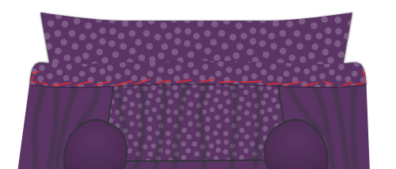

<Tip>

##### Volg de naad met Kelly en Julian

Kelly Hogaboom en Julian Collins deden een Simon(e) naadong, en ze hebben video's van
alle stappen.
Als je dit patroon wilt maken, kan Kelly en Julian je begeleiden om te beginnen.

Je kunt al het materiaal vinden op Kelly's
site: [#simonsayssew with kelly hogaboom & julian collins](https://agni.hogaboom.org/2020/07/simon-says-sew-with-kelly-hogaboom-and-julian-collins/)
</Tip>

### Stap 1: Bevestig tussenvoering

 

#### Kleef tussenvoering aan manchetten

Om twee manchetten te maken heb je je patroondeel vier keer uit stof geknipt, en twee keer uit tussenvoering.

Strijk de tussenvoering op de slechte kant van twee van de manchetstukken.

> Als je stof geen slechte kant heeft maakt het niet uit aan welke twee stukken je de tussenvoering kleeft.
> 
> Het is echter een leuk detail om de binnenkant van je manchet van een andere stof te maken. In dat geval moet je zeker zijn dat je de tussenvoering aan het stuk kleeft dat je als buitenkant wil gebruiken.

> De vorm van je manchet zal anders zijn, afhankelijk van welke soort je gekozen hebt.
> 
> In de eerste illustratie zie je zowel een ronde manchet als een Franse manchet als voorbeeld.
> 
> Vanaf nu gebruiken we de klassieke manchet in de illustraties, maar het proces is hetzelfde voor de andere soorten manchetten.

#### Strijk vlieseline op kraag, onderkraag en kraagstandaard

Om je kraag te maken heb je één onderkraag, één kraag en twee kraagstaanders nodig. Dit alles zowel in stof als in tussenvoering.

Strijk de tussenvoering tegen de slechte kant van elk deel.

### Stap 2: bereid de manchetten voor

#### Stik de manchet aan elkaar

Leg beide delen van je manchet (één met tussenvoering, één zonder) op elkaar met de goede kanten samen, en stik ze samen met de standaard naadwaarde.

> **Zorg ervoor dat je**
> 
> - Laat de kant die later aan de mouw bevestigd wordt open
> - Stop aan de naadwaarde van de rand die aan de mouw bevestigd wordt

#### Knip naadwaarde bij

Voordat we je manchet omslaan, moeten we de naadtoeslag inkorten om de bulk te verwijderen.

#### Strijk de naadwaarde terug

Vouw de naadtoeslagen terug aan elke kant van de manchet waar de manchet aan de mouw vastzit en pers ze naar beneden.

> Als je eerder iets te ver langs de rand gestikt hebt ga je nu een paar steken moeten lostornen.

#### Keer manchet en strijk

Keer je manchet met de goede kant naar buiten, en strijk grondig.

> Wanneer je je manchetten perst, zorg er dan voor dat je de naad een beetje naar de achterkant van de manchet rolt om te garanderen dat de binnenstof van de manchet niet zichtbaar is.

Je mag je manchetten nu opzij leggen, we komen hier later op terug.

### Stap 3: Bereid de kraag voor

#### Stik de kraag en onderkraag samen

Leg beide kraagdelen met de _goede kanten op elkaar_en naai ze aan elkaar met de standaard naadtoeslag.

#### Knip naadwaarde bij

Voordat we je kraag omdraaien, moeten we de naadtoeslag inkorten om de bulk te verwijderen.

#### Keer kraag en strijk

Keer de goede kanten van je kraag naar buiten, maak de puntjes zo scherp mogelijk, en strijk grondig.

> Denk er bij het strijken aan dat de onderkraag een beetje smaller is dan de bovenkraag.
> 
> Wanneer je de niet-gestikte randen op elkaar legt zorgt dit dat de naad naar de onderkant van de kraag rolt zodat deze niet zichtbaar is aan de goede kant.

#### Stik de kraag door

Geef een sierstiksel langs de rand van de kraag. Dit houdt de naadwaarde op z'n plaats en zorgt dat alles er scherp uitziet.

> Hoe ver je van de rand stikt is een stijlkeuze. Het is meestal een beetje minder dan de standaard naadwaarde. Kijk eens naar een paar bestaande hemden om een idee te krijgen.

### Stap 4: Bevestig kraag aan kraagstaander

#### Leg de kraag tussen de kraagstaanders en drieg vast

Geef het middelpunt van je kraag en kraagstaanders aan met een speld. Het middelpunt van elke kraagstaander is eigenlijk net niet in het midden, aangezien één kant langer is dan de andere. Zoek dus naar het middelpunt tussen de twee merktekens.

Leg eerst een kraagstaander met de goede kant omhoog, dan je kraag met de onderkraag naar omhoog (en de ongestikte rand bovenaan), en uiteindelijk de tweede kraagstaander met de goede kant naar beneden.

Je kraag moet tussen je twee kraagstandaards zitten en de middens (waar je je pin hebt geplaatst) moeten op één lijn liggen.

> Hoe dit eruitziet hangt wat al van je keuzes, maar over het algemeen zal je kraag naar beneden buigen, en je kraagstaander naar boven.
> 
> Om dit allemaal mooi gelijk te krijgen gaan we het driegen, in plaats van te spelden. Je kraag is een belangrijk deel van je hemd, dus het is de moeite om dit te driegen.

Vervang eerst de spelden die de middelpunten markeren door één speld die alle lagen samenhoudt.

Begin nu vanaf deze speld te driegen en werk zo in de richting van de hoek van de kraag. Zorg dat je de randen van de stof netjes gelijk legt.

Blijf driegen als je aan de hoek van je kraag komt, en drieg de uiteindes van de kraagstaanders samen.

Als je één kant hebt gedaan, begin je weer bij je speld in het midden en doe je de andere kant. Zodra je klaar bent met driegen kan je de speld verwijderen.

#### Stik je kraag aan de kraagstaanders

Stik langs de rand van je kraagstaander, met de standaard naadwaarde.

> Let op dat je 2 cm voor de rand stopt (twee keer de standaard naadwaarde) aangezien we de naadwaarde omplooien in de volgende stap, en we de kraagstaander nog open genoeg moeten laten om het hemd ertussen te krijgen.

#### Plooi en strijk de naadwaarde van de kraagstaander

Plooi de naadwaarde van de bovenste kraagstaander om en strijk.

> In het midden zal het makkelijk zijn om de naadwaarde te strijken. Maar naar de punten toe zal dit moeilijk worden zonder plooien in je kraag te strijken.
> 
> Druk het zo goed mogelijk aan zonder plooien in je kraag te maken. We strijken dit opnieuw zodra de kraagstaander gekeerd is.

#### Keer de kraagstaander en strijk

Keer de goede kanten van je kraagstaander naar buiten en strijk grondig. Let op dat de naadwaarde van de kraagstaander naar binnen gekeerd blijft.

Je kan je kraag nu opzij leggen, we komen hier later op terug.

### Stap 5: Optioneel: Bevestig je label

De volgende stap is het vastnaaien van de schouderpas. Maar deze schouderpas is een ideale plek om een label te hangen. Dus als je dat graag wil doen, doen we het best nu.

Kies een schouderpas, en je kan het label in het midden vastnaaien (aan de goede kant).

### Stap 6: Bevestig de schouderpassen aan het rugpand

 

Leg één schouderpas met de goede kant omhoog. Leg hier het rugpand op, met de goede kant naar boven, en leg de aanzetnaad van de schouderpas gelijk.

Leg hier dan de tweede schouderpas bovenop, met de goede kant naar beneden.

Je rug zou nu ingeklemd moeten zitten tussen de goede kanten van je twee jukken.

Als dat zo is, stik dan door de drie lagen van aanzetnaad. Let op dat je de juiste naadwarde respecteert.

> Let op dat de schouderpas met het label aan de verkeerde kant van je rugpand zit, mocht je een label hebben toegevoegd.

Vergeet niet deze naad goed te strijken zodat hij plat ligt.

### Stap 7: Stik de schouderpas door

Als je schouderpassen aan het rugpand bevestigd zijn gaan we ze doorstikken langs de aanzetnaad, aan de kant van de schouderpas.

> Vouw de binnenste schouderpas uit de weg. Onze randstiksels vangen het buitenstuk, de achterkant en alle naadtoeslagen op, maar niet het binnenstuk.

Stik net naast de aanzetnaad.

> Doorstikken is als een sierstiksel, maar heel dicht bij de rand

### Stap 8: Sluit de achterste nepen

  

> Afhankelijk van je maten heeft je patroon wel of geen nepen. Indien geen nepen, ga dan voort met de volgende stap.

Je patroon heeft misschien nepen in het rugpand. Als er nepen zijn, zou je ze nu moeten sluiten.

Leg je rugpand met de goede kant omhoog, en plooi het langs de zijkant om zodat de vouw van de bovenste naar de onderste punt van de neep loopt.

Doe hetzelfde voor de andere neep, zodat beide kanten teruggeplooid zijn.

Het is ok om deze vouw lichtjes te strijken, dat helpt om de nepen accuraat te stikken.

Stik langs de lijn die de nepen aangeeft om ze te sluiten. Probeer op te letten dat de bovenste en onderste punten exact zijn waar ze moeten zijn. Als één neep hoger zit dan de andere ziet het er niet uit.

Vergeet niet grondig te strijken! Strijk de stof van de neep naar de zijnaden.

### Stap 9: Bereid het knopenpat voor

> Als je een aangeknipt knopenpat gekozen heb kan je de eerste twee substapjes overslaan en verdergaan met [Plooi het knopenpat](#fold-the-button-placket).

#### Stik het knopenpat vast

Als je een apart knopenpat gekozen hebt stik je het nu vast aan het rechtervoorpand.

Leg het rechtervoorpand (deel 1) neer met de goede kant omhoog, en leg het knopenpat (deel 1b) erop met de goede kant naar beneden. Leg de randen netjes gelijk.

Stik vast met de standaard naadwaarde.

#### Strijk de naadwaarde in de richting van het knopenpat

Leg je voorpand met de goede kant naar beneden, en strijk de naadwaarde naar het knopenpat toe.

#### Plooi het knopenpat

Plooi nu het knopenpat aan de eerste vouwlijn, en strijk deze vouw.

Plooi het knopenpat opnieuw om, en let op dat de stof tot net voorbij de aanzetnaad aan het voorpand komt zodat deze bedekt is.

Als je daarmee blij bent, strijk dan het geplooide knopenpat.

#### Kleef de tussenvoering op de manchet

> Dit is de klassieke aanpak. Als je voor het naadloze knopenpat gekozen heb moet je dit niet doen.
> 
> In plaats van het knopenpat door te stikken, laat je het gewoon geplooid. De plooien worden op hun plaats gehouden wanneer we later de knopen aannaaien.

Stik het geplooide knopenpat vast door langs de goede kant van je hemd in de naad te stikken.

Om dit te doen stik je exact bovenop je eerdere naad. Omdat je de stof van je placket iets voorbij deze naad hebt gevouwen, zal hij aan de achterkant vast komen te zitten, waardoor je gevouwen placket op zijn plaats wordt gefixeerd en de naadtoeslag binnenin wordt opgesloten.

### Stap 10: Bereid het knoopsgatenpat voor

> Als je een aangeknipt knoopsgatenpat gekozen heb kan je de eerste twee substapjes overslaan en verdergaan met Hoe werkt een klassiek knopenpat.

#### Stik het knoopsgatenpat vast

Als je een apart knoopsgatenpat gekozen hebt stik je het nu vast aan het linkervoorpand.

Leg het linkervoorpand (deel 2) neer met de goede kant omhoog, en leg het knoopsgatenpat (deel 2b) erop met de goede kant naar beneden. Leg de randen netjes gelijk.

Stik vast met de standaard naadwaarde.

Vergeet niet grondig te strijken! Strijk de naadwaarde in de richting van het knoopsgatenpat.

#### Strijk de naadwaarde in de richting van het knoopsgatenpat

Leg je voorpand met de goede kant naar beneden, en strijk de naadwaarde naar het knoopsgatenpat toe.

#### Hoe werkt een klassiek knopenpat

> Als je een naadloos knopenpat gekozen hebt moet je de stappen voor het knopenpat volgen, aangezien de constructie identiek is.
> 
> De stappen hieronder zijn voor een klassiek knopenpat.

Er staan een hoop lijnen op het knopenpat, dus laat ons eerst eens kijken wat die betekenen:

- De knoopsgatenlijn heeft is een lange stippellijn met knoopsgaten op. Ze geeft aan waar de knoopsgaten moeten komen
- De twee vouwlijnen zijn lange stippellijnen en zitten op gelijke afstand rechts en links van de knoopsgatenlijn
- De twee+twee stiklijnen zijn stippellijntjes die op gelijke afstand van elke vouwlijn zitten

#### Knip naadwaarde bij

> Als je een aangesneden knopenpat gekozen hebt is dit niet van toepassing.

De naadwaarde van de aanzetnaad van het knoopsgatenpat zou in je geplooide knoopsgatenpat moeten passen.

Om dat te verkrijgen knip je de naadwaarde bij zodat ze niet verder komt dan de eerste vouwlijn op het knoopsgatenpat.

#### Plooi het knoopsgatenpat

 

Plooi het knoopsgatenpat langs de eerste vouwlijn. Strijk de vouw.

Plooi dan het deel dat je net plooide nog een keer, nu op de tweede vouwlijn. Strijk deze vouw ook.

> Als je knoopsgatenpat geplooid en gestreken is helpen een paar spelden wel eens om te voorkomen dat dingen gaan verschuiven

#### Stik het geplooide knoopsgatenpat

 

Stik op de eerste stiklijn, het dichtst bij de rand.

Draai dan je hemd om zodat de goede kant naar boven ligt, en je knoopsgatenpat ook. Stik dan op de tweede stiklijn.

> Deze twee rijen stiksel gaan altijd zichtbaar zijn, dus hou het netjes

#### Strijk het knoopsgatenpat

Gefeliciteerd, je hebt een klassiek knopenpat gemaakt.

Strijk het nu naar de verdoemenis. You know you want to.

### Stap 11: Sluit de schoudernaden

> **Laten we een burrito maken**
> 
> We gaan de schoudernaden sluiten met een techniek die algemeen bekend staat als de **burrito methode**.
> 
> Als dit je bekend in de oren klinkt weet je al wat te doen. Indien niet, lees dan even verder voor een slimme manier om de schoudernaden van je hemd te stikken en tegelijk alle naadwaarde weg te stoppen.

#### Speld de voorpanden aan de buitenste schouderpas

 

Leg het rugpand neer met de goede kant omhoog, maar let op dat je de binnenste schouderpas naar beneden plooit (zoals aangeduid met de stippellijn).

Leg de voorpanden op het rugpand, met de goede kanten naar beneden. Speld de voorpanden aan de schouderpas langs de schoudernaad, met de goede kanten samen.

#### Rol hemden, geen zakken

Rol je achterpand en voorpanden op, beginnend aan de zoom. Rol alles in een strakke worst naar boven tot je de volledige binnenste schouderpas kan zien.

Nu kan je die schouderpas over het opgerolde hemd leggen om de schoudernaden gelijk te leggen met de buitenste schouderpas.

Speld de naden vast en stik de schoudernaden. Let op dat je de hemdworst (of burritovulling) uit de weg houdt zodat ze niet in de naad terechtkomt.

> Let op dat je de eigenlijke stiklijn gelijk legt. Door de hoeken van de halsopening kan het zijn dat de rand van de stof aan één kant langer is dan aan de andere.
> 
> De naadlijnen zijn echter even lang, dus zorg ervoor dat ze goed op elkaar aansluiten met behulp van de inkepingen.

#### Keer het binnenstebuiten door de halsopening

Wanneer je de twee schoudernaden gestikt hebt haal je de voorpanden en het achterpand naar buiten door de halsopening van je burrito.

#### Strijk de schoudernaden

Dit was veel werk, dus zorg ook dat het er superscherp uitziet door het flink te strijken. Zorg dat de naadwaarde tussen je schouderpassen mooi plat ligt.

### Stap 12: Stik de schoudernaden van de schouderpas door

We gaan de schouderpas ook aan de schoudernaden doorstikken, net zoals we met de aanzetnaad van het rugpand in Stap 3 gedaan hebben.

Aangezien je deze schoudernaden gestreken hebt zou alles mooi plat moeten liggen, en moet je gewoon recht naast de naad stikken.

> Zorg dat je op de schouderpas doorstikt, waar je alle naadwaarde mee vastzet, en niet op het voorpand.

### Stap 13: Maak het mouwsplit

#### Sierstiksel op de manchetten

  

- Leg je mouw met de goede kant naar beneden, en de mouwsplitreep bovenop, ook met de goede kant naar beneden.
- Leg de rand van de mouwsplitreep (de onderlap van het mouwsplit) gelijk met de knip in de mouw, aan de kant het dichtst bij de zijnaad.
- Stik nu op de vouwlijn die op de mouwsplitreep aangeduid is, het dichtst bij de rand.

> Als je bij het uitknippen van je patroondelen het mouwsplit nog niet ingeknipt had volgens de aangegeven lijn, moet je dat eerst doen.

- Plooi de mouwsplitreep om, en strijk deze naad.
- Leg je mouw met de goede kant naar boven, en haal de mouwsplitreep door de knip in de mouw.
- Plooi twee keer op de aangegeven lijnen zodat de naadwaarde ingepakt zit.
- Maak je vouwen zo dat de bovenste vouw iets verder zit dan de naad die je al hebt gemaakt.
- Strijk alles goed plat, en stik de mouwsplitreep door aan de zijkant, door alle lagen heen.

#### Plooi en strijk de mouwsplitbies

Tijd voor origami! We gaan de mouwsplitbies plooien, met de aangegeven vouwlijnen als gids. Dit is veel makkelijker als je elke plooi strijkt voor je de volgende maakt.

- Plooi eerst de buitenste randen van de mouwsplitbies naar binnen.
- Vouw het geheel vervolgens dubbel.
- Plooi daarna de twee hoekjes tot een mooie punt.
- Strijk alles nog eens grondig.

#### Speld de mouwsplitbies

 

Leg je mouw neer met de goede kant naar omhoog. De mouwsplitreep die we eerder gemaakt hebben zit tegen de andere onafgewerkte rand van de knip die we in onze mouw gemaakt hebben.

Leg je mouwsplitbies rond die onafgewerkte rand, één kant erbovenop, één kant eronder.

Je moet de mouwsplitbies over de mouw heen schuiven tot het midden (het puntje) overeenkomt met de knip in je mouw.

Het idee is dat de mouwsplitbies de onafgewerkte rand verbergt, en meteen ook de mouwsplitreep bedekt.

Als dit er voor jou goed uitziet, speld het dan maar vast.

#### Stik de mouwsplitbies

Begin aan de rand van de mouw (de onderkant van de mouwsplitbies) en stik langs de rand naar boven.

Ga rond de punt, en langs de andere (geplooide) kant weer naar beneden tot net voorbij het einde van de mouwsplitreep.

Naai dan horizontaal aan de andere kant van de sluiting om af te werken.

> Ik heb hier een extra illustratie gemaakt die enkel de omlijning van de mouwsplitbies toont. Je ziet dat het einde van de mouwsplitreep vastzit in het stiksel van de mouwsplitbies, en dus netjes weggewerkt wordt.

### Stap 14: Zet de mouwen in

#### Belangrijk! Dit is een platte naad

> **Let op met de extra naadwaarde voor de platte naad**. Er is extra naadwaarde aan de mouw om de platte naad te kunnen maken.
> 
> Zorg dus dat je niet de rand van de stof gelijk legt, maar leg de stiklijnen zo op elkaar dat de mouw een extra centimeter uitsteekt.

#### Speldhuls op zijn plaats

Leg je hemd open zodat de voor- en achterkanten plat liggen met de goede kanten omhoog.

Leg nu je mouw erop met de goede kant naar beneden, zodat de bovenkant van de mouw overeenkomt met de schoudernaad.

> Let op, je mouw is niet symmetrisch, dus zorg ervoor dat de achterste inkeping (⊗) en manchetbeschermer aan de achterkant zitten, en de voorste inkeping (⊙) aan de voorkant.
> 
> Let er ook op dat de inkeping aan de achterkant (⊗) op de mouw geen overeenkomstige inkeping heeft aan de achterkant van het shirt. Dat komt omdat het moet overeenkomen met de naad waar je juk aansluit op de rug.

Je moet nu de mouw in het armsgat spelden. Om dit te doen, let dan op dat:

- Het begin en het einde van de mouwkop overeenkomen met het begin en het einde van het armsgat
- De merktekens op de mouwkop overeenkomen met die op de voorpanden en het rugpand
- De extra stof in de mouwkop tussen de merktekens verdeeld wordt, zoals getoond

#### Mouwgemak verdelen

De standaard hoeveelheid extra stof in de mouwkop van dit patroon is 0.5 cm. Als je extra stof in de mouwkop hebt moet je die extra lengte gelijk verdelen tussen de merktekens, zoals getoond.

> Als je niet zeker bent wat deze extra stof is, bekijk dan even de [documentatie voor de optie voor extra stof in de mouwkop](/docs/designs/simon/options/sleevecapease).

#### Stik mouw in armsgat

Wanneer je je mouw netjes in het armsgat gespeld hebt, kan je ze vaststikken. Let op dat je geen plooien maakt in het stuk tussen de merktekens waar je de extra stof moet verdelen.

> Het zou niet nodig moeten zijn, maar ik ga het toch doen: Herhaal deze stap voor de andere mouw.

### Stap 15: Platte armsgatnaad

#### Strijk naadwaarde naar één kant

Leg je versgestikte mouwnaad neer met de goede kant naar beneden

We gaan de naadwaarde naar één kant strijken. Om dit te doen kijk je aan welke kant de naadwaarde breder is (voor de platte naad).

De langere naadwaarde moet bovenop de kortere (standaard) naadwaarde liggen.

Zodra je dat bepaald hebt kan je de naadwaarde strijken.

#### Plooi de extra naadwaarde weg

Plooi nu de extra naadwaarde voor de platte naad onder de standaard naadwaarde.

Je kan spelden gebruiken om dit op z'n plek te houden, maar gewoon strijken is makkelijker.

> Dit zal redelijk eenvoudig zijn aan de rechte stukken van de naad, maar een beetje lastiger aan de afgeronde stukken. Neem je tijd, en indien nodig kan je kleine knipjes in de extra naadwaarde geven zodat ze de curves mooier kan volgen.

#### Stik de platte naad

Stik nu, langs de slechte kant van de stof, de naadwaarde door, net aan de rand waar ze onder de andere naadwaarde plooit.

Hier is het belangrijk om een gelijke afstand te houden tot de naad van je mouw. Als je een speciaal voetje voor je naaimachine hebt, kan dit helpen. Indien niet, wees dan gewoon voorzichtig.

> Het is belangrijker om op gelijke afstand van de naad te blijven dan om exact op de rand van de plooi te stikken. In een ideale wereld zit die plooi al op een gelijke afstand, maar als dit niet zo is, zorg dan gewoon dat je stiksel tenminste gelijk is. Zelfs al betekent dit dat je een beetje van de geplooide rand afwijkt.

#### Strijk de platte naad

Als je hiermee klaar bent strijk je de platte naad van de goede kant zodat ze mooi plat ligt.

### Stap 16: Sluit de zij- en mouwnaden

 

Leg je hemd met de goede kanten op elkaar, en stik de zij- en mouwnaden om het hemd te sluiten.

> Er is extra naadwaarde aan de mouw en de voorpanden om een platte naad te maken. Zorg dus dat je niet de rand van de stof gelijk legt, maar leg de stiklijnen zo op elkaar dat de extra naadwaarde een centimeter uitsteekt.

### Stap 17: Platte naad aan de zij- en mouwnaden

#### Strijk naadwaarde naar één kant

We gaan de naadwaarde naar één kant strijken. Om dit te doen kijk je aan welke kant de naadwaarde breder is (voor de platte naad).

De langere naadwaarde moet bovenop de kortere (standaard) naadwaarde liggen.

Zodra je dat bepaald hebt kan je de naadwaarde strijken.

#### Plooi de extra naadwaarde weg

Plooi nu de extra naadwaarde voor de platte naad onder de standaard naadwaarde.

Je kan spelden gebruiken om dit op z'n plek te houden, maar gewoon strijken is makkelijker.

> Dit zal redelijk eenvoudig zijn aan de rechte stukken van de naad, maar een beetje lastiger aan de afgeronde stukken. Neem je tijd, en indien nodig kan je kleine knipjes in de extra naadwaarde geven zodat ze de curves mooier kan volgen.

#### Stik de platte naad

Stik nu, langs de slechte kant van de stof, de naadwaarde door, net aan de rand waar ze onder de andere naadwaarde plooit.

Belangrijk hierbij is dat je een gelijke afstand houdt tot de naad van je mouw. Als je een speciaal voetje voor je naaimachine hebt, kan dit helpen. Indien niet, wees dan gewoon voorzichtig.

> Het is belangrijker om op gelijke afstand van de naad te blijven dan om exact op de rand van de plooi te stikken. In een ideale wereld zit die plooi al op een gelijke afstand, maar als dit niet zo is, zorg dan gewoon dat je stiksel tenminste gelijk is. Zelfs al betekent dit dat je een beetje van de geplooide rand afwijkt.

#### Strijk de platte naad

Als je hiermee klaar bent strijk je de platte naad van de goede kant zodat ze mooi plat ligt.

### Stap 18: Bevestig de manchetten aan de mouwen

#### Speld de manchet op z'n plaats

Je moet de mouw tussen de twee lagen van je manchet schuiven en ervoor zorgen dat de goede kant van de stof tegen de kant van je manchet zit waar de versteviging op is aangebracht.

Je zal dit moeten spelden, want afhankelijk van hoe lang je mouwsplit is, is dit moeilijk of zelfs onmogelijk om plat te leggen.

Merk ook op dat de rand van je mouw langer is dan je manchet (hoeveel langer hangt af van het volume van de mouw). Je zal één of meerdere plooien moeten maken om dit verschil weg te werken.

> Je patroon bevat hulplijnen op de mouw om je te helpen bij het plaatsen van de plooien.

> Neem je tijd om alles nauwkeurig te spelden. We gaan dit later aan de rand stikken, dus het is belangrijk dat de voor- en achterkant van je manchet mooi op elkaar aansluiten.

#### Stik de manchetten smal door

Zodra alles vastgespeld is kan je de rand van de manchet smal doorstikken om ze aan je mouw te bevestigen.

Het is belangrijk om zowel de buitenste als de binnenste laag van je manchet aan de rand op te vangen.

> Zorg dat je langs de goede kant doorstikt, en hou het stiksel parallel met de rand van je manchet.

Strijk alles nog eens grondig als je dit gedaan hebt.

#### Strijk de schouderpas

> Let op dat je je manchetten strijkt voor je dit doet.

Stik rond je manchet op een afstand van de rand die een beetje kleiner is dan je naadwaarde. Ga helemaal rond je manchet.

### Stap 19: Bevestig de kraag

#### Drieg de kraag vast

Dit is een belangrijke naad, en daarom driegen we alles vast zodat we zeker zijn dat het helemaal juist is voor we het naaien.

Begin aan de middenrug, en schuif de naadwaarde van het rugpand tussen je kraagstaanders. Ga verder langs één kant, en doe dan de andere.

Zorg dat je de standaard naadwaarde in het oog houdt en - belangrijk - plooien vermijdt.

> Ook al is je kraagstaander, redelijk recht, hij wordt bevestigd aan wat in feite een gat in je hemd is.
> 
> Dat is een beetje lastig, dus wees extra nauwkeurig aan de delen die het meest gebogen zijn: aan de schoudernaden.

#### Stik de mouwsplitreep door

 

Als je blij bent met hoe je kraag gedriegd is, wordt het tijd om het ding definitief vast te stikken.

We beginnen middenachter en naaien helemaal rond de kraagstandaard.

#### Stik langs de rand van de kraag

Om wat meer body aan je kraag te geven en hem stevig vast te zetten gaan we langs de bovenrand van de kraagstaander stikken.

Stik op ongeveer de helft van de naadwaarde van je eerdere stiksel. Stop een paar cm voor het einde van de kraag.

> Je moet een paar cm voor het einde van de kraag stoppen (opgelet: het einde van de kraag, niet het einde van de kraagstaander) zodat dit stiksel helemaal bedekt is wanneer de kraag naar beneden geplooid ligt.

#### Strijk de kraag

Nu je kraag vasthangt mag je hem nog eens goed strijken.

### Stap 20: Zoom je hemd

  

Tijd om de zoom af te werken (dat is het stuk dat je in je broek stopt).

Plooi de helft van de zoomtoeslag naar boven en strijk. Plooi de zoom een tweede keer om en strijk opnieuw.

Naai nu langs de bovenrand om de zoom af te werken.

### Stap 21: Maak knoopsgaten

Markeer alle plekken waar knoopsgaten nodig zijn, mocht je dit nog niet gedaan hebben.

Ze zitten aan de sluiting vooraan en aan je manchetten.

Zodra je ze aangeduid hebt kan je knoopsgaten maken.

### Stap 22: Naai knopen aan

Speld je hemd dicht om de locatie van de knoopsgaten op de kant met de knopen aan te duiden.

Naai de knopen op de gemarkeerde plaatsen.

> In plaats van de locatie van de knopen op het patroon te gebruiken, duid ik liever de gemaakte knoopsgaten aan.
> 
> Als een knoopsgat dan een beetje alternatief geplaatst is zal de knoop dit gewoon volgen.

