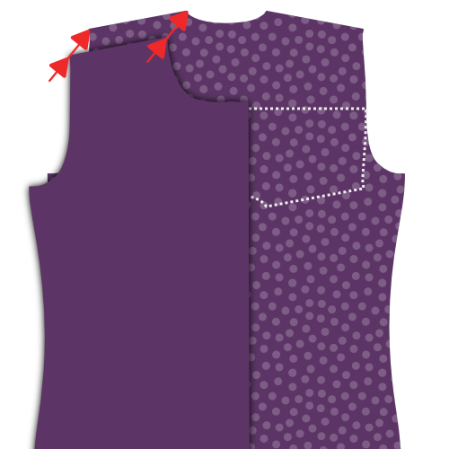
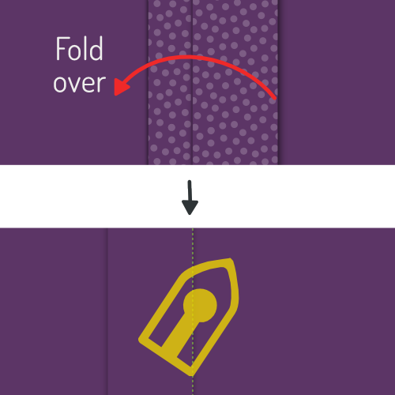
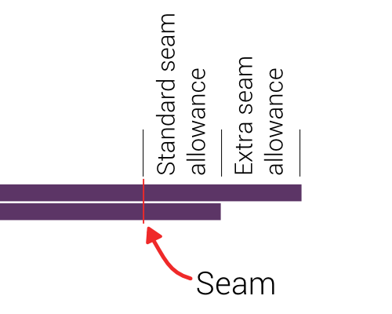

<Tip>

##### Слідкуйте за шиттям разом з Келлі та Джуліаном

Келлі Хогабум та Джуліан Коллінз зробили шиття з Simon(e), і у них є відео з
усіма етапами.
Якщо ви хочете зробити цей візерунок, Келлі та Джуліан допоможуть вам від початку до кінця.

Ви можете знайти всі матеріали на сайті Келлі
: [#simonsayssew with kelly hogaboom & julian collins] (https://agni.hogaboom.org/2020/07/simon-says-sew-with-kelly-hogaboom-and-julian-collins/)
</Tip>

### Крок 1: Взаємодія запобіжників

 

#### З'єднання преса з манжетами

Щоб зробити дві манжети, ви викроїли деталь манжети чотири рази по тканині і двічі по міжфактурному шву.

Для кожної манжети притисніть сполучну деталь до виворітного боку манжети.

> Якщо внутрішня і зовнішня сторони манжети зроблені з однакової тканини, не має значення, до якої частини манжети ви її притискаєте.
> 
> Однак, популярною стильовою деталлю є інша тканина для внутрішньої частини манжета. У цьому випадку обов'язково притисніть інтерфейс до тієї частини манжети, яка має бути зовнішньою стороною манжети.

> Залежно від того, яку манжету ви обрали, форма манжети буде відрізнятися.
> 
> На першій ілюстрації ви можете побачити як круглу манжету, так і французьку манжету в якості прикладу.
> 
> Надалі на ілюстраціях буде використовуватися кругла манжета, але процес аналогічний для інших манжет.

#### З'єднання преса з нашийником, підшийником і стійкою нашийника

Щоб пошити комір, вам потрібно викроїти один підкомір, один комір і дві стійки для коміра. І все це як у тканині, так і в інтер'єрі.

Для кожної деталі притисніть сполучну деталь до виворітного боку.

### Крок 2: Підготуйте манжети

#### Зшийте манжету разом

Складіть обидві частини манжети (одну з прокладкою, іншу без неї) лицьовими боками до лицьового боку і зшийте їх зі стандартним припуском на шви.

> **Переконайтеся, що ви**
> 
> - Не зшивайте сторону, яку ми прикріпимо до рукава пізніше
> - Зупиніться на відстані припуску на шов від краю з боку рукава

#### Припуск на обшивку шва

Перед тим, як вивернути манжету, нам потрібно обрізати припуски на шви, щоб прибрати об'єм.

#### Запрасуйте припуски шва вшивання

Відверніть припуски на шви з обох боків манжети, де манжета прикріплюється до рукава, і притисніть їх донизу.

> Якщо ви раніше прошили занадто далеко по краю, вам доведеться розпустити кілька стібків.

#### Поверніть манжету навколо і натисніть

Переверніть манжету лицьовою стороною назовні і добре відіжміть.

> Під час притискання манжети, переконайтеся, що шов трохи загорнутий на виворітну сторону манжети, щоб гарантувати, що внутрішня тканина манжети не буде видна.

Тепер ви можете відкласти наручники в сторону, ми прикріпимо їх пізніше.

### Крок 3: Підготуйте нашийник

#### Зшийте комір і підкомір разом

Складіть обидві деталі коміра лицьовими боками _разом_і зшийте їх зі стандартними припусками на шви.

#### Припуск на обшивку шва

Перед тим, як вивернути комір, потрібно обрізати припуски на шви, щоб прибрати об'єм.

#### Поверніть комір і притисніть

Переверніть комір лицьовими сторонами назовні, зробіть кінчики якомога гострішими і гарненько притисніть.

> Притискаючи комір, пам'ятайте, що під коміром він трохи вужчий.
> 
> Коли ви вирівнюєте незшиті сторони, це призведе до того, що шов загорнеться на зворотний бік коміра, щоб гарантувати, що внутрішня тканина коміра не буде видна.

#### Комір з верхнім швом

По краю коміра виконати верхню строчку. Це фіксує припуски на шви і надає виробу чіткого вигляду.

> Відстань, на якій ви будете прошивати верхній стібок від краю, залежить від вашого стилю. Часто це трохи менше, ніж стандартний припуск на шов. Погляньте на деякі існуючі сорочки, щоб отримати уявлення.

### Крок 4: З'єднайте нашийник і стійку нашийника

#### Помістіть нашийник між стійками для нашийників і закріпіть на місці

Позначте шпилькою середню точку коміра і стійки коміра. Середня точка кожної стійки для коміра насправді трохи зміщена від центру, оскільки один кінець довший за інший. Замість цього знайдіть середню точку між двома надрізами.

Спочатку покладіть підставку для коміра лицьовою стороною догори, потім ваш комір нижньою частиною догори (і незшитою стороною догори), і, нарешті, другу підставку для коміра лицьовою стороною донизу.

Ваш комір повинен знаходитися між двома стійками, а середина (де ви вставили шпильку) повинна бути вирівняна.

> Те, як це буде виглядати, буде трохи залежати від вашого комірця, але загалом ваш комір буде згинатися донизу, а стійка коміра - догори.
> 
> Щоб вирівняти все це, ми збираємося склеїти це разом, а не приколоти. Комір - важлива частина сорочки, тому варто приділити йому увагу.

Спочатку замініть шпильки, що позначають середину, на шпильки, які скріплюють усі частини разом.

Тепер почніть приметувати від цієї шпильки і рухайтеся до кута коміра, обов'язково вирівнюючи обидва краї тканини.

Коли ви дійдете до кута коміра, продовжуйте і зшийте кінці обох стійок коміра разом.

Коли ви закінчите один бік, почніть знову від шпильки посередині і зробіть другий бік. Коли ви закінчите змащувати, можна вийняти шпильку.

#### Пришийте комір до стійок коміра

Зшийте по краю стійки коміра, дотримуючись стандартних припусків на шви.

> Не забудьте зупинитися за 2 см до краю (вдвічі більше стандартного припуску на шов), оскільки на наступному кроці ми будемо підгинати припуск на шов, і нам потрібно залишити стійки коміра досить далеко один від одного, щоб згодом вставити сорочку між ними.

#### Відверніть і припрасуйте припуск шва стійки коміра

Відверніть припуск на комір-стійку на незашитий бік і притисніть його.

> У центральній частині припуск на шов буде легко притиснути. Але в напрямку до кінчиків коміра це буде складно зробити, не притискаючи складки на комірі.
> 
> Притисніть його якомога сильніше, не створюючи складок на комірі. Після того, як вивернемо комір, знову притискаємо його.

#### Поверніть стійку коміра і натисніть

Переверніть підставку для коміра лицьовими сторонами назовні і добре притисніть. Переконайтеся, що припуски на шви на стійці коміра складені всередину.

Тепер можете відкласти нашийник в сторону, ми прикріпимо його пізніше.

### Крок 5: Необов'язково: Пришийте етикетку

Наш наступний крок - прикріпити ярмо. Але ярмо - це чудове місце для того, щоб наклеїти свою етикетку. Тож якщо ви хочете це зробити, ми можемо почати з цього.

Виберіть одне ярмо, і ви можете пришити етикетку до нього по центру (з виворітного боку).

### Крок 6: Приєднайте кокетки до спинки

 

Покладіть одне ярмо лицьовою стороною догори. Зверху покладіть спину виворітною стороною догори, вирівнявши шов там, де він повинен бути прикріплений до кокетки.

Нарешті, покладіть друге ярмо зверху на спину, але лицьовою стороною вниз.

Тепер ваша спина повинна бути затиснута між хорошими сторонами двох ярмів.

Якщо це так, пришийте їх на місце вздовж шва спинки/кокетки, дотримуючись припусків на шви.

> Якщо ви додали етикетку на кроці 1, переконайтеся, що ярмо з етикеткою знаходиться на виворітній стороні спини.

Коли закінчите, не забудьте добре притиснути, щоб шов був рівним.

### Крок 7: Прострочіть кокетку по краях

Прикріпивши кокетки до спинки, прострочіть їх уздовж шва, який ми щойно виконали, з боку кокетки.

> Відкиньте внутрішнє ярмо вбік. Крайня строчка прошиває зовнішню кокетку, спинку і всі припуски швів, але не внутрішню кокетку.

Просто пришийте поруч зі швом, що з'єднує зовнішню кокетку зі спинкою.

> Краєобметочна строчка схожа на верхню строчку, але безпосередньо біля шва

### Крок 8: Закриваємо задні виточки

  

> Залежно від ваших мірок, викрійка може взагалі не мати задніх виточок. У такому випадку переходьте до наступного кроку.

Ваша викрійка може мати або не мати задніх виточок. Якщо вони є, вам слід закрити їх зараз.

Покладіть спинку лицьовим боком догори і зігніть її з бокового шва так, щоб згин проходив зверху вниз від виточки.

Зробіть те ж саме з іншою виточкою, щоб обидва боки були загнуті назад.

Не соромтеся акуратно притиснути цю складку, це допоможе вам акуратно зшити виточки.

Зшийте по лінії, що позначає виточку, щоб закрити виточку. Будьте уважні, щоб переконатися, що верхня і нижня частини виточок знаходяться саме там, де вони повинні бути. Якщо одна виточка сидить вище за іншу, це буде виглядати погано.

Коли закінчите, не забудьте гарненько віджати. Притисніть зайву тканину виточки до бокових швів.

### Крок 9: Підготуйте накладку для ґудзиків

> Якщо ви вибрали обтачку для дорослих, ви можете пропустити перші два підкроки і перейти до [Складіть обтачку для ґудзиків](#fold-the-button-placket).

#### Пришийте планку з ґудзиками

Якщо ви вибрали окрему застібку для ґудзиків, пришийте її до передньої правої деталі.

Покладіть передню праву частину (деталь 1) вниз лицьовим боком догори, а зверху накладіть на неї накладку з ґудзиками (деталь 1b) лицьовим боком донизу, вирівнявши шов.

Пришийте його на місце з припуском на шов за замовчуванням.

#### Припуски на пришивання шва до бічної сторони планки

Покладіть перед на лицьовий бік лицьовим боком донизу і припрасуйте припуски на шви до боку планки з ґудзиками.

#### Складіть накладку для ґудзиків

Тепер перегніть планку з ґудзиками на першій лінії згину і притисніть цей згин на місці.

Потім знову складіть кокетку, переконавшись, що тканина виходить трохи за межі шва, який з'єднує кокетку з передньою частиною.

Коли ви задоволені, натисніть на складену пластину.

#### Пришийте складену кокетку

> Це класичний підхід. Якщо ви обрали безшовну застібку з ґудзиками, вам не потрібно цього робити.
> 
> Замість того, щоб пришивати кокетку, просто залиште її складеною. Складки будуть закріплені на місці, коли ми пізніше прикріпимо ґудзики.

З виворітного боку сорочки пришийте складену кокетку, проклавши стібок у кюветі.

Для цього прошийте точно поверх попереднього шва. Оскільки ви склали тканину планки трохи за цим швом, вона зачепиться ззаду, фіксуючи складену планку на місці і закриваючи припуски шва всередині.

### Крок 10: Підготуйте планку для петель

> Якщо ви вибрали петлю для дорослих, ви можете пропустити перші два підкроки і перейти до розділу "Розуміння класичної петлі для ґудзиків".

#### Пришийте кокетку з петлями для ґудзиків

Якщо ви вибрали окрему планку з петлями, пришийте її до передньої лівої деталі.

Покладіть ліву передню частину (деталь 2) вниз лицьовим боком догори, а зверху накладіть на неї обшивку петлі (деталь 2b) лицьовим боком донизу, вирівнявши шов.

Пришийте його на місце з припуском на шов за замовчуванням.

Коли закінчите, не забудьте гарненько віджати. Припуски шва притисніть до виворітного боку планки.

#### Припуски шва притиснути до боку планки

Накладіть перед на лицьовий бік лицьовим боком донизу і припрасуйте припуски на петлі планки до лицьового боку.

#### Розуміння класичної петлі для гудзиків

> Якщо ви обрали безшовну застібку, вам слід виконати кроки, як для ґудзикової застібки, оскільки конструкція ідентична.
> 
> Нижче наведені кроки для класичної застібки на ґудзики.

На вашій бейджику є кілька рядків, тож давайте спочатку розберемося, що це за рядки:

- На лінії петель нанесені довгі штрихи з петлями для ґудзиків. Він позначає, де повинні проходити петлі для ґудзиків
- Дві лінії згину позначені довгими рисками і розташовані на однаковій відстані праворуч і ліворуч від лінії петлі
- Лінії зшивання "два+два" - це пунктирні лінії, які розташовані на однаковій відстані від кожної лінії згину

#### Припуск на обшивку заднього шва

> Якщо ви обрали дорослу накладку, це не стосується.

Припуск на шов у місці, де ви пришили кокетку з петлями до переду, повинен входити всередину складеної кокетки.

Для цього обріжте припуск на шов так, щоб він не виходив за першу лінію згину на кокетці.

#### Складіть кокетку для петель

 

Складіть кокетку по першій лінії згину. Притисніть згин на місце.

Потім знову складіть частину, яку ви щойно склали, цього разу по другій лінії згину. Притисніть цю складку також на місце.

> Коли ви склали і притиснули сумку, розмістіть кілька шпильок по всій довжині сумки, щоб вона не зміщувалася.

#### Зшийте кокетку з петлями

 

Пришийте на першій строчці, найближчій до краю.

Потім переверніть сорочку так, щоб лицьова сторона була зверху, а кокетка теж була зверху. Потім прошийте другу строчку.

> Ці дві лінії верхньої строчки завжди будуть помітні, тому переконайтеся, що вона акуратна

#### Притисніть планку петельки

Вітаємо, ви зробили класичну петличку для гудзиків.

Тепер натисни на цю крихітку. Ти ж знаєш, що хочеш.

### Крок 11: Зашийте плечові шви

> **Нафаршируємо буріто.**
> 
> Ми закриємо плечові шви за допомогою техніки, яка відома під назвою **метод буріто**.
> 
> Якщо ви знайомі з методом буріто, то вже знаєте, що робити. Якщо ні, то читайте далі, як акуратно закрити плечові шви сорочки, при цьому приховавши всі незавершені краї від сторонніх очей.

#### Приколіть передні частини до зовнішньої кокетки

 

Покладіть спину на підлогу доброю стороною догори, але будьте обережні, щоб скласти внутрішнє ярмо донизу (як показано пунктиром).

Покладіть передні частини на спину лицьовими сторонами донизу. Переди приколіть до кокетки в плечовому шві лицьовими боками разом.

#### Скрутіть, скрутіть, скрутіть сорочку, приколіть і зшийте шов

Підверніть спинку і перед, починаючи з подолу. Скрутіть їх в акуратну ковбаску догори, поки не буде видно весь відкинутий ярмо.

Тепер ви можете перевернути внутрішнє плече на згорнуту ковбаску, щоб вирівняти плечові шви з іншим плечем і передньою частиною.

Закріпіть їх на місці, а потім зшийте плечові шви, переконавшись, що сосиска (або начинка для буріто) не потрапила в шов.

> Переконайтеся, що вирівняли фактичну лінію шва. Через нерівні кути біля горловини край тканини часто довший з одного боку, ніж з іншого.
> 
> Однак лінії швів мають однакову довжину, тому ретельно сумістіть їх за допомогою надсічок.

#### Виверніть його навиворіт через отвір для горловини

Коли ви зшили обидва плечові шви, простягніть руку через отвір для горловини і витягніть задню і передню частини буріто навиворіт.

#### Запрасуйте плечові шви

Ви виконали всю цю роботу, тож тепер переконайтеся, що вона виглядає надзвичайно чітко, добре відпресувавши її. Для цього переконайтеся, що припуск на шов між кокетками лежить рівно і рівно.

### Крок 12: Зшийте плечові шви кокетки

Так само, як ми прострочили нижній шов кокетки в кроці 3, ми також прострочимо кокетку в плечових швах.

Оскільки ви щойно припрасували плечові шви, все повинно лежати гарно і рівно, і вам потрібно лише прокласти строчку поруч зі швом.

> Переконайтеся, що ви прокладаєте крайову строчку на частині кокетки, де ви захопите всі припуски шва, а не на передній частині.

### Крок 13: Побудуйте обшивку рукава

#### Вшийте захист манжети

  

- Покладіть рукав лицьовою стороною донизу, а зверху - манжету, також лицьовою стороною донизу.
- Вирівняйте край манжета (він же - підкладка під планку рукава) зі зрізом рукава з боку, найкоротшого до бокового шва.
- Тепер прошийте по лінії згину, позначеній на манжеті, ближче до краю.

> Якщо під час викроювання викрійки ви не розрізали рукав по лінії, де має бути вшита планка рукава, вам потрібно зробити це в першу чергу.

- Загніть манжету і притисніть цей шов.
- Виверніть рукав виворітною стороною догори і просуньте манжету крізь проріз у рукаві.
- Складіть двічі по лініях так, щоб незавершений шов був заправлений всередину.
- Складіть складки так, щоб верхня складка сиділа трохи далі, ніж шов, який ви вже зробили.
- Притисніть все, а потім пришийте захисну накладку манжети на місце.

#### Складіть і притисніть пластину

Час орігамі! Складаємо внахлест обшивку рукава, використовуючи розмічені лінії згину як орієнтир. Це буде набагато простіше, якщо натискати між кожним згином.

- Спочатку складіть зовнішні краї пакета всередину.
- Далі складаємо все це навпіл.
- Потім складіть обидва кінчики в красиву загострену форму.
- Тепер дайте йому остаточне гарне пресування.

#### Штифт встановлений на місце

 

Покладіть рукав лицьовою стороною догори. Захист, який ми вшили раніше, прилягає до іншого незакінченого краю тканини в тому місці, де ви врізали рукав.

Покладіть платівку навколо цього краю, один бік над ним, один під ним.

Вам потрібно надягнути планку на рукав так, щоб її середина (кінчик) збіглася з розрізом на рукаві.

Ідея полягає в тому, що планка закриває незавершений край, але також закриває захист іншого краю.

Коли ви встановите її там, де хочете, прикріпіть планку.

#### Зшийте обшивку рукава

Почніть з краю рукава (нижня частина планки рукава) і прострочіть вздовж краю вгору.

Обійдіть кінчик і знову спускайтеся з іншого боку (з боку згину), поки не пройдете точку, де закінчується ваш захист.

Потім зшийте горизонтально з іншою стороною планки, щоб закінчити.

> Я включив сюди додаткову ілюстрацію, яка показує лише контур бляхи. Ви можете бачити, що кінець захисної стрічки зачепився за нашу строчку, і таким чином акуратно захований всередину.

### Крок 14: Вставте рукава

#### Пам'ятайте, що це плоский шов

> **Careful with the extra seam allowance for the flat-felled seam** There is extra seam allowance on the sleeve to allow for the creation of the flat-felled seam.
> 
> Таким чином, будьте обережні, щоб не вирівняти край тканини, а вирівняти шов так, щоб рукав виступав на 1 см.

#### Втулка штифта встановлена на місце

Розправте сорочку так, щоб передня і задня частини лежали рівними лицьовими сторонами догори.

Тепер покладіть рукав зверху лицьовим боком донизу, сумістивши верх рукава з плечовим швом.

> Будьте уважні, рукав не симетричний, тому переконайтеся, що задній зріз (⊗) і манжета знаходяться на тильній стороні, а передній зріз (⊙) - на лицьовій.
> 
> Також зверніть увагу, що виріз на рукаві (⊗) не має відповідного вирізу на спині сорочки. Це тому, що він повинен збігатися зі швом, де ваше ярмо з'єднується зі спинкою.

Тепер потрібно приколоти рукав до пройми. Для цього переконайтеся, що:

- Поєднайте початок і кінець горловини рукава з початком і кінцем пройми
- Зіставте надсічки на головці рукава з надсічками на спинці та передній частині
- Розподіліть легкість манжети між надрізами, як показано на малюнку

#### Легкість розподілу ковпачка рукава

За замовчуванням для цієї викрійки ширина втачного рукава становить 0,5 см. Якщо у вас втачний рукав, вам потрібно рівномірно розподілити зайву довжину між надсічками, як показано на малюнку.

> Якщо ви не знаєте, що таке "полегшення шапки рукава", перегляньте документацію [для опції "полегшення шапки рукава"](/docs/designs/simon/options/sleevecapease).

#### Вшийте рукав в пройму

Коли ви акуратно вставили рукав в пройму, пришийте його на місце. Будьте обережні, щоб уникнути складок на ділянці між надсічками, де вам потрібно полегшити втачку рукава.

> Це зайве, але я все одно скажу: Повторіть цей крок для іншого рукава.

### Крок 15: Шов пласкої пройми

#### Припуск на шов припрасувати на один бік

Покладіть щойно зшитий шов рукава лицьовим боком донизу

Припуски шва притискаємо до одного боку. Для цього визначте припуск на шов, який є ширшим (для шва в розріз).

Довший припуск на шов повинен лежати поверх коротшого (стандартний припуск на шов).

Переконавшись у цьому, притисніть припуск на шов.

#### Складіть під додатковим припуском на шов

Тепер загніть додатковий припуск для шва впідгин під стандартний припуск шва.

Ви можете використовувати шпильки, щоб утримувати його на місці, але простіше просто натиснути на нього.

> Це буде відносно легко на прямих ділянках шва, але трохи складніше на вигнутих ділянках. Не поспішайте, і якщо потрібно, ви можете обрізати додатковий припуск на шов, щоб він розгорнувся або зігнувся.

#### Зшийте плоский шов упідгин

Тепер з виворітного боку тканини зашийте припуск на шов вниз просто на тому краю, де він заходить під інший припуск на шов.

Тут важливо дотримуватися рівної відстані від шва рукава. Якщо у вас є лапка для швейної машини, вона допоможе вам у цьому. Але якщо ні, просто будьте обережні.

> Важливіше дотримуватися рівномірної відстані від шва рукава, ніж прошивати точно по краю згину. В ідеалі, складка має бути розташована на рівній відстані, але якщо це не так, просто прострочіть її паралельно шву рукава. Навіть якщо це означає, що ви трохи відхилитеся від складеного краю.

#### Притисніть плоский фальцьований шов

Коли все буде готово, притисніть плоский шов з виворітного боку, щоб він лежав рівно і гладко.

### Крок 16: Зашийте бокові шви/шви рукавів

 

Покладіть сорочку виворітними сторонами разом і зшийте бокові та рукавні шви, щоб закрити сорочку.

> На рукаві та передньому боці є додаткові припуски на шви для створення плоского шва. Тому будьте обережні, щоб не вирівняти край тканини, а вирівняти шов так, щоб додатковий припуск виходив назовні на 1 см.

### Крок 17: Запрасуйте бокові шви/шви рукавів

#### Припуск на шов припрасувати на один бік

Припуски шва притискаємо до одного боку. Для цього визначте припуск на шов, який є ширшим (для шва в розріз).

Довший припуск на шов повинен лежати поверх коротшого (стандартний припуск на шов).

Переконавшись у цьому, притисніть припуск на шов.

#### Складіть під додатковим припуском на шов

Тепер загніть додатковий припуск для шва впідгин під стандартний припуск шва.

Ви можете використовувати шпильки, щоб утримувати його на місці, але простіше просто натиснути на нього.

> Це буде відносно легко на прямих ділянках шва, але трохи складніше на вигнутих ділянках. Не поспішайте, і якщо потрібно, ви можете обрізати додатковий припуск на шов, щоб він розгорнувся або зігнувся.

#### Зшийте плоский шов упідгин

Тепер з виворітного боку тканини зашийте припуск на шов вниз просто на тому краю, де він заходить під інший припуск на шов.

Тут важливо дотримуватися рівної відстані від шва рукава. Якщо у вас є лапка для швейної машини, вона допоможе вам у цьому. Але якщо ні, просто будьте обережні.

> Важливіше дотримуватися рівної відстані від шва рукава, ніж прошивати точно по краю згину. В ідеалі, складка має бути розташована на рівній відстані, але якщо це не так, просто прострочіть її паралельно шву рукава. Навіть якщо це означає, що ви трохи відхилитеся від складеного краю.

#### Притисніть плоский фальцьований шов

Коли все буде готово, притисніть плоский шов з виворітного боку, щоб він лежав рівно і гладко.

### Крок 18: Прикріпіть манжети до рукавів

#### Штифтована манжета на місці

Вам потрібно вставити рукав між двома шарами манжети, переконавшись, що виворітна сторона тканини прилягає до тієї сторони манжети, на яку нанесений інтерфейс.

Вам потрібно буде закріпити її на місці, тому що залежно від довжини вашого рукава, може бути важко або навіть неможливо зробити так, щоб вона лежала рівно.

Також зверніть увагу, що край рукава буде довшим за манжету (наскільки довшим - залежить від драпірування рукава). Вам потрібно зробити одну або кілька складок на рукаві, щоб пристосувати їх для цього.

> Ваша викрійка містить допоміжні лінії на рукаві, які допоможуть вам розмістити складки.

> Не поспішайте, акуратно прикріпіть все на місце. Пізніше ми прострочимо її по краю, тому важливо, щоб передня і задня частини манжети були добре вирівняні.

#### Манжети для рукавів з крайовим швом

Після того, як все закріплено, прострочіть край манжети по краю рукава, щоб прикріпити її до рукава.

Важливо, щоб зовнішній і внутрішній шари манжети були зачеплені за край.

> Обов'язково прострочіть край з боку зовнішнього шару (виворітного боку рукава) і тримайте його паралельно краю манжети.

Закінчивши, добре стисніть наручники.

#### Пришийте манжети зверху

> Перед цим не забудьте натиснути на наручники.

Прострочіть манжету на відстані від краю, трохи меншій, ніж припуск на шов. Пройдися по всій довжині манжети.

### Крок 19: Прикріпіть нашийник

#### Закріпіть нашийник на місці

Це важливий шов, тому перед тим, як пришивати, ми намастимо його, щоб переконатися, що він сидить точно так, як треба.

Почніть від центру спинки і вкладіть припуск на шов спинки між двома стійками коміра. Пройдіть навколо однієї сторони, а потім перейдіть на іншу.

Переконайтеся, що ви дотримуєтеся стандартних припусків на шви і - що важливо - уникаєте складок.

> Поки ваш комір стоїть відносно прямо, ми пришиємо його до того, що по суті є діркою у вашій сорочці.
> 
> Це трохи складно, тому будьте особливо обережні на найбільш вигнутих ділянках: там, де спинка з'єднується з передніми частинами.

#### Комір з краєвим швом на місці

 

Коли ви задоволені тим, як закріпили комір, настав час пришивати його.

Ми почнемо з центральної частини спинки і прошиватимемо по всьому периметру стійки коміра.

#### Зшийте по краю коміра

Щоб надати коміру більшої об'ємності і міцно зафіксувати його на місці, ми прошиємо по верхньому краю стійки коміра.

Зшийте приблизно половину припуску від попереднього кромочного шва. Обов'язково зупиніться за кілька сантиметрів до кінця коміра.

> Вам потрібно зупинитися за кілька см до кінця коміра (зверніть увагу: кінця коміра, а не кінця стійки коміра), щоб цей шов був повністю закритий, коли комір буде відкинутий вниз.

#### Натисніть на нашийник

Тепер, коли нашийник прикріплений, добре притисніть його.

### Крок 20: Підшийте сорочку

  

Час закінчити підгин (це та частина, яку ви заправляєте в штани).

Підверніть половину припуску на підгин і притисніть. Потім знову складіть і натисніть ще раз.

Тепер прошийте по верхньому краю, щоб закінчити підгин.

### Крок 21: Створіть петлі для ґудзиків

Якщо ви не зробили цього спочатку, позначте всі місця, де повинні бути петлі.

Вони сидять уздовж передньої застібки і на манжетах.

Коли ви їх розмітили, зробіть там дірочки для ґудзиків.

### Крок 22: Прикріпіть кнопки

Застібніть сорочку, щоб перенести місця петельок на бокові сторони ґудзиків.

Коли ви позначили, де мають бути ґудзики, пришийте їх.

> Замість того, щоб позначати розташування ґудзиків з викрійки, я вважаю за краще перенести розташування створених петельок.
> 
> Таким чином, якщо петля сидить трохи не на своєму місці, ґудзик просто слідуватиме за нею.

