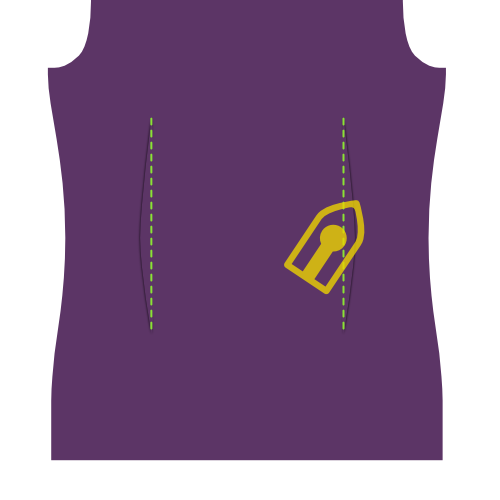
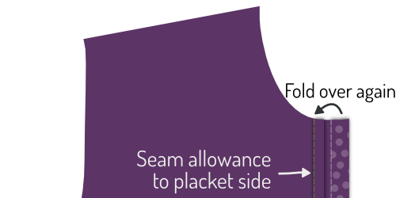
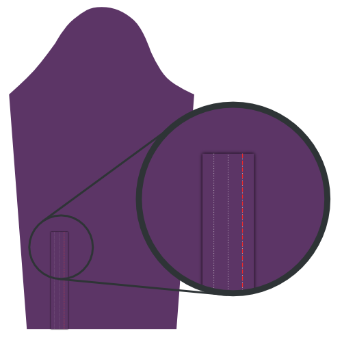

<Tip>

##### Follow the sew-along with Kelly and Julian

Kelly Hogaboom and Julian Collins did a Simon(e) sew-along, and they've got videos of
all the steps.
If you're looking to make this pattern, Kelly and Julian can guide you start to finish.

You can find all the material's on Kelly's
site: [#simonsayssew with kelly hogaboom & julian collins](https://kelly.hogaboom.org/2020/07/simon-says-sew-with-kelly-hogaboom-and-julian-collins/)

</Tip>

### Step 1: Fuse interfacing

 

#### Press interfacing to cuffs

To make two cuffs, you have cut out your cuff piece four times in fabric, and twice in interfacing.

For each cuff, press the interfacing piece to the bad side of the cuff piece.

> If the inside and outside of your cuff are the same fabric, it does not matter what cuff piece you press it to.
> 
> However, a popular style detail is to have a different fabric for the inside of the cuff. In this case, make sure to press the interfacing to the piece that you want to be the outside of your cuff.

> Depending on what cuff you have chosen, the shape of the cuff will be different.
> 
> In the first illustration, you can see both a round barrel cuff and a French cuff as examples.
> 
> Going forward, the round barrel cuff will be used in the illustrations, but the process is the same for the other cuffs.

#### Press interfacing to collar, undercollar and collar stand

To make your collar, you need to cut one undercollar, one collar, and two collar stands. All of this both in fabric and interfacing.

For each piece, press the interfacing piece to the bad side.

### Step 2: Prepare the cuffs

#### Sew cuff together

Place both parts of your cuff (one with interfacing, one without) together with the good sides, and sew them together at the standard seam allowance.

> **Ensure you**
> 
> - Do not sew together the side that we will attach to the sleeve later
> - Stop at the seam allowance distance from the edge on the sleeve side

#### Trim seam allowance

Before we flip your cuff over, we need to trim back the seam allowance to remove bulk.

#### Press back seam allowance

Fold back the seam allowances on each side of the cuff where the cuff attaches to the sleeve, and press them down.

> If you sewed too far along the edge earlier, you will have to unpick a few stitches.

#### Turn cuff around and press

Flip your cuff with the good sides out, and give it a good press.

> When pressing your cuffs, make sure to roll the seam a bit to the backside of the cuff to guarantee that the inner fabric of the cuff is not visible.

You can now put your cuffs aside, we'll attach them later.

### Step 3: Prepare the collar

#### Sew collar and undercollar together

Place both collar parts with the _good sides together_, and sew them together at the standard seam allowance.

#### Trim seam allowance

Before we flip your collar over, we need to trim back the seam allowance to remove bulk.

#### Turn collar and press

Flip your collar with the good sides out, get those tips as pointy as possible, and give it a good press.

> When pressing your collar, remember that the undercollar is a bit more narrow.
> 
> When you align the non-sewn sides, this will cause the seam to roll towards the backside of the collar to guarantee that the inner fabric of the collar is not visible.

#### Top-stitch collar

Top-stitch along the edge of the collar. This locks down the seam allowance and makes for a crisp look.

> How far you top-stitch from the edge is a style choice. It's often a bit less than the standard seam allowance. Have a look at some existing shirts to get an idea.

### Step 4: Join collar and collar stand

#### Place collar between collar stands and baste in place

Mark the middle point of your collar and your collar stands with a pin. The middle point of each collar stand is actually slightly off-center since one end is longer than the other. Instead, find the middle point between the two notches.

First place a collar stand with the good side up, then your collar with the undercollar facing up (and the non-sewn side at the top), and finally the second collar stand with the good side down.

Your collar should sit between your two collar stands, and the middles (where you placed your pin) should be aligned.

> The way things look will depend a little bit on your collar choices, but in general your collar is going to bend downward, and your collar stand will bend upward.
> 
> To align this all, we are going to baste this together, rather than pin it. Your collar is an important part of your shirt, so it's worth basting this.

First, replace the pins marking the middle with a pin that pins all parts together.

Now, start basting from this pin and work your way to the corner of the collar, making sure to align both edges of the fabric.

When you reach the corner of your collar, keep going and baste the end of both collar stands together.

When you've done one side, start from your pin in the middle again and do the other side. When you're done basting, you can take out the pin.

#### Sew your collar to the collar stands

Sew along the edge of your collar stand, respecting the standard seam allowance.

> Make sure to stop 2cm before the edge (twice the standard seam allowance) as we'll be folding the seam allowance over in the next step, and we need to leave the collar stands separated enough to slide the shirt in between them later.

#### Fold back and press the collar stand seam allowance

Fold back the seam allowance of your collar stand on the non-sewn side and press it down.

> In the center part, pressing down the seam allowance will be easy. But towards the tips of your collar, doing so will be tricky without pressing folds in your collar.
> 
> Press it as best as you can without making folds in your collar. We'll press this again after flipping the collar out.

#### Turn collar stand and press

Flip your collar stand with the good sides out, and give it a good press. Make sure to keep the seam allowance on the collar stand folded inwards.

You can now put your collar aside, we'll attach it later.

### Step 5: Optional: Sew in your label

Our next step is to attach the yoke. But the yoke is a great place to put your label. So if you'd like to do that, we might as well start with that.

Pick one yoke, and you can sew your label on it in the center (on the good side).

### Step 6: Join the yokes to the back

 

Place one yoke with the good side up. On top of that, place your back with the good side up, aligning the seam where it needs to be attached to the yoke.

Finally, place your second yoke on top of the back, but with the good side down.

Your back should now be sandwiched between the good sides of your two yokes.

If that's the case, sew them in place along the back/yoke seam, making sure to respect the seam allowance.

> If you added a label in step 1, make sure to put the yoke with your label at the bad side of your back.

When you're done, don't forget to give it a good press to make the seam lie flat.

### Step 7: Edge-stitch the yoke

With your yokes attached to the back, we are going to edge-stitch along the seam we just made, on the yoke side.

> Fold the inner yoke out of the way. Our edge stitching will catch the outer yoke, back and all the seam allowances, but not the inner yoke.

Just sew right next to the seam joining the outer yoke to the back.

> Edge-stitching is like top-stitching, but right next to the seam

### Step 8: Close the back darts

  

> Depending on your measurements, your pattern might not have back darts at all. In that case, proceed to the next step.

Your pattern may or may not have back darts. If it has them, you should close them now.

Place your back down with the good side up, and fold it back from the side seam so the fold runs from the top to the bottom of your dart.

Do the same for the other dart, so that both sides are folded back.

Feel free to gently press in this crease, it will help you to neatly sew the darts.

Sew across the line marking the dart to close the darts. Be careful to make sure the top and bottom of your darts are precisely where they need to be. If one dart sits higher than the other, it will look bad.

When you're done, don't forget to give it a good press. Press the extra fabric of the dart towards the side seams.

### Step 9: Prepare the button placket

> If you have chosen a grown-on placket, you can skip the first two sub-steps and skip ahead to [Fold the button placket](#fold-the-button-placket).

#### Sew on the button placket

If you have chosen a separate button placket, sew it to the Front Right piece.

Place the Front Right (piece 1) down with the good side up, and place the Button Placket (piece 1b) on top of it with the good side down, making sure to align the seam.

Sew it in place with the default seam allowance.

#### Press seam allowance to placket side

Place your front with the good side down, and press the seam allowance to the button placket side.

#### Fold the button placket

Now, fold over the button placket on the first fold line, and press this fold in place.

Then, fold the placket over again, making sure to have the fabric extend just beyond the seam that joins your placket to the front.

When you're happy, press the folded placket.

#### Sew down the folded placket

> This is the classic approach. If you have chosen the seamless Button placket style, you don't have to do this.
> 
> Rather than sew the placket down, simply leave it folded. The folds will be secured in place when we attach the buttons later.

From the good side of your shirt, sew down the folded placket by stitching in the ditch.

To do so, sew exactly on top of your earlier seam. Since you folded the fabric of your placket a bit past this seam, it will get caught at the back, fixing your folded placket in place, and locking the seam allowance inside.

### Step 10: Prepare the buttonhole placket

> If you have chosen a grown-on placket, you can skip the first two sub-steps and skip ahead to Understanding a classic buttonhole placket.

#### Sew on the buttonhole placket

If you have chosen a separate buttonhole placket, sew it to the Front Left piece.

Place the Front Left (piece 2) down with the good side up, and place the Buttonhole Placket (piece 2b) on top of it with the good side down, making sure to align the seam.

Sew it in place with the default seam allowance.

When you're done, don't forget to give it a good press. Press the seam allowance towards the placket side.

#### Press seam allowance to the placket side

Place your front with the good side down, and press the seam allowance to the buttonhole placket side.

#### Understanding a classic buttonhole placket

> If you have chosen a seamless placket, you should follow the steps of the button placket, as the construction is identical.
> 
> The steps below are for a classic buttonhole placket.

Your placket has a bunch of lines on it, so let's first clarify what they are:

- The buttonhole line has long dashes with buttonholes on it. It marks where the buttonholes should go
- The two fold lines have long dashes and sit at an equal distance right and left of the buttonhole line
- The two+two sew lines are dotted lines that sit at an equal distance of each fold line

#### Trim back seam allowance

> If you have chosen a grown-on placket, this does not apply.

The seam allowance of where you sewed your buttonhole placket to your front should fit inside your folded placket.

For that, trim back the seam allowance so that it doesn't extend beyond the first fold line on the placket.

#### Fold the buttonhole placket

 

Fold the placket on the first fold line. Press the fold in place.

Then, fold the part you just folded again, this time on the second fold line. Press this fold in place too.

> When your placket is folded and pressed, place a few pins along the length of your placket to keep things from shifting around

#### Sew the buttonhole placket

 

Sew on the first sew line, closest to the edge.

Then, flip your shirt over so that the good side is up, and your placket is up too. Then sew on the second sew line.

> These two lines of top-stitching will always be visible, so make sure to keep it neat

#### Press the buttonhole placket

Congratulations, you made a classic buttonhole placket.

Now press that baby. You know you want to.

### Step 11: Close the shoulder seams

> **Let's stuff a burrito**
> 
> We are going to close the shoulder seams with a technique that is commonly known as the **burrito method**.
> 
> If you are familiar with the burrito method, you already know what to do. If not, read on for a clever way to neatly close your shirt's shoulder seams while locking all the unfinished edges out of sight.

#### Pin the fronts to the outside yoke

 

Place your back down with the good side up, but be careful to fold the inner yoke downward (as illustrated by the dotted line.

Place your fronts on your back, with the good sides down. Pin fronts to the yoke at the shoulder seam, good sides together.

#### Roll, roll, roll your shirt, pin down and sew your seam

Roll up your back and fronts starting at the hem. Roll them into a neat sausage upwards until you can see the entire turned down yoke.

Now, you can flip the inner yoke over your rolled sausage to align the shoulder seams with the other yoke and fronts.

Pin them in place, and then sew the shoulder seams, making sure to keep your sausage (or burrito stuffing) out of the way so it doesn't get caught in the seam.

> Made sure to align the actual seam line. Due to the uneven angles at the neck opening, the fabric edge is often longer on one side than on the other.
> 
> However, the seamlines are the same length, so make sure to match them carefully using the notches.

#### Flip it inside out through the neck opening

When you've sewn both shoulder seams, reach in through the neck opening, and pull out the back and front parts to inside-out your burrito.

#### Press the shoulder seams

You did all this work, so now make sure you make it look super sharp by giving it a good press. Make sure that the seam allowance between your yokes lies nice and flat for that.

### Step 12: Edge-stitch the shoulder seams of the yoke

Just as we've edge-stitched the bottom seam of the yoke in Step 3, we're going to edge-stitch the yoke at the shoulder seams too.

Since you've just pressed these shoulder seams, everything should lie nice and flat, and you just need to run a stitch right next to the seam.

> Make sure to edge-stitch on the yoke part, where you will catch all the seam allowance, and not on the front part.

### Step 13: Construct the sleeve placket

#### Sew in the cuff guard

  

- Place your sleeve with the good side down, and your cuff guard on top, also with the good side down.
- Align the edge of your cuff guard (aka sleeve placket underlap) with the cut in your sleeve, on the side shortest to the side seam.
- Now sew along the fold line marked on the cuff guard, closest to the edge.

> If during cutting out your pattern pieces you had not cut into your sleeve on the line where the sleeve placket needs to be put in, you need to do that first.

- Fold over the cuff guard, and press down this seam.
- Turn your sleeve over with the good side up, and bring your cuff guard through the slit in your sleeve.
- Fold it twice on the lines so that the unfinished seam is tucked inwards.
- Make your folds so that the upper fold sits ever so slightly further than the seam you already made.
- Press everything down, and then edge-stitch the cuff guard in place.

#### Fold and press the placket

Origami time! We're going to fold the sleeve placket overlap using the marked fold lines as our guide. This will be a lot easier if you press between each fold.

- First, fold the outer edges of the placket inwards.
- Next, fold the entire thing in half.
- Then, fold down both tips into a nice pointy shape.
- Now give it a final good press.

#### Pin placket in place

 

Place your sleeve down with the good side up. The guard we have sewn in earlier sits against the other unfinished fabric edge of where you cut into your sleeve.

Place your placket around that edge, one side above it, one underneath.

You need to slide the placket onto your sleeve until the middle of it (the tip) aligns with the cut in your sleeve.

The idea is that the placket closes up the unfinished edge, but also covers the guard of the other edge.

When you've got it where you want it, pin the placket down.

#### Sew the sleeve placket

Start at the edge of the sleeve (the bottom of the sleeve placket) and edge-stitch along the edge upwards.

Go around the tip, and come down again on the other side (the fold side) until you have passed the point where your guard ends.

Then, sew horizontally to the other side of the placket to finish.

> I have included an extra illustration here that only shows the outline of the placket. You can see that the end of the guard is caught in our stitching of the placket, and is thus neatly tucked away.

### Step 14: Set in sleeves

#### Remember, this is a flat-felled seam

> **Careful with the extra seam allowance for the flat-felled seam** There is extra seam allowance on the sleeve to allow for the creation of the flat-felled seam.
> 
> As such, be careful to not align the fabric edge, but align the seam so that the sleeve sits out 1cm.

#### Pin sleeve in place

Spread your shirt open so that both fronts and back lie flat with their good sides up.

Now place your sleeve on top with the good side down, matching the top of the sleeve with the shoulder seam.

> Be careful, your sleeve is not symmetric, so be sure to have the back notch (⊗) and cuff guard on the back side, and the front notch (⊙) on the front side.
> 
> Also note that the back notch (⊗) on the sleeve does not have a corresponding notch on the back of the shirt. That's because it should match up with the seam where your yoke joins the back.

You now need to pin the sleeve to the armhole. To do so, make sure to:

- Match the start and end of the sleevehead to the start and end of the armhole
- Match the notches on the sleevehead to the notches on the back and fronts
- Distribute the sleevecap ease between the notches as shown

#### Distribute sleevecap ease

The default sleevecap ease for this pattern is 0.5cm. If you have sleevecap ease, you need to distribute that extra length evenly between the notches as shown.

> If you are unsure what sleevecap ease is, have a look at the [documentation for the sleevecap ease pattern option](/docs/patterns/simon/options/sleevecapease).

#### Sew sleeve in armhole

When you've got your sleeve neatly pinned in your armhole, sew it in place. Be careful to avoid any pleats in the part between the notches where you need to ease in the sleevecap ease.

> Needless to say, but I'll say it anyway: Repeat this step for the other sleeve.

### Step 15: Flat-fell armhole seam

#### Press seam allowance to one side

Lay down your freshly sewn sleeve seam with the good side down

We are going to press the seam allowance to one side. To do so, identify the seam allowance that is wider (for the flat-felled seam).

The longer seam allowance needs to lie on top of the shorter (standard seam allowance).

Once you have verified that, press down the seam allowance.

#### Fold under extra seam allowance

Now, fold the extra seam allowance for the flat-felled seam under the standard seam allowance.

You can use pins to hold this in place, but it's simpler to just press it.

> This will be relatively easy on the straight parts of the seam, but a bit more tricky at the curved sections. Take your time, and if needed you can cut into the extra seam allowance to allow it to flare open, or bend.

#### Sew the flat-felled seam

Now, from the bad side of the fabric, sew the seam allowance down just at the edge where it folds under the other seam allowance.

Here it is important to keep an even distance from the seam of your sleeve. If you have a felling foot for your sewing machine, it will help you with that. But if not, just be careful.

> It is more important to keep and even distance from the sleeve seam than to sew exactly at the edge of the fold. Ideally, the fold sits at an even distance anyhow, but if it doesn't, just make sure to sew parallel to the sleeve seam. Even if that means you deviate a bit from the folded edge.

#### Press the flat-felled seam

When it's all done, press the flat-felled seam from the good side so it lies nice and flat.

### Step 16: Close the side/sleeve seams

 

Place your shirt with the good sides together, and sew the side and sleeve seams to close the shirt.

> There is extra seam allowance on the sleeve and front sides to allow for the creation of the flat-felled seam. As such, be careful to not align the fabric edge, but align the seam so that the extra seam allowance sits out 1cm.

### Step 17: Flat-fell the side/sleeve seams

#### Press seam allowance to one side

We are going to press the seam allowance to one side. To do so, identify the seam allowance that is wider (for the flat-felled seam).

The longer seam allowance needs to lie on top of the shorter (standard seam allowance).

Once you have verified that, press down the seam allowance.

#### Fold under extra seam allowance

Now, fold the extra seam allowance for the flat-felled seam under the standard seam allowance.

You can use pins to hold this in place, but it's simpler to just press it.

> This will be relatively easy on the straight parts of the seam, but a bit more tricky at the curved sections. Take your time, and if needed you can cut into the extra seam allowance to allow it to flare open, or bend.

#### Sew the flat-felled seam

Now, from the bad side of the fabric, sew the seam allowance down just at the edge where it folds under the other seam allowance.

Important here is to keep an even distance from the seam of your sleeve. If you have a felling foot for your sewing machine, it will help you with that. But if not, just be careful.

> It is more important to keep an even distance from the sleeve seam than to sew exactly at the edge of the fold. Ideally, the fold sits at an even distance anyhow, but if it doesn't, just make sure to sew parallel to the sleeve seam. Even if that means you deviate a bit from the folded edge.

#### Press the flat-felled seam

When it's all done, press the flat-felled seam from the good side so it lies nice and flat.

### Step 18: Attach cuffs to sleeves

#### Pin cuff in place

You need to insert the sleeve between the two layers of your cuff, making sure that the good side of the fabric sits against the side of your cuff that has the interfacing applied to it.

You will need to pin this in place, because depending on how long your sleeve placket is, it might be hard or even impossible to get this to lie flat.

Also note that your sleeve edge will be longer than your cuff (how much longer depends on the sleeve drape). You need to make one or a few folds in your sleeve to accommodate for this.

> Your pattern contains helplines on the sleeve to help you place the folds.

> Take your time to pin everything carefully in place. We are going to edge-stitch this later, so it's important that the front and back of your cuff align nicely.

#### Edge-stitch cuffs to sleeves

Once everything is pinned in place, edge stitch along the edge of your cuff to attach it to your sleeve.

It's important to catch both the outer and inner layer of your cuff on the edge.

> Make sure to edge-stitch from the outer layer side (the good side of your sleeve) and keep it parallel with your cuff edge.

When you're done, give your cuffs a good press.

#### Top-stitch the cuffs

> Make sure to press your cuffs before you do this.

Top-stitch around your cuff at a distance from the edge that is a bit less than your seam allowance. Go all the way around your cuff.

### Step 19: Attach the collar

#### Baste collar in place

This is an important seam, so we are going to baste this in place to make sure it sits exactly right before we sew it.

Start at the center back, and place the seam allowance of your back part between your two collar stands. Work your way around one side, and then do the other.

Make sure to respect the standard seam allowance and - important - avoid any wrinkles.

> While your collar stand is relatively straight, we are going to sew it to what is essentially a hole in your shirt.
> 
> That's a bit tricky, so take extra care at those parts that are most curved: where the back joins the fronts.

#### Edge-stitch collar in place

 

When you're happy with how you've basted your collar in place, it's time to sew that thing down.

We're going to start at the center-back and sew all the way around the collar stand.

#### Sew along the collar edge

To give more body to your collar, and firmly secure it in place we're going to sew along the top edge of the collar stand.

Sew about half the seam allowance from your earlier edge-stitching. Make sure to stop a few cm before the end of the collar.

> You need to stop a few cm before the end of the collar (note: the end of the collar, not the end of the collar stand) so that this seam is entirely covered when the collar is folded down.

#### Press the collar

Now that your collar is attached, give it a good press.

### Step 20: Hem your shirt

  

Time to finish the hem (that's the part you tuck in your trousers).

Fold up half of the hem allowance and press down. Then, fold up again and press again.

Now, sew along the upper edge to finish the hem.

### Step 21: Create buttonholes

If you haven't done so initially, mark all the places you should have buttonholes.

They sit along the front closure and at your cuffs.

When you've marked them, make buttonholes there.

### Step 22: Attach buttons

Pin your shirt closed to transfer the place of the buttonholes to the button sides.

When you've marked where buttons should go, sew them on.

> Rather than mark the location of the buttons from the pattern, I prefer to transfer the location of the created buttonholes.
> 
> This way, if a buttonhole sits a little bit out of place, the button will simply follow it.

