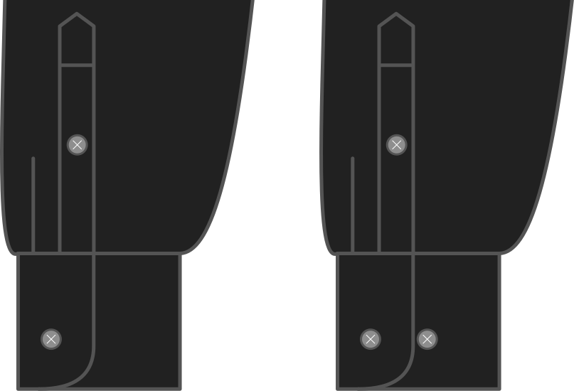

- - -
title: "Cuff narrow button"
- - -

Voulez-vous un bouton en plus pour que le boutonnage de votre poignet soit plus serré ?

Si vous portez votre chemise sous un pull ou un sweat serré aux poignets, ce bouton vous permet de rendre votre poignet de chemise plus étroit, et d'éviter qu'il ne dépasse de façon disgracieuse.

<Note>

Cela ne s'applique qu'aux poignets classiques. Donc si vous avez choisi un poignet mousquetaire, ceci ne s'applique pas.

</Note>

## Effet de cette option sur le motif

