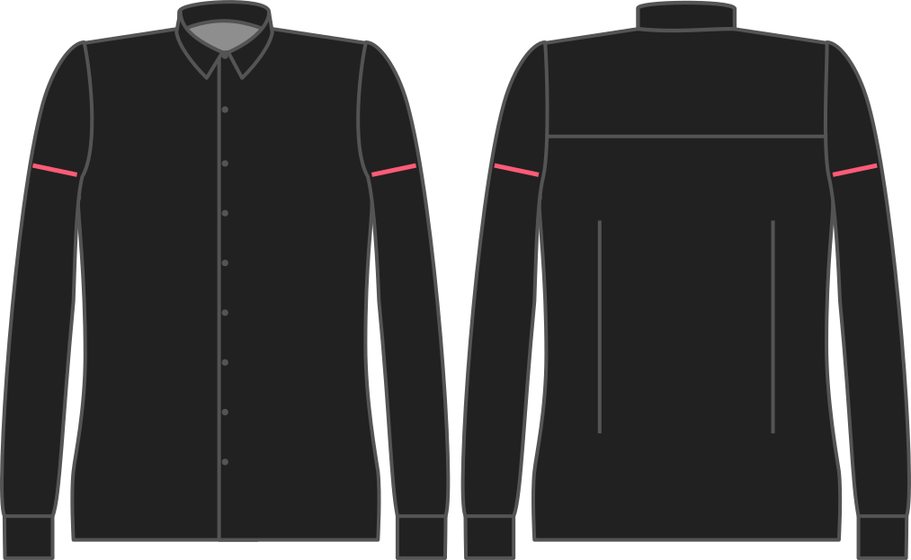

Наскільки ви хочете, щоб рукав був ширшим за обхват плеча?

<Note>

###### У чому сенс?

Насправді чоловіки з великими руками віддають перевагу більш щільному приляганню, а отже, меншій легкості. Це тому, що він привертає увагу до їхніх сильних плечей.

Якщо ваші плечі більш худі, вам знадобиться трохи більше легкості, щоб трохи вирівняти їх.

</Note>

<Warning>

Ми намагатимемося поважати ваш вибір, але наш пріоритет - щоб рукав входив в пройму.

</Warning>

## Вплив цієї опції на шаблон

