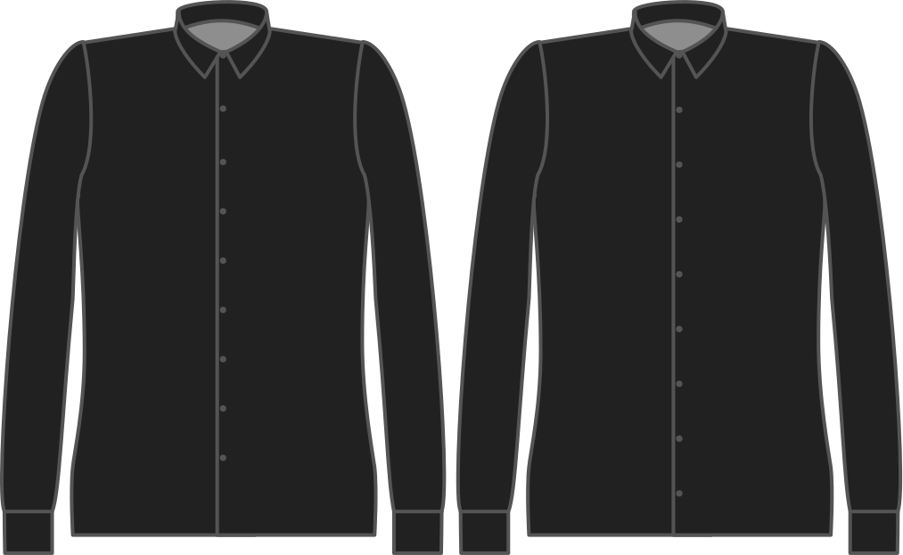

- - -
title: "Button free length"
- - -

Hoe ver voor je tailleband wil je dat je laatste knoop zit?

<Note>

###### Waarom?

Knopen voorbij je tailleband wordt door velen als vervelend ervaren.
Ze zitten vast in je riem, en maken toiletpauzes onnodig lastig.

Als je knopen onder je tailleband wil kan dat ook.

Als je knopen onder je tailleband wil kan dat ook. You should enter a negative value here,
making sure it's within the length bonus you have available.

</Note>

## Effect van deze optie op het patroon

