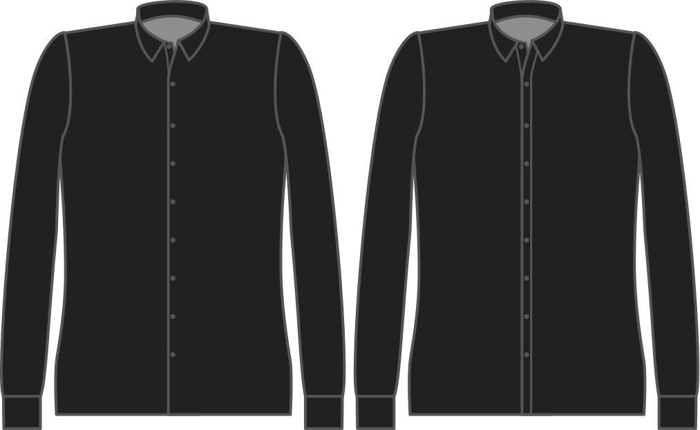

Voulez-vous une patte de boutonnière classique, ou une patte à gorge cachée (parfois appelée "de style français") ?

<Tip>

La patte de boutonnage à gorge cachée est plus facile, et a un très beau rendu.

</Tip>

<Note>

As seamless is only possible on a _cut-on_ placket, this option is ignored if you choose a seperate buttonhole placket.

</Note>

## Effet de cette option sur le motif

