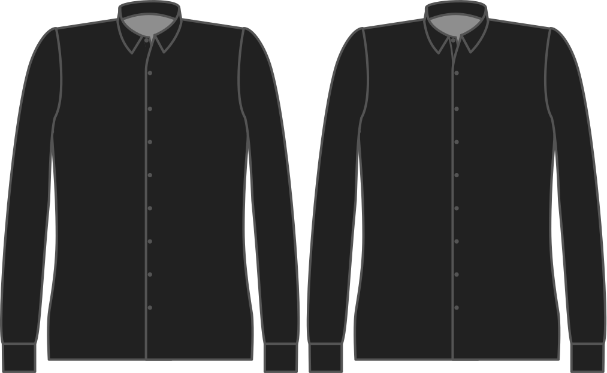

Voulez-vous que la patte de boutons soit cousue en place (style classique), ou bien pliée dos et maintenue en place par les boutons (style transparent)?

<Tip>

La patte de boutonnage à gorge cachée est plus facile, et a un très beau rendu.

</Tip>

<Note>

Comme le sans couture n'est possible que sur une patte de boutonnage _coupée_, cette option est ignorée si tu choisis une patte de boutonnage séparée.

</Note>

## Effet de cette option sur le motif

