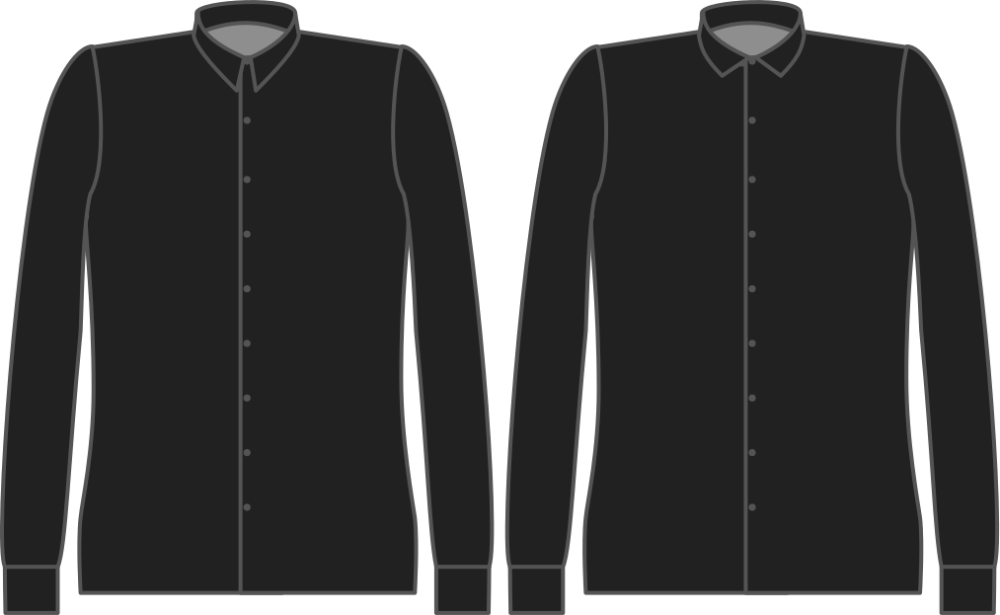

El número de grados entre el borde del cuello y el grainline.

<Note>

###### ¿Cuál es el punto?

###### What's the point?

Together with the collar height, this is the most important factor for the style of your collar.

Valores más altos significan un estilo más cortado.

En la imagen de ejemplo, la parte superior es de 80 grados (el valor por defecto) y la parte inferior es de 110 grados.

</Note>

