- - -
title: "Collar bend"
- - -

How much the collar bends (on the collar stand side), rather than being straight.

<Note>

This influences how the collar lies against the collar stand.

</Note>

## Effect of this option on the pattern

