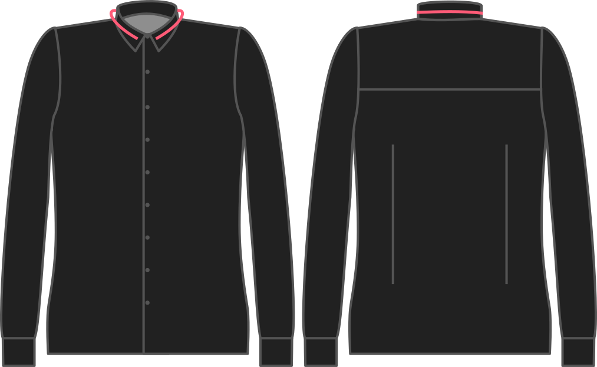

- - -
title: "Collar ease"
- - -

How much ease do you want for your collar?

If you feel that a collar is suffocating, you can give yourself a bit more ease and it will sit more loose around your neck. You could also lower the ease for a tighter fit.

## Effect of this option on the pattern

