Wie sehr sich der Kragen an den Rändern verformt.

<Note>

Sie können dies anpassen, um sicherzustellen, dass die Ränder Ihres Kragens vorne oder schön horizontal.

</Note>

## Effekt dieser Option auf das Schnittmuster

