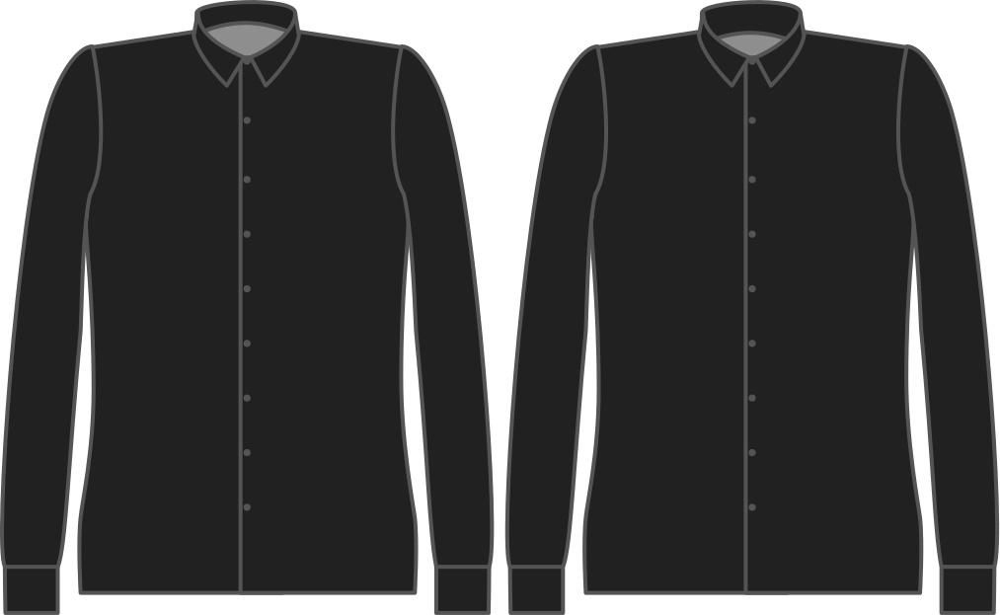

- - -
title: "Collar stand width"
- - -

The height of your collar stand.

<Note>

This is the main parameter to change the overall height of your collar. This defaults to a modern relatively slim collar, but you can crank it up all the way to Karl Lagerfeld style.

</Note>

## Effect of this option on the pattern

