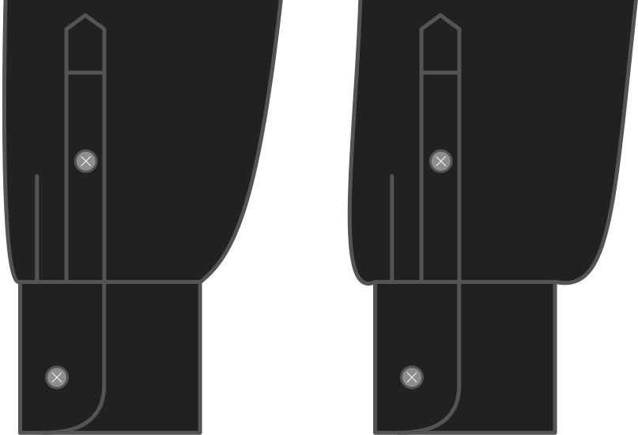

- - -
title: "Cuff drape"
- - -

How much the end of the sleeve is wider than the wrist.

<Note>

This changes the look of the sleeve a bit.
More drape makes the sleeve wider and gives you a more _blousy_ effect, whereas less drape makes the sleeve more narrow.

The drape will be worked into the cuff with pleats.

</Note>

## Effect of this option on the pattern

