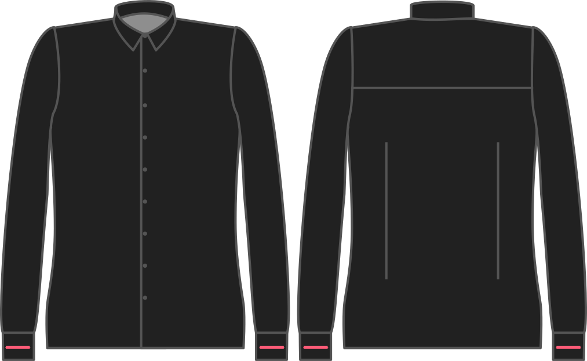

Bepaalt hoeveel groter de manchet is dan je pols.

Pas deze optie aan om jezelf meer of minder ruimte te geven aan de pols.

<Note>

Je wil misschien meer als je wil dat de manchet over een groot horloge past. Minder ruimte is beter als je het hemd ergens onder wil dragen, bijvoorbeeld een trui.

Zij die hun hemd onder een trui willen dragen moeten ook eens kijken naar de optie voor een extra versmallende knoop.

</Note>

## Effect van deze optie op het patroon

