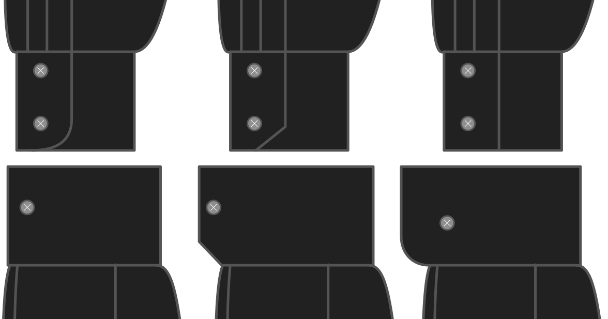

- - -
title: "Cuff style"
- - -

Wat voor manchet wil je?

- Afgeronde klassieke manchet
- Afschuining klassieke manchet
- Rechte klassieke manchet
- Afgeronde Franse manchet
- Afschuining Franse manchet
- Rechte Franse manchet

## Effect van deze optie op het patroon

