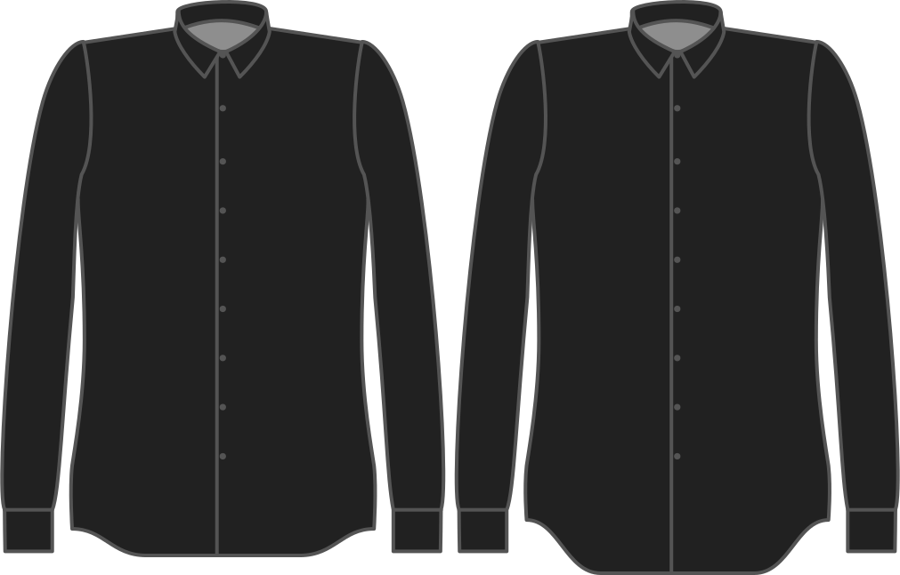

- - -
title: "Hem curve"
- - -

Combien voulez-vous que l'ourlet se courbe vers le haut ?

<Note>

- Ceci s'applique uniquement aux styles de baseball et d'ourlet tranchés. Si vous avez choisi un ourlet droit, il sera ignoré.
- Cette valeur ne peut jamais être supérieure au bonus de longueur. Si c'est le cas, il sera automatiquement fixé à la valeur de la longueur du bonus.
- Si vous mettez cette valeur à zéro, vous obtiendrez un ourlet droit quel que soit le style d'ourlet que vous choisirez.

</Note>

## Effet de cette option sur le motif

