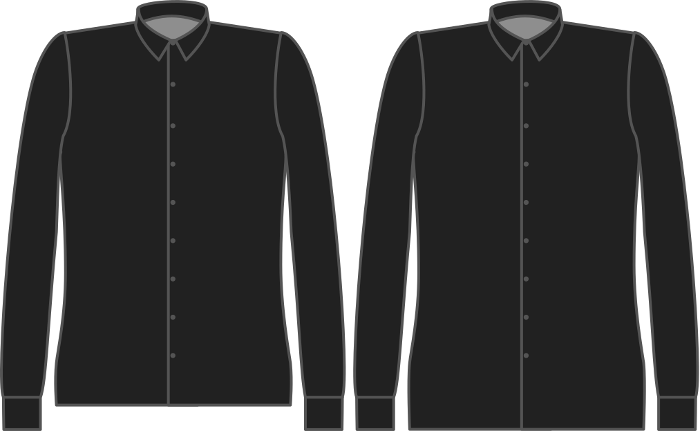

Яку довжину сорочки ви хочете мати можливість заправити в штани?

<Note>

###### У чому сенс?

Акуратно заправляти сорочку в штани - ось чому вам потрібна ця додаткова довжина.
Ніхто не повинен знати про татуювання Джастіна Бібера на попереку.

Якщо ви хочете носити більш повсякденну сорочку поверх штанів, вам слід опустити цей параметр.

</Note>

## Вплив цієї опції на шаблон

