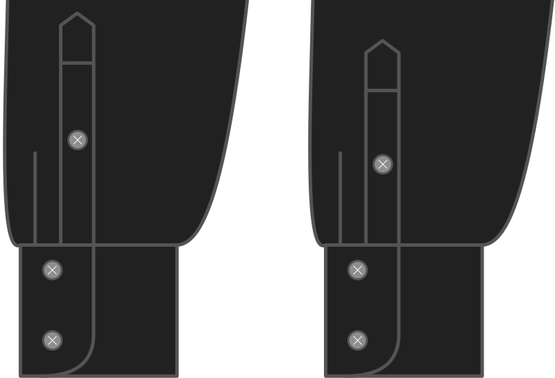

How long do you want the sleeve placket to be?

<Note>

The longer your sleeve placket is, the easier it is to get out of your shirt sleeve.
It also influences what things will look like when you roll up your sleeves

</Note>

## Effect of this option on the pattern

