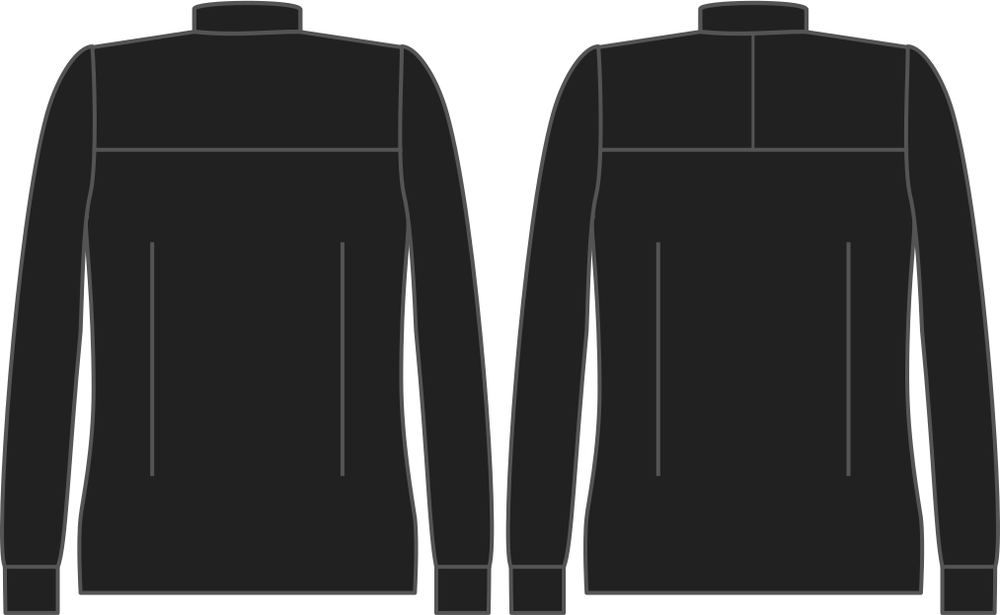

- - -
title: "Split yoke"
- - -

Wil je een tweedelige schouderpas?

<Note>

###### Waarom?

Bij een tweedelige schouderpas staat maar de helft van de schouderpas op het patroon, en zal je 4 delen moeten knippen in plaats van 2, en deze aan elkaar naaien.

Het is een beetje meer werk, maar zo kan je de draadrichting aan beide kanten anders leggen, een effect dat sommige mensen mooi vinden.

</Note>

## Effect van deze optie op het patroon

