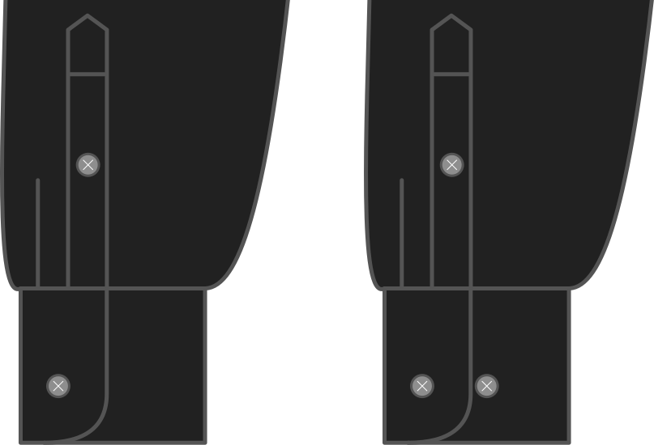

- - -
title: "Cuff narrow button"
- - -

Möchtest du mit einem zusätzlichen Knopf die Manschette fester hochdrücken?

Wenn Sie Ihr Hemd unter einem Strumpfverschluss (Handgelenk) Pullover oder Cardigan, Mit dieser Schaltfläche kannst du deine Manschette verkleinern, so dass sie nicht alles hässlich aufwirft.

<Note>

Dies gilt nur für Fässer. Wenn Sie also eine französische Manschette als Manschette wählen, wird dies ignoriert.

</Note>

## Effekt dieser Option auf das Schnittmuster

