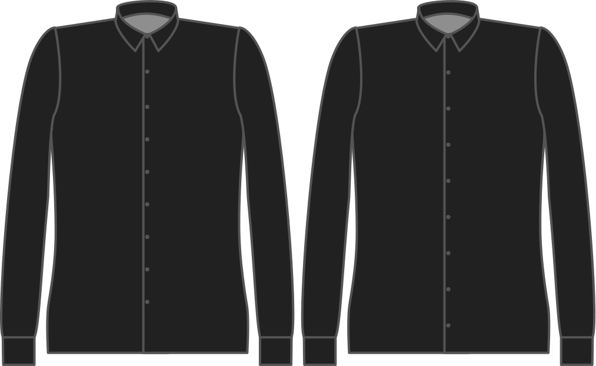

- - -
title: "Button free length"
- - -

A quelle distance de votre ceinture voulez-vous que votre dernier bouton soit placé?

<Note>

###### Pour quoi faire ?

Les boutons placés sous la ceinture sont souvent considérés comme gênants.
Ils se coincent dans votre ceinture et compliquent les pauses pipi.

Si vous voulez avoir des boutons en dessous de votre ceinture, vous pouvez.

Si vous voulez avoir des boutons en dessous de votre ceinture, vous pouvez. You should enter a negative value here,
making sure it's within the length bonus you have available.

</Note>

## Effet de cette option sur le motif

