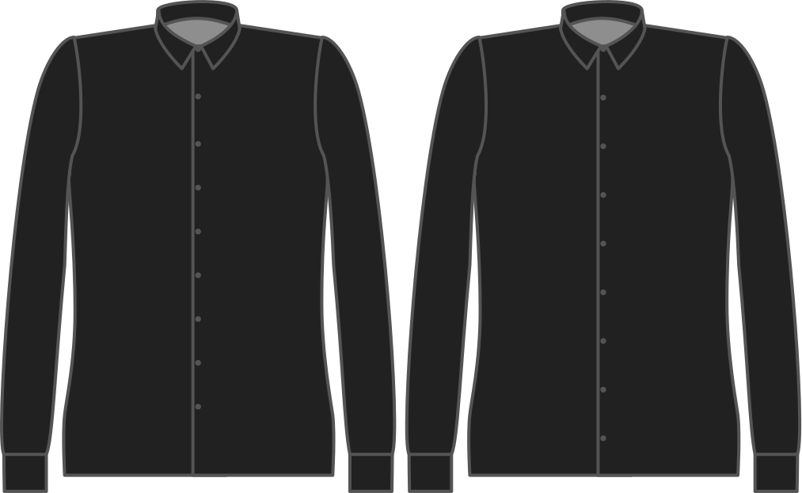

Hoe ver voor je tailleband wil je dat je laatste knoop zit?

<Note>

###### Waarom?

Knopen voorbij je tailleband wordt door velen als vervelend ervaren.
Ze zitten vast in je riem, en maken toiletpauzes onnodig lastig.

Als je knopen onder je tailleband wil kan dat ook.

Als je knopen onder je tailleband wil kan dat ook. Je moet hier een negatieve waarde invoeren,
zorg ervoor dat het binnen de lengtebonus valt die je beschikbaar hebt.

</Note>

## Effect van deze optie op het patroon

