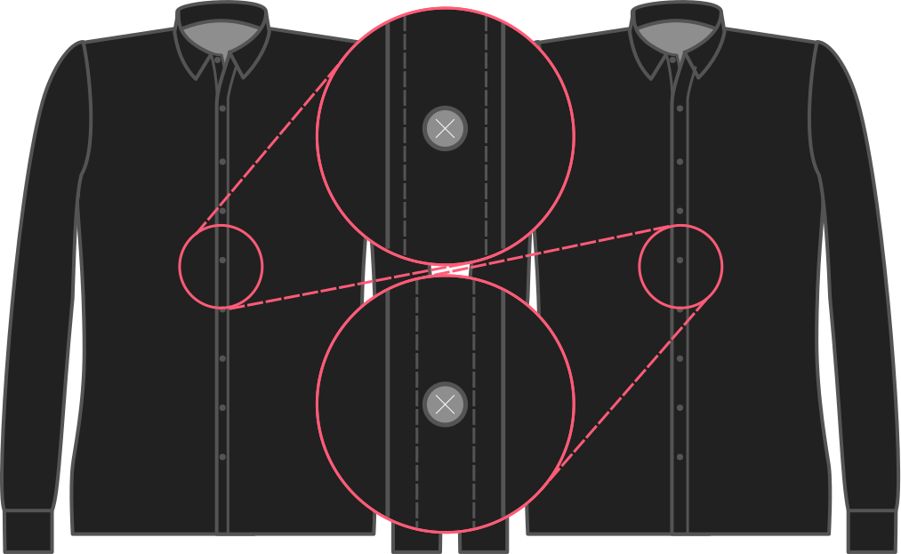

Ширина складки на класичній петлиці з ґудзиками.

<Note>

Якщо у вас тканина з візерунком (наприклад, у смужку або клітинку), ви можете встановити згин на половину ширини повторюваного візерунка.
Таким чином, ваш візерунок буде ідеально поєднуватися.

Це стосується лише класичної планки. Тому він буде проігнорований, якщо ви вибрали безшовну петличку з ґудзиками.

</Note>

## Вплив цієї опції на шаблон

