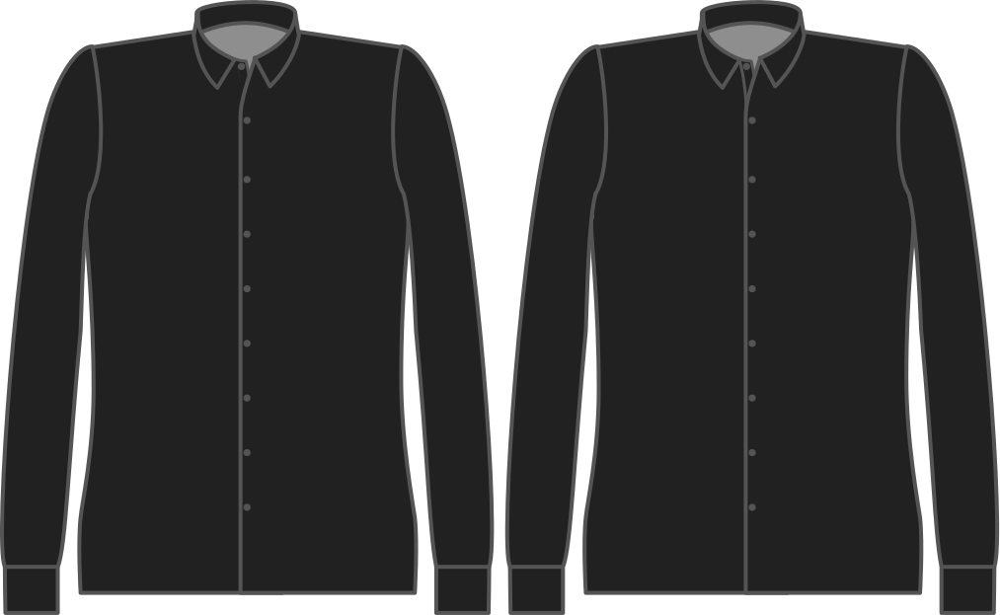

- - -
title: "Button placket style"
- - -

Voulez-vous que la patte de boutons soit cousue en place (style classique), ou bien pliée dos et maintenue en place par les boutons (style transparent)?

<Tip>

La patte de boutonnage à gorge cachée est plus facile, et a un très beau rendu.

</Tip>

<Note>

As seamless is only possible on a _cut-on_ placket, this option is ignored if you choose a seperate button placket.

</Note>

## Effet de cette option sur le motif

