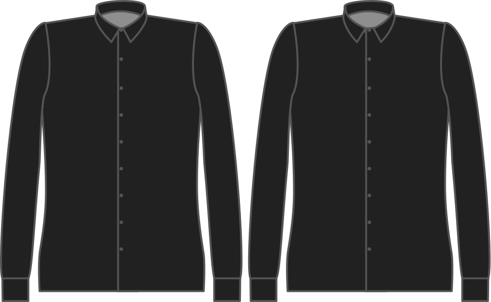

Distancia el cuello se sienta al cerrar.

<Note>

Esto es en realidad una elección de estilo, pero un hueco de cuello más ancho (junto con el ángulo de cuello) puede dar lugar a una corbata más ancha (nudo).

</Note>

## Efecto de esta opción en el patrón

