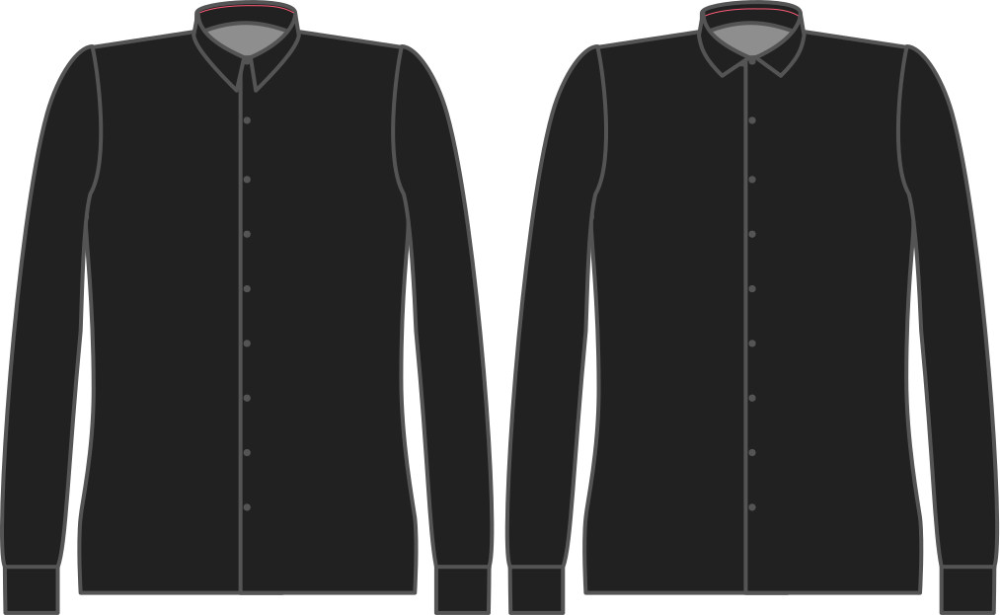

- - -
title: "Collar roll"
- - -

Combien le collier est plus grand que le collier au centre du dos.

<Note>

###### Pour quoi faire ?

Le collier commence vers le haut à partir du pied du col, puis se roule vers le bas. Mais il doit encore couvrir le porte-col. Pour cela, il doit être un peu plus long.

Augmenter cela ne fait pas augmenter le collier (utiliser la hauteur du collier pour cela) mais plutôt le faire descendre plus loin.

</Note>

## Effet de cette option sur le motif

