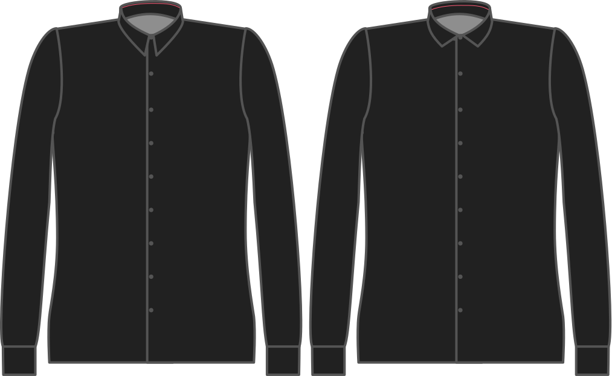

Наскільки комір вищий за стійку коміра по центру спини.

<Note>

###### У чому сенс?

Комір починається від стійки коміра вгору, а потім перекидається вниз. Але він все одно повинен закривати підставку для нашийника. Для цього потрібно трохи більше часу.

Збільшення цього параметра не робить нашийник вищим (для цього використовуйте висоту стійки нашийника), а навпаки, змушує його опускатися нижче.

</Note>

## Вплив цієї опції на шаблон

