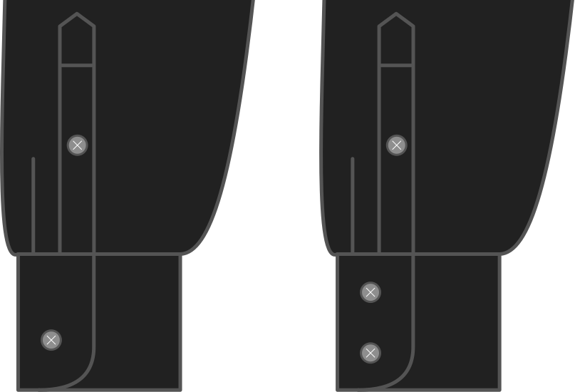

Voulez-vous un seul bouton sur votre barreau, ou deux?

<Note>

Cela ne s'applique qu'aux poignets classiques. Donc si vous avez choisi un poignet mousquetaire, ceci ne s'applique pas.

</Note>

## Effet de cette option sur le motif

