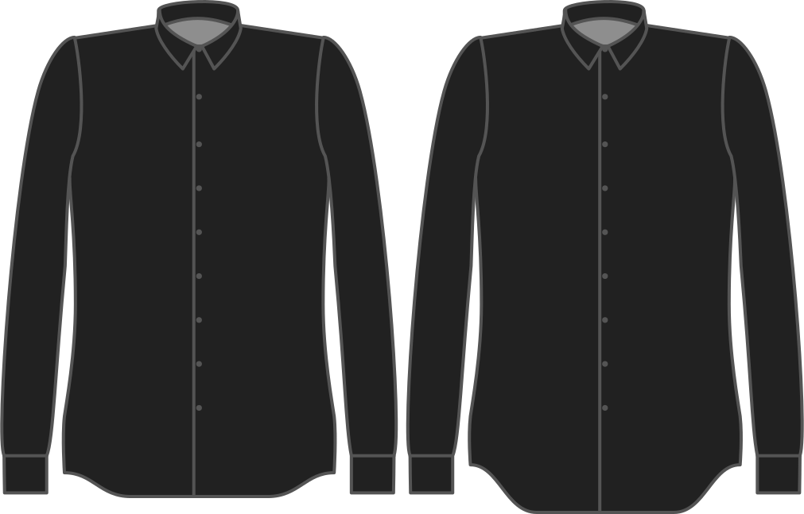

Наскільки сильно ви хочете, щоб поділ був загнутий вгору?

<Note>

- Це стосується лише фасонів бейсбол та з розрізаним подолом. Якщо ви вибрали прямий поділ, це буде проігноровано.
- Це значення ніколи не може бути більшим за бонус за довжину. Якщо так, то він буде автоматично встановлений на значення бонусу за довжину.
- Якщо ви встановите цей параметр на нуль, ви отримаєте прямий край, незалежно від того, який стиль ви вибрали.

</Note>

## Вплив цієї опції на шаблон

