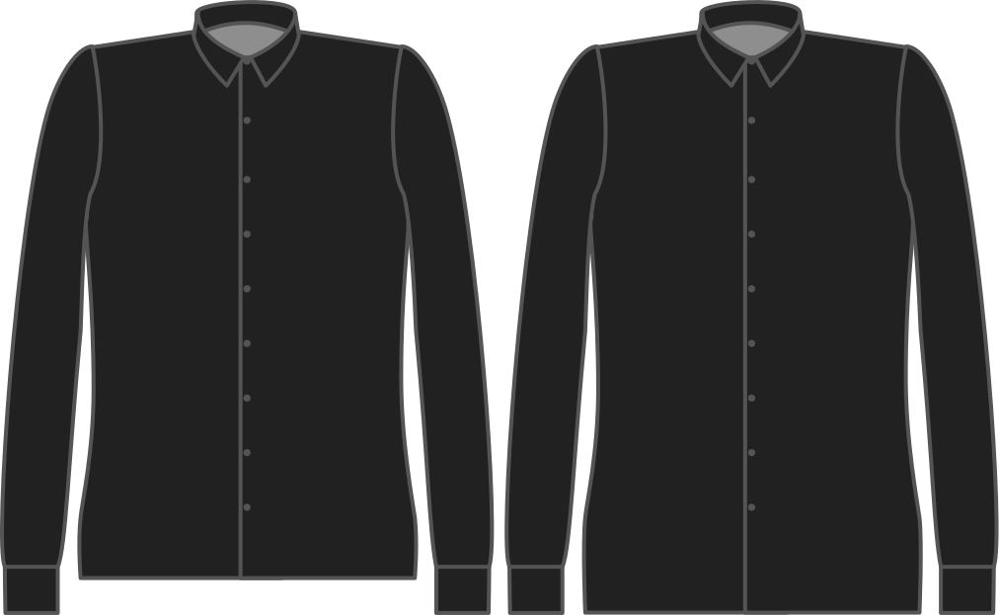

- - -
title: "Length bonus"
- - -

Hoeveel hemd wil je in je broek kunnen proppen?

<Note>

###### Waarom?

Deze extra lengte heb je nodig om je hemd netjes in je broek te houden.
Niemand hoeft iets te weten over die Justin Bieber-tattoo op je onderrug.

Als je een casual hemd wil dat je niet instopt verlaag je deze waarde best.

</Note>

## Effect van deze optie op het patroon

