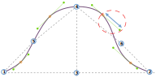

Ця опція контролює розкид вниз у другому квадранті рукавного ковпачка.

<Tip>

Дивіться [розуміння конструкції манжета](/docs/patterns/brian/options#understanding-the-sleevecap) для детального
розгляду того, як побудований рукав і як різні варіанти впливають на його форму.

</Tip>

## Вплив цієї опції на шаблон

